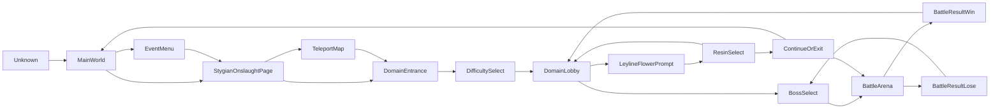

# StateMachineBase 状态机框架

`StateMachineBase<TState, TContext>` 是给游戏自动化任务使用的有限状态机基类。它把 UI 场景识别、场景处理、状态转移、重试和超时兜底放到统一框架里，避免任务里堆一长串 `switch`、`while` 和零散的超时判断。

推荐写法是：

1. 用枚举定义所有 UI 状态。
2. 用 `[StateDetector]` 标记状态检测方法。
3. 用 `[StateHandler]` 标记状态处理方法，并在节点上声明重试策略。
4. 在一个地方集中注册状态转移图。
5. 调用 `RunStateMachineUntil` 运行到目标状态。

## 核心概念

| 概念 | 说明 |
| --- | --- |
| `State` | 一个明确的 UI 场景，比如 `MainWorld`、`EventMenu`、`DomainEntrance` |
| `Detector` | 状态检测器，签名为 `bool Method(ImageRegion ra)`，只判断当前截图是否匹配这个状态 |
| `Handler` | 状态处理器，签名为 `Task<StateHandlerResult> Method(TContext context)`，负责在当前状态执行动作 |
| `Transition` | 状态图的有向边，声明某个状态执行成功后允许到达哪些状态 |
| `RetryPolicy` | 节点级兜底策略，可按次数或按时间限制当前状态的重试 |

`TState` 必须是枚举。建议第一个枚举值是 `Unknown`，因为 `default(TState)` 会被框架当作“未识别到状态”使用。

## 基本模板

```csharp
public enum MyState
{
    Unknown,
    MainWorld,
    EventMenu,
    TargetPage,
}

public class MyTask : StateMachineBase<MyState, BvPage>, ISoloTask
{
    protected override ILogger Logger => TaskControl.Logger;

    public MyTask()
    {
        RegisterAllStateHandlers();
    }

    private void RegisterAllStateHandlers()
    {
        RegisterStateMethodsByAttribute();

        RegisterStateTransitions(
            (MyState.MainWorld, [MyState.EventMenu]),
            (MyState.EventMenu, [MyState.TargetPage])
        );
    }

    public async Task Start(CancellationToken ct)
    {
        Initialize(ct, MyState.Unknown);
        var page = new BvPage(ct);

        await RunStateMachineUntil(page, MyState.TargetPage);
    }
}
```

## Detector

Detector 只负责“当前截图是不是这个状态”，不要在里面点击、等待或修改状态。

```csharp
[StateDetector(MyState.MainWorld, Order = 10)]
private bool DetectMainWorld(ImageRegion ra)
{
    return ra.Find(ElementAssets.Instance.PaimonMenuRo).IsExist();
}

[StateDetector(MyState.EventMenu, Order = 20)]
private bool DetectEventMenu(ImageRegion ra)
{
    return ra.FindMulti(RecognitionObject.Ocr(125, 142, 113, 28))
             .Any(o => o.Text.Contains("活动一览"));
}
```

`Order` 表示全量检测时的检测顺序，数值越小越先检测。建议把快且稳定的模板匹配放前面，把大范围 OCR 放后面。

状态机每轮只截图一次并复用给多个检测器。若当前状态注册了邻接状态，则只检测邻接状态；若当前状态没有注册转移关系，则回退到全量检测。

## Handler

Handler 只负责“在当前状态做一步动作”，动作结果用 `StateHandlerResult` 表达。

```csharp
[StateHandler(MyState.MainWorld)]
private async Task<StateHandlerResult> HandleMainWorld(BvPage page)
{
    Simulation.SendInput.SimulateAction(GIActions.OpenTheEventsMenu);
    await Delay(500, _ct);
    return StateHandlerResult.Success;
}

[StateHandler(MyState.EventMenu, RetryTimeout = 30000)]
private async Task<StateHandlerResult> HandleEventMenu(BvPage page)
{
    var target = page.GetByText("目标活动").FindAll().FirstOrDefault();
    if (target == null)
    {
        return StateHandlerResult.Retry;
    }

    target.Click();
    await Delay(300, _ct);
    return StateHandlerResult.Success;
}
```

`StateHandlerResult` 语义如下：

| 返回值 | 框架行为 | 典型场景 |
| --- | --- | --- |
| `Success` | 动作完成，框架等待当前状态的邻接状态出现；如果源状态在动作生效窗口内持续可见，会触发当前状态 retry | 点击按钮、发送交互键后等待页面切换 |
| `Wait` | 不计 retry，直接进入下一轮检测 | 加载中、动画中、当前状态无需动作 |
| `Retry` | 当前状态 retry 次数加一，超限后抛异常 | 按钮没找到、OCR 暂时失败、动作没法确认 |
| `Fail` | 立即抛异常 | 配置错误、关键条件不满足、无法恢复 |

目标状态通常不会执行 Handler。`RunStateMachineUntil` 每轮会先检测当前状态，发现已到达目标状态就直接返回。

## Unknown Handler

未知状态处理器用于兜底恢复，例如回主界面后重新识别。

```csharp
[UnknownStateHandler]
private async Task<StateHandlerResult> HandleUnknownState(BvPage page)
{
    await new ReturnMainUiTask().Start(_ct);
    return StateHandlerResult.Wait;
}
```

未知状态处理器最多只能注册一个。它适合做“恢复到已知入口”的动作，不适合吞掉真正的业务错误。

## 状态转移图

状态转移关系必须集中注册，保持流程可读。

```csharp
RegisterStateTransitions(
    (MyState.MainWorld, [MyState.EventMenu]),
    (MyState.EventMenu, [MyState.TargetPage])
);
```

状态图是严格的：

- 当前状态有邻接关系时，框架只检测邻接状态。
- 每个注册的状态转移必须至少有一个邻接状态；结束节点不要注册状态转移。
- 邻接状态不能包含自身，注册时会直接抛异常。
- 如果需要在同一页面重试，不要写自环，应该让 Handler 返回 `Retry`，或让 `Success` 后的源状态保持超时触发 retry。
- `Success` 状态必须有合理的下一跳，否则等待邻接状态会失败并消耗 retry。

候选状态顺序会影响检测优先级。更具体、更不容易误判的状态应放在前面。

## 结束节点

结束节点用 `RunStateMachineUntil` 的目标状态表达，不需要也不应该注册空邻接。

```csharp
RegisterStateTransitions(
    (MyState.MainWorld, [MyState.EventMenu]),
    (MyState.EventMenu, [MyState.TargetPage])
);

await RunStateMachineUntil(page, MyState.TargetPage);
```

上面这个例子里，`TargetPage` 没有出边，所以不注册 `(MyState.TargetPage, [])`。状态机每轮会先检测是否到达目标状态，命中后直接退出，不会执行目标状态的 Handler。

如果一个状态在某个阶段是结束节点，在另一个阶段还要继续流转，也可以注册它的出边。是否结束由本次 `RunStateMachineUntil` 的目标状态决定，不由状态本身永久决定。

## Retry 策略

节点可以在 `[StateHandler]` 上声明 retry 策略：

```csharp
[StateHandler(MyState.EventMenu, RetryTimeout = 30000, RetryInterval = 500)]
private async Task<StateHandlerResult> HandleEventMenu(BvPage page)
{
    ...
}

[StateHandler(MyState.TargetPage, RetryTimes = 10)]
private async Task<StateHandlerResult> HandleTargetPage(BvPage page)
{
    ...
}
```

| 属性 | 说明 |
| --- | --- |
| `RetryTimes` | 当前状态最多允许多少次 retry |
| `RetryTimeout` | 当前状态最多允许在 retry 窗口内持续多久，单位毫秒 |
| `RetryInterval` | 发生 retry 后下一轮状态机循环的等待时间，单位毫秒 |
| `TransitionTimeout` | Handler 返回 `Success` 后等待邻接状态出现的超时时间，单位毫秒 |

`RetryTimes` 和 `RetryTimeout` 互斥，不能同时设置。

retry 预算会被两类事件消耗：

- Handler 返回 `Retry`。
- Handler 返回 `Success` 后，源状态持续可见并达到动作生效窗口上限。

状态变化后 retry 计数和 retry 计时都会重置。

## 什么时候用次数，什么时候用时间

用 `RetryTimes`：

- Handler 能明确判断本次动作失败。
- 每次 retry 的成本相近。
- 失败次数比耗时更能表达问题。

用 `RetryTimeout`：

- Handler 动作是幂等的。
- 没法确认本次动作是否已经触发转场。
- 可能卡在加载、动画、弹窗等中间态，按次数容易误杀。

例如“找不到活动入口”和“交互秘境入口后没法确认是否已经选中”属于同一类问题：动作可重复，但最终只能靠后续状态检测确认。这类节点更适合设置 `RetryTimeout`。

## 转场等待

`DefaultTransitionTimeout` 表示：Handler 返回 `Success` 后，源状态持续可见多久才认为本次动作没有生效。默认是 3000ms。达到这个窗口上限后，状态机会触发当前状态 retry。

`DefaultIntermediateTransitionTimeout` 表示：如果界面已经离开源状态，但还没到任何邻接目标，最多允许中间态持续多久。默认是 120000ms。这个设计是为了避免游戏加载、传送、黑屏等中间态被短动作窗口误判成当前状态 retry。

转场等待会按 `DefaultDetectionInterval` 持续轮询“邻接目标状态 + 源状态”，不会做全量状态检测。这样可以避免 `MainWorld` 这类宽泛状态在秘境入口、地图等场景误命中，导致当前节点本该 retry 的动作被误判成中间态。

等待期间按下面的规则计时：

- 检测到邻接目标状态：立即转换成功。
- 检测到源状态：说明动作还没有触发转场，动作生效窗口继续计时，中间态长超时重置。
- 源状态和邻接目标都没检测到：说明可能处于加载、黑屏、动画等中间态，动作生效窗口重置，中间态长超时继续计时。
- 中间态长超时：直接抛出中间态转换超时异常，不计入当前源状态的 retry 预算。

可以在节点上覆盖动作生效窗口：

```csharp
[StateHandler(MyState.TeleportMap, TransitionTimeout = 10000)]
private async Task<StateHandlerResult> HandleTeleportMap(BvPage page)
{
    ...
}
```

## Handler 内可读状态

Handler 内可以读取当前 retry 信息，用于调整动作强度或打印日志：

```csharp
if (CurrentStateRetryCount > 3)
{
    Logger.LogWarning("当前状态已重试 {Count} 次", CurrentStateRetryCount);
}
```

可读属性：

| 属性 | 说明 |
| --- | --- |
| `CurrentState` | 当前状态 |
| `CurrentStateRetryCount` | 当前状态已累计 retry 次数 |
| `CurrentStateRetryLimit` | 当前状态的次数上限，使用时间策略时为 0 |
| `CurrentStateRetryTimeout` | 当前状态的时间上限，使用次数策略时为 null |
| `CurrentStateRetryUsesTimeout` | 当前状态是否使用时间策略 |
| `CurrentStateRetryInterval` | 当前状态 retry 后的循环间隔 |
| `CurrentStateTransitionTimeout` | 仅在当前状态 Handler 返回 `Success` 后生效；从 `Success` 返回后开始计时，源状态持续可见超过此时长会触发 retry |

这些属性都是只读保护属性，节点不能直接改框架内部计数。

## 完整示例

自动幽境危战任务是当前状态机的完整示例：

`GameTask/AutoStygianOnslaught/AutoStygianOnslaughtTask.cs`

简化状态图：



幽境危战里的两个典型兜底：

```csharp
[StateHandler(StygianState.EventMenu, RetryTimeout = 30000)]
private async Task<StateHandlerResult> HandleEventMenuState(BvPage page)
{
    ...
}

[StateHandler(StygianState.StygianOnslaughtPage, RetryTimes = 10)]
private async Task<StateHandlerResult> HandleStygianOnslaughtPageState(BvPage page)
{
    ...
}
```

`EventMenu` 使用时间预算，因为找不到活动入口时无法确认是否已经进入右侧详情页，只能交给后续状态检测兜底。`StygianOnslaughtPage` 使用次数预算，因为找不到“前往挑战”按钮是当前页内的明确失败。

## 常见坑

- 不要把自身放到邻接状态里。需要重复当前页面动作时，使用 `Retry` 或节点 retry 策略。
- 不要在 Detector 里点击或等待。Detector 只做识别。
- 不要让 Handler 自己写无限循环。循环、retry、超时交给状态机。
- 不要把所有状态都塞进邻接状态。邻接表越精确，误判越少。
- `Wait` 不消耗 retry。只在确实可预期等待时使用，否则可能靠 `maxIterations` 兜底才退出。
- `Success` 表示“动作已发出”，不是“已经到达下一页”。下一页确认由状态机的邻接状态检测完成。
- 如果节点动作可重复但无法确认效果，优先考虑 `RetryTimeout`。
- 如果节点失败很明确，优先考虑 `RetryTimes`。

## 迁移旧任务

旧代码如果手动调用 `RegisterStateHandlers` 和 `RegisterStateDetectors`，可以按下面步骤迁移：

1. 保留原来的状态枚举。
2. 在检测方法上加 `[StateDetector(State, Order = n)]`。
3. 在处理方法上加 `[StateHandler(State)]`。
4. 未知状态处理方法加 `[UnknownStateHandler]`。
5. 注册入口改成先调用 `RegisterStateMethodsByAttribute()`。
6. 保留并整理 `RegisterStateTransitions(...)`。
7. 把节点级 retry 策略从集中注册迁到对应 `[StateHandler]` 上。

迁移后，状态的检测逻辑、处理逻辑和节点策略都贴在方法声明处；状态图仍集中维护。
