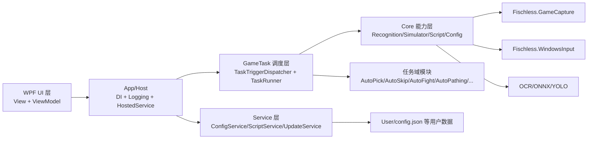
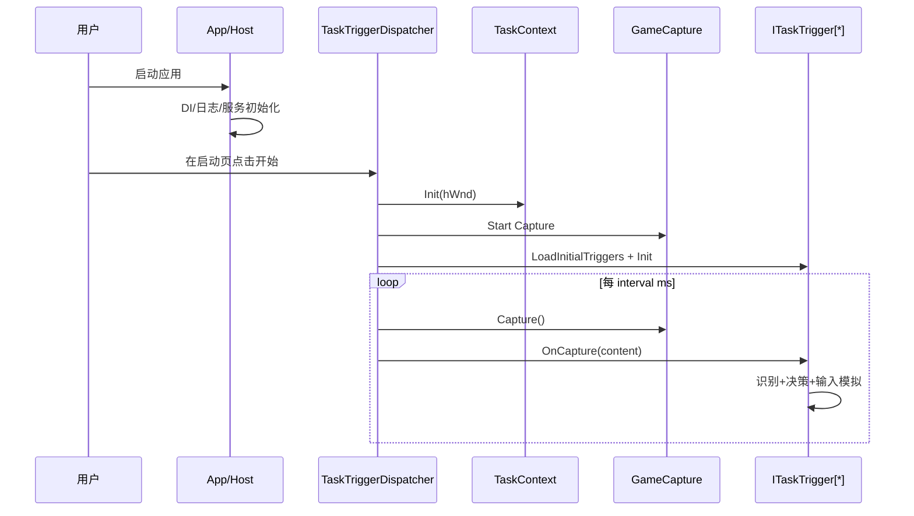
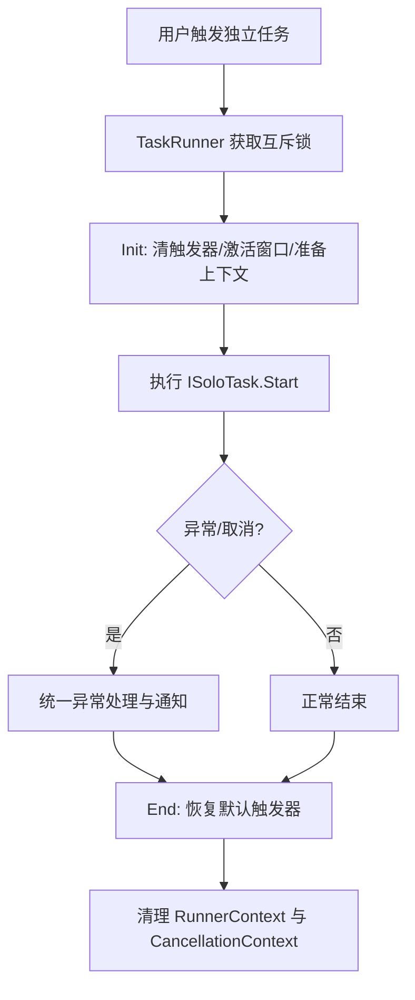
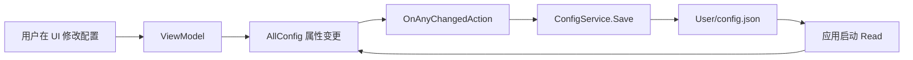
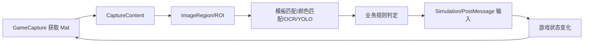

# BetterGI 设计文档

## 1. 项目总览

BetterGI（BetterGenshinImpact）是一个基于计算机视觉与输入模拟的 Windows 桌面自动化工具，面向《原神》中的高频重复操作场景。项目通过“截图识别 -> 状态判断 -> 模拟输入”的闭环，在不修改游戏内存的前提下实现自动化能力。【】

类似案件精灵的点击外挂
内存挂---可以直接找到进程的内存空间，对内存进行精细化控制
高手外挂作者往往精通：
1汇编2Windows内核3PE文件4调试器5反汇编6内存模型

从工程上看，本项目采用“主应用 + 基础能力库 + 任务域模块”的分层方式：

- 主应用 `BetterGenshinImpact`：WPF UI、配置管理、任务调度、视觉识别、业务任务。
- 基础能力库 `Fischless.GameCapture`：多种截图后端（BitBlt / DWM / Graphics 等）。
- 基础能力库 `Fischless.WindowsInput`：统一输入模拟抽象。
- 基础能力库 `Fischless.HotkeyCapture`：全局热键捕获。
- 测试工程 `Test/BetterGenshinImpact.UnitTest` 与 `Test/BetterGenshinImpact.Test`：单元测试与可视化/实验测试。

## 2. 技术栈

## 2.1 平台与运行时

- .NET: `net8.0-windows10.0.22621.0`
- 语言: C# 12
- UI: WPF + WPF-UI（含 Violeta 组件）
- 目标平台: Windows x64

## 2.2 核心框架

- `Microsoft.Extensions.Hosting`：Generic Host 承载应用生命周期
- `Microsoft.Extensions.DependencyInjection`：依赖注入
- `CommunityToolkit.Mvvm`：MVVM 模式与可观察对象
- `Serilog`：文件/控制台/RichTextBox 多通道日志

## 2.3 视觉与识别

- `OpenCvSharp`：图像预处理、模板匹配、颜色识别、特征处理
- `Sdcb.PaddleOCR` + 自定义 OCR 抽象：文本识别
- `Microsoft.ML.OnnxRuntime(DirectML)`：ONNX 推理
- `YoloSharp`：YOLO 模型推理封装

## 2.4 自动化与系统交互

- `Vanara.PInvoke.*`：窗口句柄、前台窗口、输入等 Win32 能力
- `Fischless.WindowsInput`：输入模拟底座
- `Fischless.GameCapture`：截图后端
- `Microsoft.Web.WebView2`：脚本仓库/页面桥接
- `Microsoft.ClearScript.V8`：脚本引擎支持

## 2.5 工程与测试

- `xUnit` + `Microsoft.NET.Test.Sdk` + `coverlet.collector`
- 部分功能资产通过 NuGet 包分发（如地图与模型资产）

## 3. 整体架构与组件结构图

## 4. 代码库与目录职责

## 4.1 解决方案级目录

- `BetterGenshinImpact/`: 主程序，包含 UI、核心能力、任务系统、配置与服务。
- `Fischless.GameCapture/`: 截图能力抽象与实现。
- `Fischless.WindowsInput/`: 键鼠输入模拟抽象与实现。
- `Fischless.HotkeyCapture/`: 热键监听能力。
- `Build/`: 打包、安装器、CI 构建脚本。
- `Docs/`: 用户文档与设计文档。
- `Test/`: 测试工程。

## 4.2 主程序目录（BetterGenshinImpact）

- `Core/`: 与业务无关或弱业务耦合的通用核心能力。
  - `Config/`: 全局配置模型（`AllConfig` 及子配置）。
  - `Recognition/`: OCR、模板、颜色、ONNX、YOLO 等识别能力。
  - `Simulator/`: 输入模拟封装、动作映射、扩展方法。
  - `Script/`: 脚本项目模型、脚本引擎扩展、仓库更新与桥接。
  - `Monitor/`、`Recorder/`: 键鼠监听与录制回放。
  - `BgiVision/`: 视觉上下文与绘制能力（调试可视化）。
- `GameTask/`: 核心业务域，按“功能任务”拆分子模块。
  - `AutoPick/`, `AutoSkip/`, `AutoFight/`, `AutoPathing/`, `AutoFishing/` 等。
  - `Common/`: 任务执行公共能力（休眠、暂停、重试、截图入口）。
  - `TaskRunner`, `TaskTriggerDispatcher`, `GameTaskManager`: 任务框架骨架。
- `Service/`: 应用服务层。
  - `ConfigService`: 配置读写与持久化。
  - `ScriptService`: 配置组脚本调度与执行。
  - `ApplicationHostService`: 主窗体激活与启动流程。
  - `UpdateService`: 版本检查与更新交互。
- `View/` + `ViewModel/`: 页面与状态绑定。
- `User/`: 用户配置与用户脚本数据目录（运行时）。
- `Resources/`: 图标、字体与其他资源。

## 5. 核心类设计（重点类详解）

以下类是主流程与业务流程的“骨架类”。

## 5.1 启动与宿主

1. `App`  
职责：
- 构建 Generic Host，注册 DI、日志、页面、服务。
- 程序启动时执行 Host 启动、事件注册、协议注册。
- 程序退出时停止 Host、清理临时资源。

2. `ApplicationHostService`  
职责：
- 在 Host 启动后创建主窗口。
- 根据命令行参数路由页面及触发任务启动。

## 5.2 上下文与配置

3. `TaskContext`  
职责：
- 维护任务执行必需上下文：游戏句柄、系统信息、DPI、输入模拟器。
- 暴露全局配置入口（通过 `ConfigService.Config`）。

4. `RunnerContext`  
职责：
- 维护任务运行态：连续执行标志、暂停状态、自动拾取暂停计数、队伍缓存等。
- 提供跨任务共享的临时状态与恢复机制。

5. `AllConfig`  
职责：
- 聚合所有功能模块配置（自动拾取、自动剧情、自动战斗、路径追踪等）。
- 通过属性变更事件触发保存。

6. `ConfigService`  
职责：
- 读写 `User/config.json`。
- 处理 OpenCV 类型序列化（`Rect`、`Point` 转换器）。

## 5.3 调度与执行框架

7. `TaskTriggerDispatcher`  
职责：
- 维护截图定时循环（默认 50ms）。
- 管理触发器列表，执行独占/并行触发逻辑。
- 管理前后台行为、遮罩窗口同步、截图生命周期。

8. `GameTaskManager`  
职责：
- 初始化并维护触发器字典。
- 统一加载任务素材，按分辨率选择资产并缩放。
- 支持动态增删触发器与刷新配置。

9. `ITaskTrigger`  
职责：
- 实时任务接口：`Init()` + `OnCapture(CaptureContent)`。
- 声明优先级、独占模式、后台运行能力。

10. `TaskRunner`  
职责：
- 以互斥锁（`SemaphoreSlim`）保护独立任务执行。
- 接管任务初始化、异常统一处理、结束恢复流程。

11. `ISoloTask`  
职责：
- 定义独立任务入口 `Start(CancellationToken)`。

12. `CaptureContent`  
职责：
- 封装每帧图像与帧上下文。
- 将捕获区域标准化到 1080P 坐标体系，降低识别坐标复杂度。

## 5.4 代表性业务类

13. `AutoPickTrigger`  
职责：
- 识别拾取交互键区域与物品文本。
- 白名单/黑名单过滤后触发交互按键。
- 支持 OCR 引擎切换（Paddle / Yap 模型）。

14. `AutoSkipTrigger`  
职责：
- 检测剧情状态并自动推进对话。
- 自动处理选项、奖励、邀约场景。
- 支持后台运行（非前台时使用后台输入模拟）。

15. `AutoFightTask`  
职责：
- 识别队伍角色，装载并执行战斗脚本。
- 可选战斗结束检测（YOLO + UI特征检测）。
- 处理超时、跳过、护盾奶优先等策略。

16. `PathExecutor`  
职责：
- 执行路径点序列，支持传送点分段、异常重试、动作处理器分发。
- 与自动战斗、自动拾取、剧情跳过等模块协同。

17. `ScriptService`  
职责：
- 加载脚本组并执行多任务调度。
- 支持周期执行、跳过规则、优先执行组、进度恢复。

18. `SystemControl`  
职责：
- 封装进程/窗口状态检测，处理激活与焦点恢复。
- 支持原神进程句柄查找与窗口区域计算。

19. `TaskControl`  
职责：
- 统一暂停处理、焦点校验、截图入口、可取消延迟。

20. `BgiYoloV8Predictor` / `OcrFactory` / `PaddleOcrService`（Core 识别层）  
职责：
- 提供模型推理与 OCR 抽象工厂。
- 隔离具体识别后端，便于切换与演进。

## 6. 核心业务流程

## 6.1 启动到实时任务循环

关键点：

- 触发器按优先级执行；若存在独占触发器，则仅执行独占触发器。
- 非前台时，仅在存在允许后台运行的触发器时继续处理帧。
- 游戏窗口尺寸变化触发截图器重启与遮罩窗口位置同步。

## 6.2 独立任务执行流程

关键点：

- 独立任务与实时触发器通过 `TaskRunner` 做切换，避免互相干扰。
- 通过 `CancellationContext` 统一传递取消令牌。

## 6.3 脚本组/一条龙执行流程

1. `ScriptService.RunMulti` 装载脚本组。
2. 调用 `StartGameTask` 确保截图器与上下文启动。
3. 在 `TaskRunner` 保护下串行执行每个 `ScriptGroupProject`。
4. 结合“跳过规则/周期配置/优先组”决定是否执行。
5. 写入任务进度，支持中断后恢复。

## 7. 数据流设计

## 7.1 配置数据流

说明：

- 配置以 `AllConfig` 聚合，模块配置为子对象。
- 使用读写锁保证并发读写安全。

## 7.2 图像到动作数据流

说明：

- `CaptureContent` 统一坐标尺度，降低每个模块自适配成本。
- 识别链路可按任务选择不同后端（模板、OCR、ONNX）。

## 8. 并发、稳定性与容错

- 任务互斥：`TaskRunner` 内 `SemaphoreSlim` 防止独立任务重入。
- 帧循环互斥：`TaskTriggerDispatcher.Tick` 使用 `Monitor.TryEnter` 避免重叠执行。
- 异常兜底：应用层注册 UI 线程、任务线程、域级未捕获异常处理。
- 资源管理：每帧显式 `Dispose` 图像对象，并周期性触发 GC 控制峰值内存。
- 焦点恢复：`TaskControl` 检测窗口焦点，必要时恢复前台后继续任务。

## 9. 可扩展性设计

## 9.1 新增实时触发器

1. 实现 `ITaskTrigger`。
2. 在 `GameTaskManager.LoadInitialTriggers()` 注册。
3. 准备对应 `Assets` 与配置项。

## 9.2 新增独立任务

1. 实现 `ISoloTask`。
2. 通过 `TaskRunner.RunSoloTaskAsync` 启动。
3. 复用 `TaskControl` 的延迟、暂停、焦点与截图工具。

## 9.3 新增识别后端

1. 在 `Core/Recognition` 下新增实现（如 OCR 或检测器）。
2. 通过工厂（如 `OcrFactory`）接入。
3. 在业务模块配置中加入后端选择项。

## 10. 目录级设计总结

本项目整体设计可概括为：

- UI 与业务解耦：MVVM + Service 层组织应用行为。
- 核心循环稳定：定时截图循环 + 触发器策略 + 独立任务互斥。
- 识别与动作分层：Core 识别能力可复用，GameTask 负责业务编排。
- 配置驱动：大多数行为由 `AllConfig` 与脚本配置决定，便于定制。
- 扩展友好：新任务、新识别后端、新脚本流程接入成本较低。

这一架构使 BetterGI 在“实时触发 + 长流程自动化 + 脚本化编排”三类场景下能够共存，并保持较好的可维护性与演进空间。
