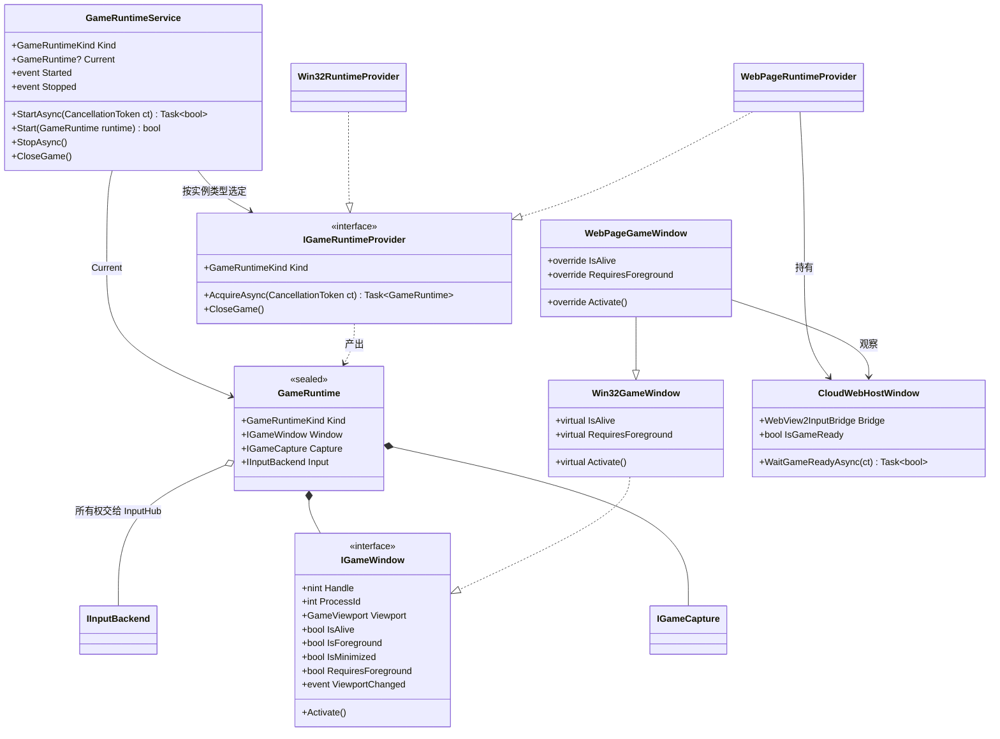

# BetterGI 游戏运行环境 GameRuntime 设计

> 状态：P1、P2 已实现（第 6 版） · 2026-09-30 · 前置：[InputHub 设计](input-hub.md)

第 6 版变更（维护者要求与 feat/yys 的目标对齐，正文已同步，汇总见第 11 节）：

- 实例名参数改为 `--instance-name`，并登记到根实例的端点。
- 数据目录改为 `WebView2Data/CloudGame/<实例名>`。
- 页面地址固定为 `https://ys.mihoyo.com/cloud/?autobegin=1`，删除 `CloudWebConfig`。
- WebView2 禁止缩放、关闭状态栏，开发者工具只在 Debug 下可用。
- 页面固定按 100% 渲染，不跟随系统缩放；宿主改为直接托管 `CoreWebView2Controller`，不再使用 WPF `WebView2` 控件（7.2）。
- 宏回放改走 InputHub；网页版跳过本地原神设置检查。

第 5 版变更（维护者要求，正文已同步）：

- 网页版截图改用 WGC（`GraphicsCapture`），不再用 `GraphicsCaptureV2`。
- 宿主客户区锁定为 1920×1080 物理像素，不能调整大小或最大化。
- 网页版实例不显示主界面，只显示宿主窗口；关闭宿主即退出实例。原先为网页版准备的主界面改动随之删除。

第 4 版变更：P2 落地，与设计有出入的地方已同步到正文，汇总见第 11 节"P2 实施说明"。

第 3 版变更：落实第 15 节的确认结果。

- 页面默认地址为 `https://ys.mihoyo.com/cloud/`。
- 网页版实例不响应任何热键。
- 宿主禁用 Chromium 的遮挡与后台降频。
- RTC 断线只停止截图器。
- 文字输入只加注释，不做适配。
- 配置共享问题由维护者另行安排。

第 2 版变更：

- P1 优化：
  - Provider 的两个启动方法合并为 `AcquireAsync`。
  - WinEventHook 改为只订阅游戏进程，并去掉 SKIPOWN 标志。
  - `WebPageGameWindow` 改为继承 `Win32GameWindow`。
  - 启动统一切到 UI 线程执行。
  - 截图参数改为集中构建。
- P2 补充：
  - 网页版实例改为"命名多实例"，WebView 数据按实例名存放。
  - 补充宿主窗口、截图、输入精简与接入的设计。

## 1. 背景

BetterGI 目前只支持一种运行环境：本机上的一个 Win32 游戏窗口（本地原神或 Windows 云原神客户端）。代码里没有"运行环境"类型，整个程序用一个 `IntPtr GameHandle` 表示它，相关职责分散在四处：

| 位置 | 承担的职责 |
| --- | --- |
| `SystemControl`（静态） | 找窗口、启动和关闭游戏、前台判断、激活与焦点、窗口几何 |
| `TaskContext.Init(hWnd)` | 写死 `new Win32InputBackend(hWnd)` 和 `new SystemInfo(hWnd)` |
| `TaskTriggerDispatcher.Start(hWnd, mode, interval)` | 创建截图器、激活窗口、挂 WinEventHook；Tick 中判断存活、前台、最小化 |
| `HomePageViewModel.OnStartTriggerAsync` | 启动编排：关 HDR → 找窗口 → 关联启动 → `Start(hWnd)` |

云原神网页版运行在 WebView2 中，和 Win32 窗口有四点不同，现有的 hWnd 模型接不进去：

1. 游戏"进程"就是 BetterGI 自己。`GameProcess.HasExited` 永远为 false；按进程名判断前台时，BetterGI 主窗口也会被当成游戏。
2. 输入经 RTC 数据通道发往云端，不需要前台。但 `TaskControl` 的每次 Sleep / Delay 都会检查前台并抢焦点。
3. 宿主窗口和调度器在同一进程。Dispatcher 的 WinEventHook 带 `WINEVENT_SKIPOWNPROCESS`，收不到宿主窗口的事件。
4. 截图方式应该由运行环境决定，但现在只能来自用户配置。

启动链路上还有几处反 DI 的写法：
- `ScriptService.StartGameTask` 通过 `App.GetService<HomePageViewModel>()` 反向调用 ViewModel；
- `TaskTriggerDispatcher` 自己创建截图器；
- `TaskContext` 可以在任何地方被写入。

## 2. 目标与非目标

目标：

- 把"窗口 + 截图 + 输入"收成一个可替换的单元 `GameRuntime`，由各环境的 Provider 产出。
- 实现两种运行环境：Win32Window（现有行为）和 WebPage（云原神网页版）。
- 网页版以命名实例运行，可以同时开多个，每个实例使用独立的 WebView 数据目录。
- 运行环境由 DI 管理。`TaskContext`、`SystemControl`、`InputHub` 保留为静态入口并改为转发，500+ 调用点不改。
- 精简 `TaskContext` 与现有的 WebSdk 输入实现。

非目标：

- 一个进程同时驱动多个游戏。一个进程同一时刻只有一个运行环境，多开靠多进程。
- 主实例与网页版实例之间的任务下发和状态回传（`task.*` IPC）。
- 按实例拆分 `User/config.json`。由维护者另行安排，见第 15 节。
- 网页版的文字输入适配，见 7.5。
- 游戏画面没有铺满 WebView 时的子区域裁剪。
- 静态调用点改为构造注入（P3 渐进进行）。

## 3. 术语

| 术语 | 含义 |
| --- | --- |
| 运行环境（`GameRuntime`） | 一次绑定的产物：游戏窗口 + 截图器 + 输入后端。启动截图器即绑定，停止即解绑 |
| 游戏窗口（`IGameWindow`） | 游戏画面所在的顶层 Win32 窗口；网页版就是宿主窗口 |
| 画面区域（`GameViewport`） | 游戏画面在屏幕上的物理像素矩形，即现在的 `CaptureAreaRect` |
| Provider（`IGameRuntimeProvider`） | 负责某种运行环境的获取和关闭，产出 `GameRuntime` |
| 网页版实例 | 以 `--instance webview --instance-name <实例名>` 启动的独立 BetterGI.exe 进程 |
| 实例名 | 网页版实例启动前由用户指定，用于区分实例和 WebView 数据目录 |
| 宿主窗口（`CloudWebHostWindow`） | 网页版实例中承载云原神页面的 WPF 窗口 |

实例类型与运行环境一一对应，不需要配置项：

| 实例类型 `BetterGiInstanceType` | 运行环境 `GameRuntimeKind` | 游戏 |
| --- | --- | --- |
| Primary / ChildSession | Win32Window | 本地原神、Windows 云原神 |
| WebView | WebPage | 云原神网页版 |

Wine 不算运行环境：它仍然是 Win32 窗口，保留现有的 `WinePlatformAddon` 分支。

## 4. 实例拓扑

```text
Primary（BetterGI.exe）
├─ GameRuntimeService ─ Win32RuntimeProvider
├─ 调度器 / 任务 / 脚本 / 遮罩
└─ 首页「云原神网页版」卡片 ─ WebViewInstanceStore（实例名列表）
      │ WebViewInstanceLauncher.Launch("小号A")
      ▼
网页版实例「小号A」（BetterGI.exe --instance webview --instance-name 小号A start）
├─ GameRuntimeService ─ WebPageRuntimeProvider
├─ 调度器 / 任务 / 脚本 / 遮罩（功能完整，由命令行驱动）
├─ 不创建 MainWindow
└─ CloudWebHostWindow ─ WebView2（唯一界面，即 Application.MainWindow；数据目录 WebView2Data/CloudGame/小号A）

网页版实例「小号B」……（结构相同，与「小号A」互不影响）
```

- 每个进程各有一套运行环境、调度器和任务。`TaskContext`、`InputHub`、`TaskTriggerDispatcher` 都是进程级单例，天然隔离。
- 网页版实例通过已有的根管道登记到 Primary（`WebViewConnectionsByProcessId`），本期不新增 IPC 操作。
- 同名实例同一时刻只能运行一个，靠实例名互斥体保证（7.1）。

## 5. 运行环境抽象（L2）

### 5.1 层级与依赖规则

```text
L4 使用方    Task / Trigger / JS 脚本 / Region / 遮罩 / HomePageViewModel / ScriptService
               │ 只依赖 L3 和 L2
L3 编排层    GameRuntimeService（DI 单例）；TaskContext（静态入口，只读转发）
L2 抽象层    GameRuntime = IGameWindow + IGameCapture + IInputBackend；IGameRuntimeProvider
L1 实现层    Win32   ：Win32GameWindow、Win32RuntimeProvider
             WebPage ：WebPageGameWindow（继承 Win32GameWindow）、WebPageRuntimeProvider、CloudWebHostWindow
L0 原始层    SystemControl 的 Win32 函数 / Fischless.GameCapture / InputHub 各后端 / WebView2
```

- 只允许上层依赖下层。L4 唯一可以直接用 L1 的地方是手动选窗：`Win32RuntimeProvider.AttachTo(hWnd)`，而且这个入口只在 Win32 实例中显示。
- `IGameCapture` 和 `IInputBackend` 直接复用，不再包一层。
- 目录：
  - 抽象与实现放在 `GameTask/Runtime/{Win32,WebPage}`，命名空间为 `BetterGenshinImpact.GameTask.Runtime`；
  - 宿主窗口放在 `View/Windows/CloudWebHostWindow.xaml`；
  - 实例名存储与启动器放在 `Service/Instance/`。

### 5.2 类图



### 5.3 接口定义

```csharp
namespace BetterGenshinImpact.GameTask.Runtime;

public enum GameRuntimeKind
{
    /// <summary>本机 Win32 游戏窗口：本地原神、Windows 云原神</summary>
    Win32Window,

    /// <summary>WebView2 承载的云原神网页版</summary>
    WebPage,
}

/// <summary>游戏画面在屏幕上的区域。ScreenRect 为物理像素，尺寸与截图帧一致</summary>
public readonly record struct GameViewport(RECT ScreenRect, float DpiScale)
{
    public int Width => ScreenRect.Width;

    public int Height => ScreenRect.Height;
}

/// <summary>
/// 游戏画面所在的顶层窗口，网页版为宿主窗口。
/// 成员都是实时查询，会在 Tick 所在的线程池线程上调用，实现不能访问 WPF 对象
/// </summary>
public interface IGameWindow : IDisposable
{
    /// <summary>顶层窗口句柄。用于截图、遮罩定位，兼容 TaskContext.GameHandle</summary>
    nint Handle { get; }

    /// <summary>窗口所属进程。网页版为当前 BetterGI 进程</summary>
    int ProcessId { get; }

    GameViewport Viewport { get; }

    /// <summary>Win32：游戏进程未退出；网页版：宿主窗口未关闭且 RTC 通道为 open</summary>
    bool IsAlive { get; }

    /// <summary>前台窗口就是 Handle</summary>
    bool IsForeground { get; }

    bool IsMinimized { get; }

    /// <summary>
    /// 操作游戏是否依赖前台。Win32 为 true（SendInput 只发往前台）；
    /// 网页版为 false（输入经 RTC 发往云端），失焦后任务继续运行
    /// </summary>
    bool RequiresForeground { get; }

    /// <summary>让窗口进入可操作状态。Win32：还原并置前；网页版：只从最小化还原，不抢前台</summary>
    void Activate();

    /// <summary>窗口移动或缩放。只做通知，最新值以 Viewport 为准</summary>
    event EventHandler? ViewportChanged;
}

/// <summary>一次绑定的产物。两种环境的差异都在 Provider 和 IGameWindow 的实现里</summary>
public sealed class GameRuntime(
    GameRuntimeKind kind, IGameWindow window, IGameCapture capture, IInputBackend input) : IDisposable
{
    public GameRuntimeKind Kind { get; } = kind;

    public IGameWindow Window { get; } = window;

    /// <summary>已经 Start 的截图器</summary>
    public IGameCapture Capture { get; } = capture;

    /// <summary>绑定时交给 InputHub.Attach，之后由 InputHub 负责释放</summary>
    public IInputBackend Input { get; } = input;

    /// <summary>释放截图器和窗口监听。不关闭游戏，也不释放 Input</summary>
    public void Dispose()
    {
        Capture.Dispose();
        Window.Dispose();
    }
}

/// <summary>每种运行环境一个实现，注册为 DI 单例</summary>
public interface IGameRuntimeProvider
{
    GameRuntimeKind Kind { get; }

    /// <summary>
    /// 获取运行环境：先附着到正在运行的游戏，没有就按本环境的策略启动后再附着。
    /// Win32：未开启关联启动时给出提示并返回 null。网页版：打开宿主窗口并等待就绪。
    /// 在 UI 线程上调用
    /// </summary>
    Task<GameRuntime?> AcquireAsync(CancellationToken ct);

    /// <summary>关闭游戏。Win32：结束游戏进程；网页版：关闭宿主窗口</summary>
    void CloseGame();
}
```

`GameRuntimeService` 的公开成员：

| 成员 | 说明 |
| --- | --- |
| `Kind` | 由实例类型决定，进程内不变 |
| `Current` / `IsRunning` | 当前运行环境 |
| `StartAsync(ct)` | 切到 UI 线程串行执行；已在运行时直接返回 true；停止请求会等待启动完成后再解绑 |
| `Start(GameRuntime)` | 用外部构造的运行环境启动，只用于手动选窗 |
| `StopAsync()` / `CloseGame()` | 等待启动完成后停止截图器 / 关闭游戏（转发给 Provider） |
| `Started` / `Stopped` | 供 HomePageViewModel 管理遮罩和 MouseKeyMonitor |
| `IsStarting` / `StartingChanged` | 正在执行 `AcquireAsync`（找窗、关联启动、网页版等待登录）。首页据此把启动按钮显示为"停止"，网页版实例显示等待提示 |

## 6. Win32 实现（P1）

### 6.1 Win32GameWindow

```csharp
/// <summary>在 UI 线程创建（WinEventHook 需要消息循环）</summary>
public class Win32GameWindow : IGameWindow
{
    public Win32GameWindow(nint hWnd);

    public nint Handle { get; }
    public int ProcessId { get; }                       // GetWindowThreadProcessId(Handle)
    public GameViewport Viewport =>                     // 沿用现有算法
        new(SystemControl.GetCaptureRect(Handle), DpiHelper.GetScale(Handle).Y);
    public virtual bool IsAlive => !_process.HasExited;
    public bool IsForeground => User32.GetForegroundWindow() == Handle;
    public bool IsMinimized => User32.IsIconic(Handle);
    public virtual bool RequiresForeground => true;
    public virtual void Activate();                     // 原 SystemControl.ActivateWindow(hWnd)
    public event EventHandler? ViewportChanged;
    public virtual void Dispose();                      // 解除钩子，释放 Process
}
```

WinEventHook 从 Dispatcher 搬进这里，同时做两处调整：

- `idProcess` 传 `ProcessId`，不再订阅全系统。现在的钩子会收到所有进程的 LOCATIONCHANGE 事件（光标、插入符移动也算），全部在 UI 线程上过滤。
- 去掉 `WINEVENT_SKIPOWNPROCESS | WINEVENT_SKIPOWNTHREAD`。钩子已经限定到游戏进程，不再需要这两个标志；网页版宿主和 BetterGI 同进程，也因此能收到事件。回调仍然按 `hwnd == Handle && idObject == 0` 过滤。

### 6.2 Win32RuntimeProvider

| 成员 | 行为 |
| --- | --- |
| `AcquireAsync` | 按配置关闭 HDR，然后 `FindGenshinImpactHandle`。找到就 `AttachTo`；没找到时，开启了关联启动则 `StartFromLocalAsync` 后 `AttachTo`，否则提示"未找到原神窗口"并返回 null |
| `AttachTo(hWnd)` | Activate，确认窗口没有最小化，`GameCaptureFactory.Create(配置的 CaptureMode)` 并 Start，然后组装 `GameRuntime`。输入为 `new Win32InputBackend(hWnd)` |
| `CloseGame` | 调用 `SystemControl.CloseGameProcesses()`（原 `CloseGame` 的实现）：按进程名结束同 Session 的游戏进程 |

截图参数由 `GameCaptureSettings.From(AllConfig)` 集中构建，生成的就是现在 Dispatcher 里那个字典：`autoFixWin11BitBlt`、`MinUpdateIntervalMs`、`UseCpuConvert`。两个 Provider 都用它。

原 `TaskContext.GetGenshinGameProcessNameList` 移到 `SystemControl.GetGenshinGameProcessNameList()`，因为找窗函数 `FindGenshinImpactHandle` 仍在那里，`DialogueOptionVoiceDiagnosticService` 也直接使用它：
- 已绑定 Win32 窗口时，返回 `Win32GameWindow.ProcessName`；
- 否则返回候选进程名。

`StartFromLocalAsync` 同样留在 `SystemControl`，作为 L0 函数由 Provider 调用。

## 7. 网页版实现（P2）

### 7.1 命名实例

实例名规则由 `WebViewInstanceStore` 统一校验：

- 去掉首尾空白后长度为 1~32；
- 不含 `\ / : * ? " < > |` 和控制字符，不以 `.` 结尾（因此也排除了 `.` 和 `..`）；
- 不能是 Windows 保留名（CON、PRN、AUX、NUL、COM1~9、LPT1~9），按第一个 `.` 之前的部分判断，`CON.txt` 同样被拒绝；
- 不区分大小写，不能重名。

这套规则与 feat/yys 的 `WebViewInstanceName` 等价，唯一的区别是末尾空格：feat/yys 直接拒绝，这里去掉后接受。

`WebViewInstanceStore` 同时负责存储：

| 成员 | 说明 |
| --- | --- |
| `Root` | `<exe目录>/WebView2Data/CloudGame`，与 feat/yys 一致。`WebView2Data` 本身是 HtmlMask 等功能共用的用户数据目录，它们不会使用 `CloudGame` 子目录，各实例的用户数据互相独立 |
| `List()` | 列出 `Root` 下名称合法的子目录，目录就是实例名的唯一存储，不另建索引文件 |
| `GetDataFolder(name)` | `Root/<name>`，作为该实例的 WebView2 用户数据目录 |
| `Create(name)` / `Delete(name)` | 新建目录 / 删除目录。删除只在实例未运行时可用，UI 需要二次确认 |
| `IsRunning(name)` | `Mutex.TryOpenExisting(MutexName(name))` |
| `MutexName(name)` | `Local\BetterGI.WebView.<小写实例名的 SHA-256 前 16 位>`。用哈希是为了避开非法字符和大小写差异 |

启动参数与实例身份：

- `WebViewInstanceLauncher.Launch(name)` 的参数为 `--instance webview --instance-name <name> start`，路径取 `Environment.ProcessPath`。以 dotnet dll 方式运行时，参考 `ChildSessionProcessLauncher.CreateBetterGiStartInfo`。参数名与 feat/yys 一致。
- `CommandLineOptions` 像处理 `--instance` 那样剥离 `--instance-name`，存为 `InstanceName`。`InstanceContext` 增加 `InstanceName`，只有 WebView 实例有值。
- `InstanceBootstrap` 对 WebView 实例额外做两件事：
  - 没有 `--instance-name` 或名称不合法时提示并退出；
  - 获取实例名互斥体（进程内一直持有），已被占用时提示"实例「name」已在运行"并退出。带 `--restart-from-pid` 时最多等待 15 秒，让应用内重启的旧进程先退出；旧进程未释放就退出时按已获取处理（`AbandonedMutexException`）。
  - 提示使用 WinForms MessageBox，和 App 启动失败时的兜底方式一样。
- `WebViewInstanceLauncher.Launch` 只启动已存在的实例（目录存在）且未在运行的实例，启动前先 `IConfigService.Flush()`，与桌面分身一致。
- `SystemControl.RestartApplication` 对 WebView 实例追加 `--instance-name`。
- 日志标识 `BgiInstance` 带上实例名，例如 `WebView(小号A):S1:P1234:T…`。
- 实例名随 `connection.open`（`ConnectionOpenRequest.InstanceName`）登记到根实例，写入 `InstanceEndpoint.InstanceName`，`webview.list` 按实例名排序。Primary 和其他实例因此能按名称识别网页版实例。
  - 根实例不按名称判重，同名互斥只由互斥体保证。应用内重启时，旧进程的连接可能还没被根清理，在根上判重会误拒新进程。

网页版实例不创建 MainWindow，`ApplicationHostService` 改走 `HandleWebViewActivation`：

- 总是调用 `HomePageViewModel.HandleActivation` → `GameRuntimeService.StartAsync`，与有没有 `start` 参数无关（例如应用内重启）。宿主窗口在 `StartAsync` 的同步阶段创建，并设为 `Application.MainWindow`，之后等待绑定。
- 一条龙：依次调用 `OneDragonFlowViewModel.OnNavigatedTo()`（加载配置列表）和 `LoadedCommand`（读取命令行后执行），与页面被导航到时的顺序一致。
- 配置组 / 任务进度：直接调用 `ScriptControlViewModel` 的对应方法。
- 这些命令都由 `StartGameTask` 自行启动截图器，与上面的自动启动走同一个串行的 `StartAsync`，不会重复绑定。

### 7.2 宿主窗口 CloudWebHostWindow

约束：

- 使用系统标题栏的普通 WPF `Window`，不用自绘标题栏（例如 FluentWindow + ExtendsContentIntoTitleBar）。自绘标题栏属于 Win32 客户区，会被截进画面，坐标也会偏。
- WebView2 铺满客户区，不留边距，也不放工具栏。
- 页面固定按 100% 渲染，不跟随系统缩放：
  - WebView2 默认按显示器 DPI 设置 `RasterizationScale`。150% 缩放时页面视口只有 1280×720 CSS 像素，页面自己的悬浮菜单、登录框等都会跟着放大，不同机器上的页面布局也不一样。
  - 宿主关闭 `ShouldDetectMonitorScaleChanges`，把 `RasterizationScale` 固定为 1，`BoundsMode = UseRawPixels`、`Bounds` 为客户区物理像素。页面视口因此始终是 1920×1080 CSS 像素，`devicePixelRatio` 为 1。
  - WPF 的 `WebView2` 控件不公开 `CoreWebView2Controller`，做不到这一点，所以宿主不用该控件，而是用 `CoreWebView2Environment.CreateCoreWebView2ControllerAsync(Handle)` 直接托管在窗口句柄上。宿主自己负责：客户区尺寸变化时更新 `Bounds`、窗口移动时 `NotifyParentWindowPositionChanged`、窗口激活时 `MoveFocus`（否则登录时键盘输入不进页面）、关闭时 `Close`。
  - 标题栏和边框属于非客户区，仍由系统按 DPI 绘制，不影响截图。
- 客户区锁定为 1920×1080 物理像素，不随 DPI 缩放，截图和识图直接工作在 1080P 下：
  - `ResizeMode="CanMinimize"`：不能拖动调整大小，也不能最大化；
  - `SourceInitialized` 中用 `SetWindowPos` 设置外框尺寸（当前边框 + 1920×1080），不走 DIP 换算，避免舍入误差；首次设置时按 `Screen.FromHandle` 的物理像素工作区居中，工作区放不下时记 warn，窗口会超出屏幕；
  - `OnDpiChanged`（拖到 DPI 不同的显示器）中重新锁定，因为 WPF 会按 DIP 缩放窗口。
- 不设 Topmost。现有 WGC 对 Topmost 窗口不做客户区裁剪。
- 网页版实例没有主界面，宿主就是唯一的窗口：由 `WebPageRuntimeProvider` 设为 `Application.MainWindow`，供对话框 Owner、`UIDispatcherHelper.MainWindow` 等使用。
- 标题为"云原神 · {实例名}"。关闭宿主窗口即退出实例（`Closed` 中 `BeginInvoke(Application.Shutdown)`），`CloseGame` 也会走到这里。

初始化：

1. 创建 `CoreWebView2Environment`，用户数据目录为 `WebViewInstanceStore.GetDataFolder(实例名)`，并通过 `AdditionalBrowserArguments` 禁用遮挡与后台降频：
   ```text
   --disable-features=CalculateNativeWinOcclusion
   --disable-backgrounding-occluded-windows
   --disable-renderer-backgrounding
   --disable-background-timer-throttling
   ```
   - 前两项让宿主在被遮挡时照常渲染，否则 WGC 会一直拿到旧帧（7.4）。
   - 后两项让页面在后台不降低优先级，也不限流定时器。SDK 的 `tapKey` / `click` 用 `setTimeout` 控制按住时长，限流后按键时序会被拉长。
   - 每个实例的数据目录都是独立的，这些参数不会和 HtmlMask 等功能的 WebView2 环境冲突。
2. `controller = await environment.CreateCoreWebView2ControllerAsync(Handle)`，然后设置（`ConfigureController`）。页面必须按 1:1 铺满 1920×1080 客户区，截图与输入坐标才一致：
   - `ShouldDetectMonitorScaleChanges = false`，`RasterizationScale = 1`，`BoundsMode = UseRawPixels`：不跟随系统缩放（见上）；
   - `IsZoomControlEnabled = false`，`ZoomFactor = 1`：禁止 Ctrl + 滚轮 / Ctrl + +/- 缩放（与 feat/yys 一致，下同）；
   - `IsStatusBarEnabled = false`：左下角的链接状态栏会被截进画面；
   - `AreDevToolsEnabled = RuntimeHelper.IsDebug`：开发者工具只在 Debug 下可用；
   - `IsWebMessageEnabled = true`：输入桥依赖 WebMessage，显式开启。
3. `bridge = await WebView2InputBridge.InstallAsync(core)`：注入 SDK 和分发脚本，然后返回桥（7.5）。
4. 导航到固定地址 `https://ys.mihoyo.com/cloud/?autobegin=1`（常量 `CloudGameUrl`，与 feat/yys 一致）。`autobegin=1` 让页面加载后自动开始游戏，不需要手动点"开始游戏"。不提供配置项：`config.json` 由所有实例共享，没法按实例区分。

就绪检测：

- 用 DispatcherTimer 每秒调用一次 `bridge.GetStatusAsync()`。`rtcDataChannelState == "open"` 且 `gameDataStarted == true` 时，`IsGameReady` 为 true。
- 已就绪之后，连续 3 次未就绪（约 3 秒）才判定为断开，避免单次查询失败就停掉任务。
- 断开后只让截图器停止（Tick 发现 `IsAlive == false`），不自动刷新页面，也不自动重新绑定。网页版实例没有主界面、不响应热键，无法手动重新启动截图器，需要关闭宿主窗口（即退出实例）后从 Primary 重新启动。这条限制写在 `CloudWebHostWindow` 和 `WebPageGameWindow.IsAlive` 的代码注释里，避免以后有人误以为这里会自动重连。
- `IsGameReady` 用 volatile 字段保存。Tick 线程通过 `WebPageGameWindow.IsAlive` 读取它。
- `WaitGameReadyAsync(ct)` 等到就绪为止，不设短超时，因为登录和排队可能要几分钟。就绪返回 true，宿主被关闭返回 false，取消时抛 `OperationCanceledException`。未就绪的原因（例如页面更新导致 ClientCore 模块找不到）只在变化时记一条 Debug 日志。
- 初始化失败（例如未安装 WebView2 Runtime）时弹出错误提示并关闭窗口，等待中的启动随之返回。

### 7.3 运行环境：WebPageGameWindow 与 WebPageRuntimeProvider

宿主是一个真实的顶层 Win32 窗口，而且 WebView 铺满客户区，所以 `WebPageGameWindow` 继承 `Win32GameWindow`，只覆写三个成员：

```csharp
public sealed class WebPageGameWindow(CloudWebHostWindow host) : Win32GameWindow(host.Handle)
{
    /// <summary>宿主关闭后 IsGameReady 为 false</summary>
    public override bool IsAlive => host.IsGameReady;

    public override bool RequiresForeground => false;

    /// <summary>只从最小化还原，不抢前台</summary>
    public override void Activate()
    {
        if (IsMinimized)
        {
            User32.ShowWindow(Handle, ShowWindowCommand.SW_RESTORE);
        }
    }
}
```

以下成员直接继承，不需要单独实现：
- `Viewport`、`IsForeground`、`IsMinimized`、`ProcessId`（即当前进程）；
- `ViewportChanged`：钩子限定到当前进程即可收到宿主事件。

`WebPageGameWindow` 还订阅宿主的 Closing 事件，在其中调用 `InputHub.ReleaseAll()`（input-hub.md 5.7.5 第 5 步）。Closing 在 UI 线程上触发，桥会直接投递 `releaseAll`（7.5），能在页面销毁前送达。

`AcquireAsync` 在就绪后先调用一次 `window.Activate()`：宿主最小化时 WGC 拿不到帧，画面尺寸也不满足 `SystemInfo` 的要求。

`WebPageRuntimeProvider.AcquireAsync`：

```text
1. host = 已有宿主 ?? 新建 CloudWebHostWindow，设为 Application.MainWindow 并 Show()   Provider 持有宿主
2. await host.WaitGameReadyAsync(ct)                           日志：等待云原神就绪（登录 / 排队）
3. window  = new WebPageGameWindow(host)
   capture = new GraphicsCapture(); capture.Start(host.Handle, GameCaptureSettings.From(config))
             与 Win32 路径一样在 UI 线程上创建（帧池用 Direct3D11CaptureFramePool.Create）
   input   = new WebSdkInputBackend(host.Bridge, () => window.Viewport.ScreenRect)
4. return new GameRuntime(GameRuntimeKind.WebPage, window, capture, input)
```

`CloseGame` 关闭宿主窗口（经 Dispatcher 切到 UI 线程），宿主关闭即退出实例。`GameRuntime.Dispose` 不关闭宿主，和"停止截图器不关闭本地游戏"一致。

### 7.4 截图

- 固定使用 WGC（`GraphicsCapture`，不是 `GraphicsCaptureV2`），对宿主窗口句柄截图，参数取 `GameCaptureSettings.From(config)`，不读 `CaptureMode`。
  - 不读 `CaptureMode` 是因为 `config.json` 由所有实例共享，网页版实例改了它会影响 Primary。
  - 网页版实例没有主界面，截图模式等 Win32 专属设置本来就看不到。
- `Fischless.GameCapture` 不改。现有 WGC 已经会从窗口裁出客户区，而 7.2 的约束保证客户区就是 1920×1080 的游戏画面。
- 宿主和 BetterGI 同进程，WGC 可以用 `CreateForWindow` 截取本进程的窗口。WebView2 的内容在宿主的子 HWND 中渲染，由 DWM 合成到宿主窗口，需要实测确认能截到（13.2 #3）。
- WGC 在没有新帧时会返回缓存帧。如果 Chromium 在宿主被遮挡时停止渲染，任务会拿到旧画面而不自知。因此宿主通过浏览器参数禁用了遮挡降帧（7.2），测试见 13.2 #5。
- 扩展方式：以后如果需要其他截图方式（例如 `CoreWebView2.CapturePreviewAsync`），新增一个 `IGameCapture` 实现，由 `WebPageRuntimeProvider` 选择，上层不受影响。

### 7.5 输入：接入与精简

`Resources/JavaScript/ys-input-inject.js` 与 `E:\HuiTask\云原神\_analysis\ys-input-inject.js` 的内容一致，只是换行符不同。但 csproj 里没有任何打包项，发布后找不到这个脚本。

现有 `Core/Input/Backends/WebSdk/` 有 5 个文件，精简为 4 个：

| 文件 | 调整 |
| --- | --- |
| `WebSdkChannel.cs` | 删除，内容并入 `WebSdkInputBackend` |
| `WebSdkInputBackend.cs` | 改为 `WebSdkInputBackend : InputChannelBase, IInputBackend`。自身就是通道，`Foreground` 和 `Background` 都返回 `this`；`ReleaseAll()` 同时实现两个接口。保留 `Sdk` 属性作为扩展口 |
| `WebView2InputBridge.cs` | 新增 `static Task<WebView2InputBridge> InstallAsync(CoreWebView2 core)`，负责注入嵌入资源中的 SDK 和 `BootstrapScript`；新增 `GetStatusAsync()`；投递改为非阻塞；删除 `InvokeFailed` |
| `IWebInputBridge.cs` | 保留单个 `Invoke` 方法，修正注释里过时的脚本路径 |
| `WebKeyCodes.cs` | 不变 |

桥的实现要点：

- 注入：`ys-input-inject.js` 设为 `EmbeddedResource`（LogicalName `BetterGenshinImpact.Resources.JavaScript.ys-input-inject.js`），`InstallAsync` 用 `AddScriptToExecuteOnDocumentCreatedAsync` 注入它和 `BootstrapScript`。宿主只需要调用这一个方法，构造函数和 `BootstrapScript` 改为私有。
  - 注入脚本也会在子 frame 中执行，而子 frame 没有 `chrome.webview`：SDK 原文不改，外面包一层 `if (window.top === window)`；分发脚本同样只在顶层文档生效。
- 调用：其他线程由 `Dispatcher.Invoke` 改为 `Dispatcher.BeginInvoke`，UI 线程上直接投递。
  - 同优先级的调用按 FIFO 执行，同一线程内顺序不变；
  - 任务线程不再阻塞，也不会在 UI 线程同步等待任务时死锁；
  - UI 线程直接投递，保证宿主 Closing 中发出的 `releaseAll` 能在页面销毁前送达；
  - 投递失败（例如页面已关闭）在 UI 线程内捕获并限频打 warn；桥已释放时 `Invoke` 同步抛 `InvalidOperationException`，与原契约一致。
- 状态：`GetStatusAsync()` 执行 `ExecuteScriptAsync`，在页面内用 try/catch 包住 `window.__ysInputInject?.status()`，返回 `WebSdkStatus(RtcDataChannelState, GameDataStarted, Error)`，其中 `IsReady => RtcDataChannelState == "open" && GameDataStarted == true`。
- 错误：删除 `InvokeFailed` 事件。它现在没有订阅者，页面断开改由状态轮询发现。页面回报的调用错误限频打 warn。

扩展方式：

- 键鼠接口表达不了的能力，直接调用 `WebSdkInputBackend.Sdk.Invoke(方法名, 参数)`，不用改接口。
- 文字输入本期不适配，只在 `GlobalMethod.InputText` 上加注释。注释写明三点：
  - 网页版下，写本机剪贴板对云端无效；
  - 需要时可以把"写本机剪贴板"换成 `Sdk.Invoke("sendClipboard", text)`，或者直接调用 `Sdk.Invoke("sendIme", text)`；
  - 两种方式都没有实测过。
- `WebSdkInputBackend` 里相对移动和滚轮的系数 TODO 保留，P2 测试时一起标定。

接入：由 `WebPageRuntimeProvider` 创建后端，`GameRuntimeService` 负责 `InputHub.Attach`。落地后同步更新 input-hub.md 的 5.7.5 和 5.9。

### 7.6 界面

Primary 的首页新增「云原神网页版」卡片，只在 `IsRoot` 时显示：
- 实例名下拉框，数据来自 `WebViewInstanceStore.List()`，并用 `IsRunning` 标出运行中的实例（"名称（运行中）"）；
- 刷新、启动、新建（`PromptDialog` 输入名称并校验）、删除（`ThemedMessageBox.QuestionAsync` 二次确认）四个按钮。
- 实例正在运行时禁用启动和删除。运行状态在进入首页、启动实例 3 秒后、点击刷新时更新。

Primary 的首页：截图器启动过程中（`GameRuntimeService.IsStarting`），启动按钮显示为"停止"；停止按钮提交停止请求，在本次启动结束后解绑（获取完成后直接放弃，不再绑定）。

网页版实例：

- 不显示主界面，只显示宿主窗口（7.1、7.2）。任务由启动参数决定：默认只启动截图器（实时触发器照常工作），一条龙、配置组、任务进度由对应的命令行参数触发。
- 因为没有主界面，原先为网页版准备的界面改动都已去掉：标题栏徽章、首页隐藏 Win32 专属设置、"等待云原神就绪"提示、热键页 InfoBar。
  - "同时启动原神"卡片里的配置仍按共享配置生效，例如"自动进入游戏"对网页版同样有效。
- 要结束等待或结束实例，关闭云原神窗口即可。
- 不响应任何热键，全局热键和键鼠监听都算在内：
  - `HotKeyPageViewModel.IsHotKeyEnabled` 在网页版实例中为 false，跳过全部 `RegisterHotKey`。热键原本在 `HomePage` 构造时初始化，网页版实例不创建页面，所以这里只是兜底；
  - 热键配置由所有实例共享，只能在 Primary 中编辑；
  - 这样也避开了同一 Session 中全局热键只能被先启动的实例注册的问题。

## 8. 生命周期、所有权与 DI

```text
启动（首页按钮 / ScriptService.StartGameTask / 命令行 start）
  GameRuntimeService.StartAsync(ct)             切到 UI 线程；串行；已在运行时返回 true
    1. runtime = await provider.AcquireAsync(ct)    期间 IsStarting = true；返回 null 时整体返回 false
       获取期间收到停止请求（stopVersion 变化）：释放 runtime，返回 false，不绑定
    2. TaskContext.Instance().Bind(runtime)         由 Viewport 构建 SystemInfo，记录 DpiScale 快照
    3. InputHub.Attach(runtime.Input)
    4. dispatcher.Start(runtime, interval)          加载触发器，订阅 ViewportChanged，启动定时器
    5. 触发 Started                                  HomePageViewModel 显示遮罩；Win32 实例订阅 MouseKeyMonitor
    第 2~4 步任一步抛异常：回滚已完成的步骤，然后 runtime.Dispose()

停止（按钮 / Tick 发现 !IsAlive 或截图器停止 / 切换截图模式）
  GameRuntimeService.StopAsync()
    0. 等待 _startLock；停止请求之前排队的 StartAsync 跳过绑定
    1. CancellationContext.Instance.Cancel()
    2. dispatcher.Stop()
    3. InputHub.ReleaseAll()，然后 Attach 未绑定后端     显式释放旧后端输入，再切换
    4. TaskContext.Instance().Bind(null)
    5. runtime.Dispose()
    6. 触发 Stopped                                  HomePageViewModel 隐藏遮罩，取消订阅
```

| 资源 | 创建方 | 释放方 |
| --- | --- | --- |
| `GameRuntime` | Provider | `GameRuntimeService.StopAsync` |
| `IGameCapture`、`IGameWindow` | Provider | `GameRuntime.Dispose` |
| `IInputBackend` | Provider | `InputHub`（被替换时） |
| `CloudWebHostWindow` | `WebPageRuntimeProvider` | 用户关闭 / `CloseGame`，关闭后退出实例 |
| `WebView2InputBridge` | `CloudWebHostWindow` | 宿主关闭时 |
| 实例名互斥体 | `InstanceBootstrap` | 进程退出 |

```csharp
services.AddSingleton<Win32RuntimeProvider>();
services.AddSingleton<IGameRuntimeProvider>(sp => sp.GetRequiredService<Win32RuntimeProvider>());
services.AddSingleton<IGameRuntimeProvider, WebPageRuntimeProvider>();
services.AddTransient<CloudWebHostWindow>();
services.AddSingleton<Func<CloudWebHostWindow>>(sp => () => sp.GetRequiredService<CloudWebHostWindow>());
services.AddSingleton<GameRuntimeService>();
services.AddSingleton<WebViewInstanceStore>();
services.AddSingleton<WebViewInstanceLauncher>();
```

`GameRuntimeService` 通过构造函数注入：
- `IEnumerable<IGameRuntimeProvider>`，按 `InstanceType == WebView ? WebPage : Win32Window` 从中选定；
- `InstanceBootstrap`、`TaskTriggerDispatcher`、`IConfigService`、`ILogger<GameRuntimeService>`。

`HomePageViewModel` 在启动时一定会被创建：Primary 中 `ApplicationHostService` 总是先导航到首页；网页版实例没有页面，由 `HandleWebViewActivation` 直接从 DI 取出它。所以遮罩交给它管理，`GameRuntimeService` 不依赖任何 View。

## 9. TaskContext 拆分

使用次数按 `TaskContext.Instance().成员` 统计。

| 成员 | 使用情况 | 处理 | 去向 |
| --- | --- | --- | --- |
| `Init(IntPtr)` | 1 处（Dispatcher.Start） | 删除 | `internal Bind(GameRuntime?)`，只由 `GameRuntimeService` 调用 |
| `IsInitialized { set; }` | 读 17 处 / 16 个文件；外部写 1 处（HomePageViewModel.Stop） | 改为只读 | `=> Runtime is not null` |
| `GameHandle { set; }` | 34 / 24 | 改为 private set，兼容保留 | Bind 时记录，解绑后保留最近一次的句柄（与改造前一致）；新代码用 `Runtime.Window` |
| `DpiScale { set; }` | 27 / 22 | 改为 private set | Bind 时记录快照 |
| `SystemInfo { set; }` | 119 / 64 | 改为 private set | Bind 时由 Viewport 构建 |
| `GetGenshinGameProcessNameList()` | 3 处，全在 SystemControl | 移出 | 见 6.2 |
| `LinkedStartGenshinTime` | 写 1 处；唯一的读取在 GameLoading.cs:80，已被注释 | 删除 | 这个状态无人读取 |
| `CurrentScriptProject` | 写 1 处，读 3 处（Http、Notification、HtmlMaskWindow） | 移出 | `RunnerContext.CurrentScriptProject`，生命周期不变 |
| `Config` | 296 / 120 | 暂留 | 只是转发配置。不加 Obsolete，避免产生 296 条警告；P3 迁移 |
| `Instance()` | 506 / 173 | 保留 | 静态入口 |

```csharp
public class TaskContext
{
    public static TaskContext Instance() { /* 不变 */ }

    /// <summary>当前运行环境。截图器未启动时为 null</summary>
    public GameRuntime? Runtime { get; private set; }

    public bool IsInitialized => Runtime is not null;

    /// <summary>最近一次绑定的窗口句柄，解绑后保留。兼容旧调用点，新代码请使用 Runtime.Window</summary>
    public IntPtr GameHandle { get; private set; }

    /// <summary>绑定时的快照。解绑后保留最后一次的值，与现状一致</summary>
    public float DpiScale { get; private set; }

    /// <summary>绑定时由 Viewport 构建。解绑后保留最后一次的值，与现状一致</summary>
    public ISystemInfo SystemInfo { get; private set; }

    /// <summary>只是转发 ConfigService.Config。新代码请注入 IConfigService</summary>
    public AllConfig Config => /* 不变 */;

    internal void Bind(GameRuntime? runtime)
    {
        if (runtime is not null)
        {
            var viewport = runtime.Window.Viewport;
            SystemInfo = new SystemInfo(viewport); // 分辨率不合规时抛异常，Runtime 保持不变
            DpiScale = viewport.DpiScale;
            GameHandle = runtime.Window.Handle;
        }

        Runtime = runtime;
    }
}
```

`ISystemInfo` 同步删除 `GameProcess`、`GameProcessName`、`GameProcessId`。这三个成员共有 5 处使用，分别改为 `Window.IsAlive`、`Win32GameWindow` 和 `Window.ProcessId`。`SystemInfo` 的构造函数改为 `SystemInfo(GameViewport)`，原来的最小化检查移到 `AttachTo`。

## 10. 调用点改造

| 位置 | 改造后 | 期 |
| --- | --- | --- |
| `HomePageViewModel` 启动 / 停止 / 手动选窗 | 调用 `GameRuntimeService`；遮罩和 MouseKeyMonitor 放在 Started / Stopped 中处理；删除 `_hWnd` 和 `OnUiTaskStartTick`（`UiTaskStartTickEvent` 只在注释代码里被触发） | P1 |
| `ScriptService.StartGameTask`、`ArtifactOcrDialog` | 改为 `App.GetService<GameRuntimeService>()` 并调用 `StartAsync()`，不再反向获取 ViewModel。`StartGameTask` 是静态方法，调用方里还有直接 new 出来的 `TaskRunner`，无法构造注入，P3 再处理 | P1 |
| `SystemControl.CloseGame()` | 保留为静态入口，转发到 `GameRuntimeService.CloseGame()`。调用点（`ScriptService`:419、`OneDragonFlowViewModel` 3 处）不改，因为 `OneDragonFlowViewModel` 也会被 `TaskSettingsPageViewModel` 直接 new，无法构造注入 | P1 |
| `TaskTriggerDispatcher.Start` | `Start(GameRuntime, interval)`：只负责加载触发器、订阅 ViewportChanged、启动定时器；截图器和钩子移出 | P1 |
| `TaskTriggerDispatcher.Tick` | 每帧检查 `Window.IsAlive`；最小化和前台判断改用 `Window` 的成员；`RequiresForeground == false` 时，失焦也执行全部触发器；遮罩白名单改为"前台属于本进程或游戏进程，或者是 Idle" | P1 |
| `TaskTriggerDispatcher.SyncMaskWindowPosition` / `GlobalGameCapture` | 分别改读 `Window.Viewport` 和 `Runtime.Capture` | P1 |
| `OverlayMetricsService`:411 | 改用 `Window.IsAlive` / `Window.ProcessId` | P1 |
| `SystemControl.ActivateWindow()` | 转发到 `Runtime.Window.Activate()`，未启动时照旧抛出"请先启动BetterGI" | P1 |
| `SystemControl.IsGenshinImpactActive / Minimized` | 不改，继续按 `TaskContext.GameHandle` 判断。绑定期间与 `Window` 的结果一致；解绑后 `GameHandle` 保留旧值，键鼠监听类热键的行为与改造前相同 | — |
| `SystemControl.IsGenshinImpactActiveByProcess` | `RequiresForeground == false` 时返回 true，否则保持原逻辑。它的 9 个调用点实际是在问"现在能不能操作游戏" | P1 |
| `SystemControl.StartFromLocalAsync` / `CloseGameProcesses`（原 `CloseGame` 的实现） | 保留为 L0 函数，由 `Win32RuntimeProvider` 调用 | P1 |
| `TaskControl.CheckAndActivateGameWindow` | `RequiresForeground == false` 时，只在最小化时调用 `Activate()` | P1 |
| `CommandLineOptions` / `InstanceContext` / `InstanceBootstrap` | 支持 `--instance-name`，获取实例名互斥体 | P2 |
| `ConnectionOpenRequest` / `InstanceEndpoint` / `InstanceRequestHandler` / `InstanceService` | 登记与展示实例名，`webview.list` 按实例名排序 | P2 |
| `KeyMouseMacroPlayer` | 改走 `InputHub.Foreground`，网页版中也能回放（input-hub.md 第 6 版） | P2 |
| `MaskWindow` / `HomePageViewModel` | 网页版跳过本地原神的注册表设置检查和安装目录读取 | P2 |
| `SystemControl.RestartApplication`、`App.xaml.cs` 日志标识 | 带上实例名 | P2 |
| `BetterGenshinImpact.csproj` | 把 `ys-input-inject.js` 设为 EmbeddedResource | P2 |
| `GlobalMethod.InputText` | 只加注释，说明网页版的替代方式（7.5） | P2 |
| `HotKeyPageViewModel` | 网页版实例中不注册任何热键（兜底） | P2 |
| `ApplicationHostService` | 网页版实例不创建 MainWindow，改走 `HandleWebViewActivation`（7.1） | P2 |
| `HomePage` | Primary 的「云原神网页版」卡片；启动按钮改绑 `IsTriggerButtonChecked`（7.6） | P2 |

以下调用点不用改：
- `MaskWindow` / `HtmlMaskWindow` 定位；
- `DpiHelper`、`AssertUtils.CheckGameResolution`、各任务的 `LogScreenResolution`；
- `KeyMouseHook`；
- `GameCaptureRegion` → `DesktopRegion` 点击链路；
- 画中画定位。

它们只用 GameHandle 做几何计算。网页版的 Handle 也是真实的顶层窗口，并且 WebView 铺满客户区，所以算出来的结果与 Viewport 一致。网页版的坐标换算只是 0~65535 与屏幕像素之间的算术往返，不受多显示器影响。

## 11. 迁移步骤

P1：纯重构，只有 Win32 实现，除 12.1 所列差异外行为不变。

1. 新增 L2 类型：`GameRuntimeKind`、`GameViewport`、`IGameWindow`、`GameRuntime`、`IGameRuntimeProvider`。
2. 新增 `Win32GameWindow`（包含 6.1 的钩子调整）、`Win32RuntimeProvider`、`GameCaptureSettings`。
3. 新增 `GameRuntimeService` 并完成 DI 注册。首页、`ScriptService`、`OneDragonFlowViewModel` 改为调用它。
4. 按第 9 节收缩 `TaskContext` 和 `ISystemInfo`。
5. 按第 10 节改造 Dispatcher、`SystemControl`、`TaskControl`。
6. 编译，然后按 13.1 回归。

P1 实施说明：
- 已完成步骤 1~5，解决方案编译通过。13.1 的手动回归尚未进行。
- P1 只注册了 `Win32RuntimeProvider`。`GameRuntimeService` 找不到 WebView 实例对应的 WebPage Provider 时，会记录警告并回退到 Win32，行为与改造前相同。这个回退标了 `TODO(P2)`，P2 注册 `WebPageRuntimeProvider` 后删除。

P2：网页版。

1. 实例命名：`--instance-name` 参数、`InstanceName`、互斥体、重启参数、日志标识。
2. `WebViewInstanceStore`、`WebViewInstanceLauncher`，以及 Primary 首页卡片。
3. 按 7.5 精简输入，并把脚本改为嵌入资源。
4. `CloudWebHostWindow`：初始化、注入、就绪检测。
5. `WebPageGameWindow`、`WebPageRuntimeProvider`，并完成 DI 注册。
6. 网页版实例界面（7.6）。
7. 按 13.2 测试，并标定相对移动和滚轮系数。

P2 实施说明：
- 已完成步骤 1~6，解决方案编译通过，命令行解析的单元测试（`InstanceIpcProtocolTests`）通过。步骤 7 的手动测试与系数标定尚未进行。
- P1 的 Win32 回退已删除：找不到对应的 Provider 时 `GameRuntimeService` 直接抛异常。
- 与设计的出入（正文已同步）：
  - 获取期间收到停止请求时，获取完成后直接放弃，不绑定（原设计是绑定后再解绑，效果相同，但不会闪一下遮罩、也不会加载触发器）。网页版要立即结束等待，关闭宿主窗口即可。
  - 桥在 UI 线程上直接投递，其他线程才用 `BeginInvoke`（7.5），否则 Closing 里的 `releaseAll` 送不到页面。
  - SDK 注入外包 `if (window.top === window)`，分发脚本也只在顶层文档生效（7.5）。
  - 网页版实例没有 `start` 参数也会自动打开宿主（7.1）。
- 第 5 版调整（正文已同步）：
  - 截图由 `GraphicsCaptureV2` 改为 `GraphicsCapture`（7.3、7.4）。
  - 宿主由"锁定 16:9、最小 1280×720"改为客户区固定 1920×1080 物理像素，`ResizeMode="CanMinimize"`，DPI 变化后重新锁定（7.2）。删除了 `WindowAspectRatioBehavior` 的使用、`WS_MAXIMIZEBOX` 处理和 `StateChanged` 兜底。
  - 网页版实例不创建 MainWindow，宿主成为 `Application.MainWindow`，关闭即退出实例；命令行任务由 `ApplicationHostService.HandleWebViewActivation` 驱动（7.1、7.2）。原来的"随主窗口关闭"逻辑删除。
  - 删除了看不到的网页版界面改动：MainWindow 徽章（`MainWindowViewModel.IsWebViewInstance` / `InstanceName`）、首页隐藏 Win32 设置和"等待云原神就绪"提示、热键页 InfoBar。
  - RTC 断开后没有界面可以重新启动截图器，需要关闭宿主后从 Primary 重新启动（7.2）。
- 新增文件：
  - `GameTask/Runtime/WebPage/{WebPageGameWindow,WebPageRuntimeProvider}.cs`
  - `View/Windows/CloudWebHostWindow.xaml(.cs)`
  - `Service/Instance/{WebViewInstanceStore,WebViewInstanceLauncher}.cs`
  - `Model/CloudWebInstanceItem.cs`
- 删除文件：`Core/Input/Backends/WebSdk/WebSdkChannel.cs`。
- 第 6 版调整（与 feat/yys 的目标对齐，正文已同步）：
  - 启动参数 `--name` 改为 `--instance-name`；实例名登记到根实例的端点（7.1）。
  - 数据目录由 `WebView2Instances/<name>` 改为 `WebView2Data/CloudGame/<name>`（7.1）。旧目录不迁移，里面的登录态需要重新登录。
  - 地址改为固定的 `https://ys.mihoyo.com/cloud/?autobegin=1`，删除 `CloudWebConfig`（7.2）。已保存到 `config.json` 的 `CloudWebConfig` 字段在读取时被忽略。
  - 补上 WebView2 设置：禁止缩放、关闭状态栏、开发者工具只在 Debug 下可用（7.2）。
  - 宏回放改走 InputHub；网页版跳过本地原神设置检查（第 10 节）。

P3：渐进收敛。

- 新代码改为注入 `GameRuntimeService` 并从 `GameRuntime` 取依赖；`GlobalGameCapture` 和 `TaskContext.GameHandle` 逐步下线。
- `TaskContext.Config` 的调用点改为注入 `IConfigService`。
- `CurrentScriptProject` 改为在 `EngineExtend.InitHost` 创建 Http / Notification / HtmlMask 时传入所属项目的权限。

## 12. 行为变化

### 12.1 Win32（P1 之后）

- 触发频率的检查（必须大于 0）提前到获取运行环境之前，配置不合法时不会先去启动游戏。
- （P2）获取运行环境期间（例如关联启动游戏时）首页启动按钮显示为"停止"。点击后提交停止请求，游戏仍会启动，但截图器不会绑定。原来这段时间按钮显示为"启动"，也无法中止。
- 停止后，`InputHub` 换回一个未绑定窗口的 Win32 后端：前台输入照常可用，后台输入只打 warn。
- 前台是另一个 BetterGI 实例时，本实例的遮罩会隐藏。原来按进程名 "BetterGI" 放行，多个实例的置顶遮罩会叠在一起。
- WinEventHook 只接收游戏进程的事件，UI 线程上的回调次数明显减少。
- Tick 每帧检查 `IsAlive`（原来只在失焦或截图器停止时才检查）。
- DPI 取值不变，仍然是绑定时的快照。

### 12.2 网页版与 Win32 的差异

| 场景 | 网页版 |
| --- | --- |
| 宿主失焦 | 截图和全部触发器照常运行，遮罩隐藏 |
| 任务中的 Sleep / Delay | 不检查前台，不抢焦点；宿主最小化时自动还原 |
| `ActivateWindow()` | 只从最小化还原，不置前 |
| 截图方式 | 固定 WGC（`GraphicsCapture`），忽略截图模式配置 |
| 画面尺寸 | 客户区固定 1920×1080 物理像素，不能调整大小；页面固定按 100% 渲染，不跟随系统缩放 |
| 界面 | 没有主界面，只有宿主窗口；关闭宿主即退出实例 |
| 游戏退出判定 | 宿主窗口关闭，或 RTC 通道连续约 3 秒未就绪。之后只停止截图器，不自动刷新页面或重新绑定；要继续运行需关闭宿主，从 Primary 重新启动 |
| 热键 | 不响应任何热键 |
| 文字输入 `inputText` | 未适配，写本机剪贴板对云端无效 |
| 遮罩 FPS 指标 | 不反映游戏帧率，因为页面在 WebView2 自己的进程中渲染 |
| 本地原神设置检查 | 跳过（亮度、灵敏度、小地图等注册表检查，以及安装目录读取）。网页版的游戏设置保存在云端 |
| 登录、排队、进入游戏 | 由用户在宿主窗口中完成；绑定之后，游戏内的流程与 Win32 相同 |

## 13. 手动测试

### 13.1 Win32 回归（P1）

| # | 场景 | 关注点 |
| --- | --- | --- |
| 1 | 游戏已运行，启动 / 停止截图器 | 遮罩显示和隐藏，触发器正常 |
| 2 | 游戏未运行，分别开启、关闭关联启动 | 开启时启动并绑定游戏；关闭时提示"未找到原神窗口" |
| 3 | 手动选窗 | 绑定到选中的窗口 |
| 4 | 运行中切换截图模式 | 自动重启，新模式生效 |
| 5 | 移动、缩放游戏窗口 | 遮罩跟随 |
| 6 | 运行中关闭游戏 | 截图器自动停止 |
| 7 | 任务中切走焦点，分别开关 `RestoreFocusOnLostEnabled` | 开启时抢回焦点，关闭时暂停并重试 |
| 8 | 未手动启动截图器，直接运行调度组 | `StartGameTask` 自动启动截图器，遮罩正常显示 |
| 9 | 一条龙结束后"关闭游戏" | 游戏被关闭，截图器随之停止 |
| 10 | 在桌面分身实例中启动截图器 | 行为与改造前一致 |

### 13.2 网页版（P2）

| # | 场景 | 关注点 |
| --- | --- | --- |
| 1 | 新建实例名：非法字符、保留名、与已有名称仅大小写不同 | 都被拒绝，并给出原因 |
| 2 | 启动实例「A」 | 只显示宿主窗口，没有主界面；页面自动开始游戏，排队后自动绑定；数据写入 `WebView2Data/CloudGame/A`；遮罩启动时日志里没有本地原神的亮度、灵敏度等检查结果 |
| 3 | 100% 与 150% 缩放的显示器，以及在两者之间拖动宿主 | 客户区始终为 1920×1080 物理像素；截图尺寸、遮罩位置与画面一致，截到的是游戏画面而不是黑屏 |
| 4 | 识图后点击、键盘移动、视角转动 | 坐标准确，按键不卡住 |
| 5 | 宿主失焦、被其他窗口完全遮挡 | 任务继续，截图画面不冻结 |
| 6 | 宿主最小化 | 任务的下一次 Sleep 自动还原窗口 |
| 7 | 任务运行中关闭宿主窗口 | 没有卡住的按键，实例进程退出 |
| 8 | 同时运行实例「A」「B」和 Primary | 各自登录不同账号，任务、遮罩、输入互不干扰 |
| 9 | 实例「A」运行时再次启动「A」 | Primary 禁用启动按钮；手动用命令行启动时提示已在运行 |
| 10 | 在实例「A」中通过设置页重启 | 重启后仍然是「A」，登录态保留 |
| 11 | 删除未运行的实例「B」 | 二次确认后，目录被删除，列表中不再出现 |
| 12 | 在网页版实例的宿主窗口处于前台时按热键 | 网页版实例没有反应；Primary 的热键照常工作 |
| 13 | 运行中断开 RTC（例如断网或长时间挂机被踢） | 约 3 秒后截图器停止，页面保持原样，不自动刷新 |
| 14 | 用命令行启动网页版实例并附带一条龙 / 配置组参数 | 进入游戏后自动绑定，并执行对应任务 |
| 15 | 在宿主中按 Ctrl + 滚轮、Ctrl + +/-、F12 | 页面不缩放；Release 构建打不开开发者工具 |
| 17 | 100%、150% 缩放下分别打开宿主，并在两块缩放不同的显示器之间拖动；Debug 下在开发者工具里查看 `devicePixelRatio`、`innerWidth` | 始终为 1 和 1920，页面布局与 100% 时相同；登录框能用键盘输入；移动窗口后下拉框位置正确 |
| 16 | 网页版中运行含键鼠脚本的配置组、AutoBoss 宏路线 | 输入落到页面，桌面前台窗口收不到按键 |

## 14. 决策记录

| 议题 | 决定 | 原因 |
| --- | --- | --- |
| 命名 | `GameRuntime` / `IGameWindow` / `GameViewport` / `IGameRuntimeProvider` / `GameRuntimeService`，实现按载体命名 | 仓库中 Session、Host、Instance、Launcher 已被占用；按载体命名能涵盖 Windows 云原神 |
| 运行环境的粒度 | Win32Window 与 WebPage 两种 | 本地原神与 Windows 云原神的绑定方式相同 |
| GameRuntime 用类还是接口 | sealed 组合类 | 差异都在 Provider 和 IGameWindow 里 |
| Provider 的启动接口 | 只保留一个 `AcquireAsync` | "找不到就启动"的策略属于各个环境，编排层不需要按环境分支 |
| 网页版窗口 | `WebPageGameWindow` 继承 `Win32GameWindow` | 宿主是真实顶层窗口，几何、前台、钩子都可以复用，只覆写三个成员 |
| WinEventHook | 按游戏进程订阅，去掉 SKIPOWN 标志 | 一套实现同时适用于两种环境，也不再接收全系统的事件 |
| 启动在哪个线程执行 | 统一切到 UI 线程 | 宿主窗口和 WinEventHook 都依赖消息循环，而 `StartGameTask` 可能从后台线程调用 |
| 运行环境如何选择 | 由实例类型决定 | 网页版一定运行在独立实例中 |
| 多实例 | 按实例名运行多个进程，每个进程一个运行环境 | 进程级单例天然隔离；`WebView2InputBridge` 需要和 WebView2 同进程 |
| 实例名存储 | 每个实例一个目录，不建索引文件 | 数据目录本身就是实例名的唯一来源，不会出现不一致 |
| 同名互斥 | 命名互斥体，不走 IPC | 不依赖 Primary 是否在线，也不需要改协议 |
| 截图方式 | 网页版固定 WGC（`GraphicsCapture`），由 Provider 决定 | 维护者指定用 WGC 而不是 V2；截图模式配置由所有实例共享，不能被网页版实例修改 |
| 宿主尺寸 | 客户区固定 1920×1080 物理像素 | 维护者确认；识图直接工作在 1080P 下，不需要缩放 |
| 页面缩放 | 固定 `RasterizationScale = 1`，不跟随系统；为此不用 WPF `WebView2` 控件，直接托管 `CoreWebView2Controller` | 维护者要求；WPF 控件不公开 Controller。用 `ZoomFactor = 1/DPI` 抵消也能做到，但缩放比例会有舍入误差，也不影响右键菜单、滚动条等；反射取私有字段则会随 SDK 升级失效 |
| 网页版界面 | 不显示主界面，宿主即主窗口，关闭即退出 | 维护者确认；实例只用于自动化，任务由启动参数决定 |
| 画面裁剪 | 不裁剪，约定 WebView 铺满客户区 | 复用现有 WGC 的客户区裁剪，只做几何计算的旧调用点不用改 |
| 失焦策略 | 由 `IGameWindow.RequiresForeground` 声明 | 是否依赖前台是输入通道的属性，不是任务的属性 |
| WebSdk 后端 | 后端兼任通道，脚本注入和状态查询收进桥 | 文件从 5 个减到 4 个，宿主只需调用一个方法 |
| SDK 调用投递 | `BeginInvoke` 非阻塞 | 调用本身就是 fire-and-forget；FIFO 保证顺序，还能避免死锁 |
| 页面断开如何发现 | 状态轮询，删除 `InvokeFailed` 事件 | 该事件没有订阅者；轮询还能覆盖长时间没有输入的情况 |
| 静态入口 | 保留，改为只读转发 | 500+ 调用点，一次性迁移风险大 |
| TaskContext.DpiScale | 绑定时快照 | 与现状一致 |
| 输入后端所有权 | 交给 InputHub；停止时 Attach 一个未绑定后端 | 沿用 InputHub"替换即释放"的规则 |
| 宿主窗口所有权 | 由 Provider 持有，GameRuntime 不关闭它 | 停止截图器不应关闭游戏 |
| 页面地址 | 固定 `https://ys.mihoyo.com/cloud/?autobegin=1`，不提供配置 | 维护者要求与 feat/yys 对齐；自动开始游戏，配置文件又是所有实例共享的 |
| 实例名参数与数据目录 | `--instance-name`，`WebView2Data/CloudGame/<name>` | 维护者要求与 feat/yys 对齐 |
| 实例名登记 | 写入根实例的端点，但根不判重 | 名称对 Primary 可见；判重交给互斥体，避免应用内重启时被误拒 |
| 宏回放 | 走 `InputHub.Foreground`，不区分后端 | 维护者要求；宏回放是对游戏的模拟操作 |
| 网页版实例的热键 | 全部不响应 | 维护者确认；同时避开全局热键的跨实例冲突 |
| 遮挡与后台降频 | 通过浏览器参数禁用 | 降频会影响自动化：WGC 会拿到旧帧，SDK 的按键时序会被拉长 |
| RTC 断线 | 只停止截图器，并在代码注释中写明 | 维护者确认；自动重连涉及页面状态，本期不做 |
| 文字输入 | 只加注释 | 这个功能不一定会用到 |

## 15. 遗留事项

第 2 版的待确认事项都已落实，结论见第 14 节。剩下一项由维护者另行安排，本设计不处理：

- 配置共享：所有实例读写同一个 `User/config.json`，没有跨进程锁，后写入的会覆盖先写入的。多个网页版实例同时运行时，这种情况更容易发生。
