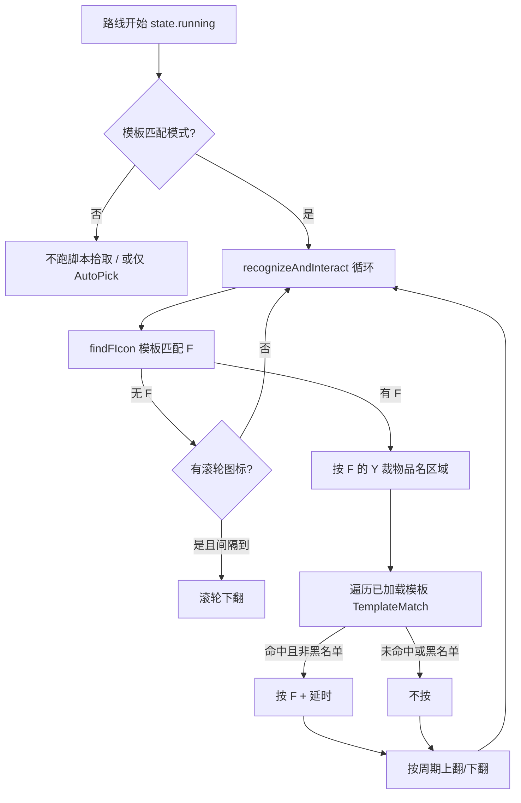
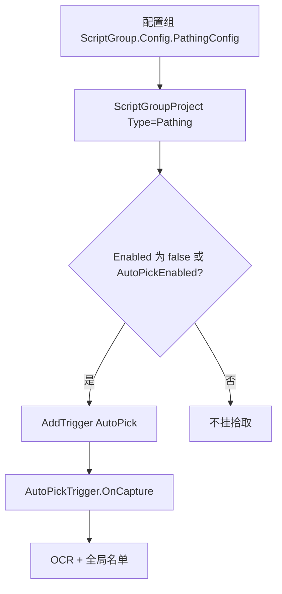

# 配置组「只拾取圣遗物」设计

状态：已实现（第一期）  
范围：调度器配置组中的地图追踪拾取；用模板匹配圣遗物名称，替换该组内的原版 `AutoPick` OCR 拾取

参考实现：`AutoHoeingOneDragon`（锄地一条龙）中的「模板匹配拾取，只拾取狗粮」

## 1. 背景

锄地（尤其是精英路线）的掉落里，圣遗物狗粮（三/四星套装名，如「冒险家」「战狂」「教官」）价值高，怪物材料、采集物、宝箱、NPC 对话往往不需要。用户希望在某个配置组跑地图追踪时**只捡圣遗物、其它 F 交互一律跳过**。

当前配置组只有布尔开关 `PathingPartyConfig.AutoPickEnabled`：

- 开启：地图追踪任务里 `AddTrigger("AutoPick")`，走全局实时触发器 `AutoPickTrigger`（OCR + 黑/白名单）
- 关闭：该组路径追踪不挂自动拾取

全局 `AutoPick` 用 OCR 读物品名再套名单。锄地脚本作者认为这条路径**开销大、短名/相似名不准**，因此在 JS 里另做了一套**物品名模板匹配**，并单独提供「只拾取狗粮」模式。

本功能目标：把这套「只拾取圣遗物」做成 BetterGI 内置能力，挂在配置组上，运行该组地图追踪时**替换**原 `AutoPick`，而不是和 OCR 拾取叠两套按 F。

本功能**不是**：

- 把整份锄地一条龙（选路、CD、泥头车、药品）搬进本体
- 在全局实时触发器设置页永久改掉 `AutoPick` 行为
- 用白名单 OCR 近似「只捡圣遗物」（那正是脚本要避开的路径）

## 2. 脚本侧分析（AutoHoeingOneDragon）

脚本版本参考：锄地一条龙 `2.13.3`，目录 `User/JsScript/AutoHoeingOneDragon`。

### 2.1 配置入口

`settings.json` 的 `pickup_Mode`：

| 选项 | 行为 |
| --- | --- |
| 模板匹配拾取，拾取狗粮和怪物材料 | 加载 `assets/targetItems/` 下全部 PNG（圣遗物 + 怪物材料） |
| **模板匹配拾取，只拾取狗粮** | **只加载 `assets/targetItems/其他/`** |
| bgi原版拾取 | `dispatcher.AddTrigger(RealtimeTimer("AutoPick"))`，脚本自己不捡 |
| 不拾取任何物品 | 不启动模板拾取、不挂 AutoPick |

「狗粮」在脚本语境里就是**圣遗物套装名模板**，不是食物。`其他/` 下是按套装截的拾取列表文字图（冒险家、游医、战狂、幸运儿、教官、流放者、勇士之心、行者之心、祭礼、以及带阈值的 `00匹配阈值0.8` 子目录等）。怪物材料在 `targetItems/怪物掉落材料/`，只拾取狗粮时根本不加载。

相关辅助项（本体第一期不必全搬）：

- `onlyRelatedItems`：按当前路线怪物裁材料模板（只对「狗粮+材料」有效）
- `disableSecondCheck`：命中后不再二次模板确认
- `findFInterval` / `pickupDelay` / `rollingDelay` / `timeMove`：识别与滚轮节拍
- 账户黑名单 `blacklists/`：背包满 OCR 后把对应模板拉黑

### 2.2 运行时结构

模板模式**不走** `AutoPick`。每条路线 `pathingScript.runFile` 的同时，`pickupTask` 循环调用 `recognizeAndInteract()`，直到 `state.running == false`。



关键常数（相对 **1920×1080**，脚本未做与本体同等的 `AssetScale` 适配）：

| 用途 | 值 |
| --- | --- |
| F 图标 ROI | `(1102, 335, 34, 400)`，阈值 `0.95`，图 `assets/F_Dialogue.png` |
| 物品名裁剪 | `(1219, F中心Y - 15, 154, 30)` |
| 滚轮图标 ROI | `(1017, 496, 512, 85)`，图 `assets/拾取滚轮.png` |
| 默认模板阈值 | `0.9`；路径里中/英括号数字可覆盖，如 `(0.8)` |
| 无 F 时翻页间隔 | 200 ms |
| 同名且 Y 差 ≤20 | 视为重复，延时 160 ms 再处理 |
| 滚动周期 | 默认 1000 ms，约 45% 下翻、55% 上翻 |

命中逻辑：`targetItems` 按加载顺序**第一个** `isExist()` 为准；未关二次确认时对同一模板再 `find` 一次。

背包满：OCR 一块提示区域，用物品中文名与 OCR 的最长连续匹配比 ≥0.75 则加入黑名单。第一期本体可不移植（圣遗物狗粮几乎不会「该类已满」）。

### 2.3 和本体 AutoPick 的差异

| 点 | AutoPickTrigger | 脚本模板拾取 |
| --- | --- | --- |
| 调度 | 截图 Tick 实时触发器 | JS 异步循环 + `sleep` |
| 认物品 | OCR（Paddle/Yap）+ 名单 | 物品名 PNG 模板 |
| 范围 | 全局名单，黑/白名单模式 | 本次加载的模板集合即白名单 |
| 滚动 | 无 F 时像素点判断黄白滚轮，下翻 | 模板认滚轮；有 F 时仍周期性上下翻 |
| NPC/设置图标 | 聊天气泡、设置图标排除 | 无图标分类；对不上模板就不按 |
| 分辨率 | `AssetScale` | 按 1080p 写死 |
| 配置组 | 只能开关是否挂 AutoPick | 脚本自己的 `pickup_Mode` |

脚本 README 写明：原版拾取「性能开销大，准确低，尽量不要使用」。只拾取圣遗物要保留**模板白名单**，不要退化成「把圣遗物名填进 AutoPick 白名单」。

### 2.4 值得搬 / 不必搬

搬：

- 「只加载圣遗物模板」作为独立拾取策略
- 认 F → 按 F 的 Y 裁名 → 模板匹配 → 按键
- 列表过长时的滚轮扫描（无 F 下翻；有 F 时小幅上下翻）
- 二次确认、重复命中节流
- 模板阈值写在文件名括号里

第一期不搬：

- 怪物材料模板与 `onlyRelatedItems`
- 路线拾取历史、按历史重排模板
- 背包满拉黑
- 与选路/CD/泥头车绑在一起的脚本调度

## 3. 现状代码路径（本体）



关键文件：

- `Core/Config/PathingPartyConfig.cs`：`AutoPickEnabled`
- `Core/Script/Group/ScriptGroupProject.cs`：路径追踪里挂 `AutoPick`
- `View/Pages/View/ScriptGroupConfigView.xaml`：配置组「是否开启自动拾取」开关
- `GameTask/AutoPick/AutoPickTrigger.cs`：OCR 拾取
- `GameTask/AutoPick/Assets/Recognition.json`：F 键 ROI `rect(1090*s, 330*s, 60*s, 420*s)`
- `Core/Script/Dependence/Model/TimerConfig/AutoPickExternalConfig.cs`：目前只有 `ForceInteraction` / `TextList`
- `GameTask/TaskTriggerDispatcher.cs`：任务期 `AddTrigger("AutoPick", options)`

JS 配置组项目**不会**因组配置自动挂 AutoPick；锄地一条龙在组里跑时拾取完全由脚本 `pickup_Mode` 决定。本功能第一期对准**配置组内的地图追踪条目**。

## 4. 决策

在配置组行走配置里，把「是否自动拾取」升级为**拾取策略**，地图追踪启用时只挂一种策略。

| 策略 | 行为 |
| --- | --- |
| 原版自动拾取（默认，兼容旧配置） | 与现在 `AutoPickEnabled == true` 相同 |
| 只拾取圣遗物 | **不**挂 OCR AutoPick；挂同一套 F 检测 + 圣遗物名模板匹配 |
| 不拾取 | 与现在 `AutoPickEnabled == false` 相同 |

实现落点：扩展 `AutoPickTrigger`（或由其委托的策略对象），用 `AddTrigger("AutoPick", options)` 传入模式，而不是再注册一个并行触发器。理由：

1. 任务期允许挂的名字目前是 `AutoPick` / `AutoSkip` / `AutoEat`。
2. `RunnerContext.StopAutoPick()`、战斗/传送暂停拾取、F 模板资源都已挂在 AutoPick 上。
3. 同时开 OCR 和模板会抢 F、重复滚动。

备选且不采用：

- **只改全局白名单**：无法按配置组切换，OCR 短名问题仍在。
- **新独立 Trigger**：要改 Dispatcher 白名单、暂停语义、和 AutoPick 互斥，收益不大。
- **配置组里嵌一整份 AutoPickConfig**：过重，且仍是 OCR。

## 5. 配置模型

### 5.1 枚举与字段

`PathingPartyConfig`：

```csharp
public enum PathingPickupMode
{
    AutoPick,      // 原版 OCR
    ArtifactOnly,  // 只拾取圣遗物（模板）
    Disabled
}

[ObservableProperty]
private PathingPickupMode _pickupMode = PathingPickupMode.AutoPick;

// 保留 AutoPickEnabled，只做读写转发，避免旧 JSON / 旧 UI 绑定炸掉
[JsonIgnore]
public bool AutoPickEnabled
{
    get => PickupMode != PathingPickupMode.Disabled;
    set => PickupMode = value ? PathingPickupMode.AutoPick : PathingPickupMode.Disabled;
}
```

旧组 JSON 只有 `"autoPickEnabled": true/false`、没有 `pickupMode` 时：`true` → `AutoPick`，`false` → `Disabled`。可用 `JsonExtensionData` 或反序列化后再根据缺省 `pickupMode` + 旧字段迁移一次。新保存同时写 `pickupMode`，不再依赖旧字段。

`AutoPickExternalConfig` 增加：

```csharp
public enum AutoPickRuntimeMode
{
    Ocr,           // 默认，现有逻辑
    ArtifactTemplate
}

public AutoPickRuntimeMode RuntimeMode { get; set; } = AutoPickRuntimeMode.Ocr;
```

`OnEnabled(options)` 已把 options 赋给 `_externalConfig`。`OnCapture` 开头按 `RuntimeMode` 分发；任务结束 `OnDisabled` 清掉，全局实时拾取仍是 OCR。

### 5.2 挂载条件

`ScriptGroupProject` 路径追踪（现有判断改成）：

```csharp
pathingTask.PartyConfig = GroupInfo?.Config.PathingConfig;
var pickupMode = pathingTask.PartyConfig is { Enabled: true }
    ? pathingTask.PartyConfig.PickupMode
    : PathingPickupMode.AutoPick; // 组行走配置未启用时，保持现在「仍挂 AutoPick」的行为

switch (pickupMode)
{
    case PathingPickupMode.AutoPick:
        TaskTriggerDispatcher.Instance().AddTrigger("AutoPick", null);
        break;
    case PathingPickupMode.ArtifactOnly:
        TaskTriggerDispatcher.Instance().AddTrigger("AutoPick",
            new AutoPickExternalConfig { RuntimeMode = AutoPickRuntimeMode.ArtifactTemplate });
        break;
    case PathingPickupMode.Disabled:
        break;
}
```

组配置未启用时仍默认原版拾取，与当前 `!Enabled || AutoPickEnabled` 一致，避免关掉「强制行走配置」后突然不捡。

### 5.3 UI

`ScriptGroupConfigView` 里「是否开启自动拾取」改为三选一（`ComboBox` 或三个互斥项），文案建议：

- 原版自动拾取：沿用全局实时触发器的 OCR 与黑白名单
- 只拾取圣遗物：用物品名模板识别，只捡圣遗物狗粮，不捡材料/采集/对话
- 不拾取：本配置组地图追踪不自动按拾取键

说明里写清：只拾取圣遗物**覆盖**原版拾取，不叠加；模板按 16:9 制作，极端分辨率可能漏检。

## 6. 模板拾取策略（运行时）

在 `AutoPickTrigger` 内拆两段，OCR 路径尽量不动。

### 6.1 资源

建议目录：

```
BetterGenshinImpact/GameTask/AutoPick/Assets/Artifacts/
  冒险家.png
  战狂.png
  ...
  游医(0.8).png   # 可选：括号内阈值
```

从锄地脚本 `assets/targetItems/其他/` 拷贝一套内置模板（去重、去掉明显重复的 `(1)` 副本，保留阈值变体）。用户可在 `User/pick_artifact_templates/` 再放 PNG，启动该模式时**内置 ∪ 用户目录**一起加载。

加载规则对齐脚本：

- `itemName` = 文件名去掉 `.png`，再去掉用于阈值的括号段
- 默认阈值 `0.9`
- `InitTemplate()` 一次，Tick 里只 `Find`

资源生命周期：首次进入 `ArtifactTemplate` 时加载并缓存 `Mat`；切回 OCR / 触发器 Disable 时释放。不要每帧读盘。

### 6.2 单帧流程

与现 AutoPick 共用：`PickRo` 认 F、`StopAutoPick` 暂停、自定义拾取键、L 键千星奇遇跳过。

模板模式**不做**：聊天/设置图标分类、OCR、全局黑白名单、`DoNotPick` 动态文案。认不出模板就不按，等价于白名单。

1080p 基准，全部乘 `AssetScale`：

1. `Find(PickRo)`。无 F：若有滚轮则下翻（可先复用现有像素判断，不准再补滚轮模板）。
2. 有 F：ROI = `(1219*s, F.centerY - 15*s, 154*s, 30*s)`，越界则跳过。
3. 对该 ROI 按模板列表匹配，第一个命中（可选二次确认）则 `KeyPress(PickVk)`，日志 `交互或拾取：{itemName}`。
4. 为扫到列表外的圣遗物：有 F 时按配置做小幅滚轮（节拍可先写死接近脚本默认：翻页延时约 32–50 ms，周期约 1 s）。**注意 Tick 线程不可长时间 Sleep**；滚动与二次确认用帧计数/时间戳节流，不要把 `recognizeAndInteract` 的 `while + sleep` 原样搬进 `OnCapture`。

重复命中：同一 `itemName` 且 F 的 Y 接近时跳过若干帧，避免连按。

### 6.3 性能

内置模板大约几十到一百张。每帧对全部模板做全图匹配会打满截图线程。约束：

- 只在已裁好的 154×30（缩放后）小图上匹配
- 灰度、`CcoeffNormed`
- 可按文件名长度/历史命中粗排，第一期顺序加载即可
- 匹配失败也要限制单帧耗时；必要时隔帧扫描滚轮

### 6.4 暂停与冲突

- `ForceInteraction == true` 时仍「见 F 就按」，与现逻辑一致（秘境等），优先级高于模板。
- `StopAutoPick` 期间模板模式同样不按、不滚。
- 全局设置里 AutoPick 开关不影响任务期 `AddTrigger` 强制启用（与现在路径追踪一致）。
- 配置组选「只拾取圣遗物」时不要再让用户全局 OCR 名单生效。

## 7. 非目标与后续

第一期不做：

- JS 配置组条目自动注入该策略（锄地脚本已有自己的 `pickup_Mode`，避免双拾取）
- 怪物材料模板、按路线怪物筛选
- 配置组内再编辑圣遗物名单（改文件名/往用户目录丢图即可）
- 非 16:9 专门调参

后续若需要：

- 配置组「圣遗物 + 指定材料」复用同一套模板引擎
- 把滚轮改成与脚本相同的模板，替换像素点
- 拾取统计写入日志分析

## 8. 实现顺序

1. `PathingPickupMode` + JSON 迁移 + `AutoPickExternalConfig.RuntimeMode`
2. 配置组 UI 三选一，旧开关绑定迁到 `PickupMode`
3. 内置模板资源拷入 `AutoPick/Assets/Artifacts`，加载器 + 用户目录
4. `AutoPickTrigger` 模板分支：裁图、匹配、按键、节流；滚动用帧节拍
5. `ScriptGroupProject` 按模式 `AddTrigger`
6. 日志与说明文案（i18n）

验收（实现后，不作为本文档完成条件）：

- 旧配置组 `autoPickEnabled: true/false` 行为与改前一致
- 组内地图追踪选「只拾取圣遗物」：圣遗物名按 F，材料/采集/NPC 不按
- 选「原版」时仍走 OCR 名单
- 选「不拾取」时任务期无 AutoPick
- 全局实时拾取在未跑该组任务时仍为 OCR
- 传送/战斗暂停拾取时模板模式也不按 F

## 9. 实现落点（便于不并入 fork 时剔除）

主体逻辑都在独立文件：

| 文件 | 作用 |
| --- | --- |
| `Core/Config/PathingPickupMode.cs` | 配置组拾取枚举 |
| `Core/Script/Dependence/Model/TimerConfig/AutoPickRuntimeMode.cs` | 任务期运行时枚举 |
| `GameTask/AutoPick/PathingGroupPickup.cs` | 解析模式并 `AddTrigger` |
| `GameTask/AutoPick/ArtifactPickTemplate.cs` | 模板模型 |
| `GameTask/AutoPick/ArtifactPickTemplateLoader.cs` | 内置 + `User/pick_artifact_templates` |
| `GameTask/AutoPick/ArtifactTemplatePickHandler.cs` | Tick 上的模板拾取 |
| `GameTask/AutoPick/Assets/1920x1080/Artifacts/*.png` | 内置名称图（冒险家/幸运儿/战狂/教官/流放者/游医） |

需要改动的既有文件（回退时手工还原这几处）：

- `PathingPartyConfig`：`PickupMode` 字段
- `AutoPickExternalConfig`：`RuntimeMode`
- `AutoPickTrigger`：模板模式早退
- `ScriptGroupProject`：改为调用 `PathingGroupPickup.AddTrigger`
- `ScriptGroupConfigView.xaml`：三选一
- i18n JSON
