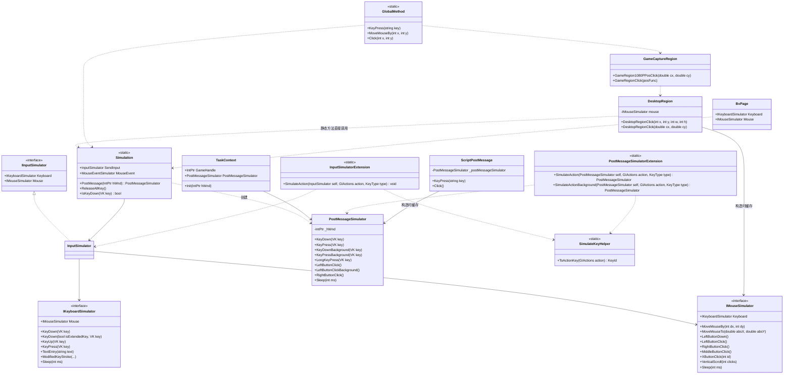
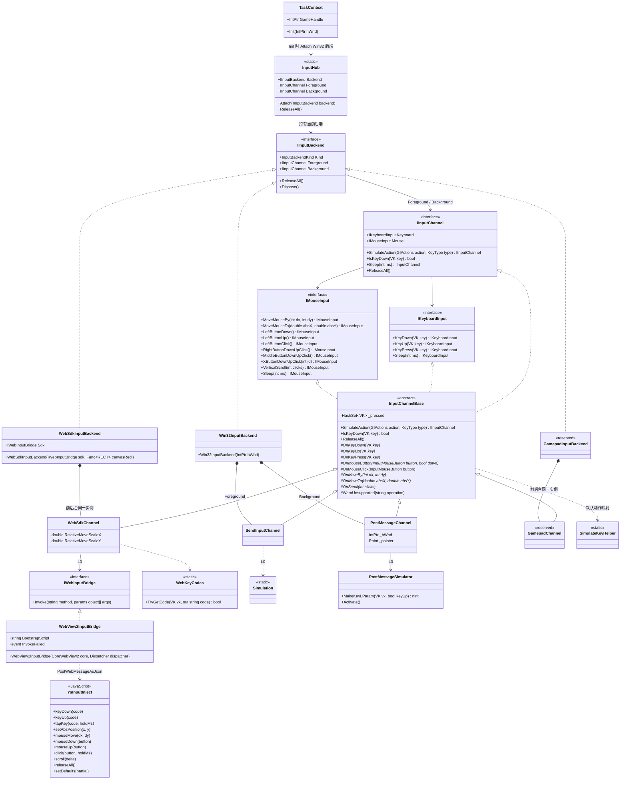

# BetterGI 输入层 InputHub 设计

> 状态：已实现（第 4 版，Win32 + WebSdk 输入层；网页版宿主与手柄未实现） · 2026-09-30

## 1. 背景

BetterGI 需要在三个平台上模拟操作：

| 平台 | 可用输出 |
| --- | --- |
| Windows 原神 | a. SendInput 前台、b. PostMessage 后台、c. 手柄（本期只预留） |
| Windows 云原神 | a、b、c（c 本期只预留） |
| 云原神网页版 | d. JS SDK，接口与键鼠一致 |

Windows 平台上前台和后台总是同时使用，不存在整体从前台切到后台的场景。需要整体切换的是 (a,b)、c、d 三组输出。

现状（`main`）：业务代码直接调用 `Simulation.SendInput` 和 `TaskContext.PostMessageSimulator`，没有统一入口，因此无法整体切换到手柄或网页。

本设计基于 `main`。从 `feat/yys` 分支只取一样东西：页面注入脚本 `ys-input-inject.js`，也就是 d 的 JS SDK。C# 侧对 SDK 的调用按本设计重新实现。

## 2. 目标与非目标

目标：

- 以 Windows 原神键鼠操作为基准，定义统一的输入接口。
- 支持 (a,b) / c / d 三组输出整体切换。
- 保留“同一任务里前台、后台混用”的写法。
- 层级彻底分开：新增入口 `InputHub`，`Simulation` 降为原始层，业务代码不再直接引用。
- 本期实现 Win32 和 WebSdk 两个后端；Gamepad 只预留类和接口，不实现。

非目标：

- 网页版宿主：承载云原神页面的 WebView2 窗口、页面生命周期、截图。本设计只约定宿主接入输入层的方式（5.7.5）。
- 游戏运行环境的整体抽象。`TaskContext` 保持 `main` 的形态，输入层只依赖窗口句柄。
- 手柄的全部实现：驱动、映射表、视角标定。
- 1080P 和游戏区域的坐标换算。这部分留在 `Region` 体系，不进入输入层。
- `ys-input-inject.js` 本身的改造。

## 3. 术语

| 术语 | 含义 |
| --- | --- |
| 后端（Backend） | 一组可以整体切换的输出：`Win32` (a,b)、`WebSdk` (d)、`Gamepad` (c) |
| 通道（Channel） | 后端内部的前台、后台两路。只有 Win32 后端的两路不同，其余后端两路是同一个实例 |
| 原始层 | 直接调用系统 API、驱动或 SDK 的类，不感知后端切换 |
| 宿主 | 承载云原神网页的 WebView2 窗口，负责注入 SDK 并接入 WebSdk 后端 |

平台与后端的对应关系：

| 平台 | 后端 | 由谁接入 |
| --- | --- | --- |
| Windows 原神 / Windows 云原神 | Win32（默认）、Gamepad（预留） | `TaskContext.Init(hWnd)` |
| 云原神网页版 | WebSdk | 宿主，在 `TaskContext.Init` 之后 |

## 4. 改造前

### 4.1 层级

```text
业务调用   Task / Trigger / JS 脚本 / Region 点击 / BvPage / Music / AutoFishing
             │                                  │
             │  每个调用点自己选择走哪条路，也常绕过映射层直接调用原始实现
             ├──────────────────────────────────┐
动作映射   InputSimulatorExtension            PostMessageSimulatorExtension
             │                                  │
原始实现   Simulation.SendInput               TaskContext.PostMessageSimulator
           Fischless.InputSimulator           PostMessageSimulator
             │                                  │
系统接口   SendInput                          PostMessage(hWnd)
```

### 4.2 类图



注：`ScriptPostMessage` 即 `Core.Script.Dependence.Simulator.PostMessage`，也就是 JS 里的 `new PostMessage()`。

### 4.3 问题

1. 没有统一入口。前台还是后台由调用点直接选原始类，无法整体切换到手柄或网页。
2. 动作映射写了两份，行为不一致：前台支持中键和侧键，后台静默忽略；前台 `SimulateAction` 返回 `void`，后台返回自身。
3. Win32 细节外泄：扩展键判断散落在扩展方法、`GlobalMethod`、Music 和宏回放里；是否发送 WM_ACTIVATE 要由调用方选择 `*Background` 变体。
4. `ReleaseAllKey` 依赖 `GetAsyncKeyState`，只能覆盖 SendInput，经 PostMessage 按下的键释放不了。
5. `DesktopRegion`、`AutoSkipTrigger`、JS `PostMessage` 都在字段里缓存了输入实例，一旦后端可以切换，这些引用就会过期。
6. 已知缺陷：`MouseSideButton2` 和 JS 的 `VK_XBUTTON2` 发的都是 `XButton(0x0001)`；`PostMessageSimulator` 的 lParam 扫描码写死为 `0x1E`。

## 5. 改造后

### 5.1 层级与依赖规则

```text
L4 业务层    Task / Trigger / JS 脚本 / Region / BvPage / Music / AutoFishing
               │ 只依赖 L3 InputHub 和 L2 接口
L3 入口层    InputHub
               │ Backend / Foreground / Background / Attach / ReleaseAll
L2 抽象层    IInputBackend -> IInputChannel -> IKeyboardInput / IMouseInput
               │ InputChannelBase：按下状态、默认动作映射、warn 限频
L1 后端层    Win32InputBackend     Foreground: SendInputChannel   Background: PostMessageChannel
             WebSdkInputBackend    Foreground = Background: WebSdkChannel
             GamepadInputBackend   Foreground = Background: GamepadChannel（预留）
               │
L0 原始层    Simulation / Fischless.WindowsInput / PostMessageSimulator
             IWebInputBridge <- WebView2InputBridge -> ys-input-inject.js（页面内）
             手柄驱动（预留，本期不定义）

接入         TaskContext.Init(hWnd) -> InputHub.Attach(new Win32InputBackend(hWnd))
             网页版宿主 -> InputHub.Attach(new WebSdkInputBackend(...))
```

规则：

- 只允许上层依赖下层。L4 只能看到 L3 和 L2。
- L0 只被 L1 引用。白名单：
  - `KeyMouseMacroPlayer`：宏回放本身就是 Win32 键鼠回放。
  - `RelativeMouseMessageHandler`：把根实例上用户的真实鼠标位移转发到桌面分身的桌面，不是对游戏的模拟操作，不应跟随后端切换。
- 命名空间：`BetterGenshinImpact.Core.Input`，后端放在 `Core/Input/Backends/{Win32,WebSdk,Gamepad}`。

### 5.2 类图



注：
- `IMouseInput` 里的 `XxxButtonDownUpClick` 是类图里的简写，实际是 `Down` / `Up` / `Click` 三个方法，名字与 Fischless 相同。
- `<<reserved>>` 表示本期只有预留实现，见 5.8。
- `YsInputInject` 即 `ys-input-inject.js` 暴露在页面上的 `window.__ysInputInject`，图中只列出本设计用到的函数。

### 5.3 接口定义

```csharp
namespace BetterGenshinImpact.Core.Input;

public enum InputBackendKind { Win32, WebSdk, Gamepad }

public interface IInputBackend : IDisposable
{
    InputBackendKind Kind { get; }
    IInputChannel Foreground { get; }
    IInputChannel Background { get; }   // WebSdk / Gamepad：与 Foreground 是同一实例
    void ReleaseAll();
}

public interface IInputChannel
{
    IKeyboardInput Keyboard { get; }
    IMouseInput Mouse { get; }
    IInputChannel SimulateAction(GIActions action, KeyType type = KeyType.KeyPress);
    bool IsKeyDown(User32.VK key);      // 含鼠标键 VK_LBUTTON 等
    IInputChannel Sleep(int ms);
    void ReleaseAll();
}

public interface IKeyboardInput
{
    IKeyboardInput KeyDown(User32.VK key);
    IKeyboardInput KeyUp(User32.VK key);
    IKeyboardInput KeyPress(User32.VK key);
    IKeyboardInput Sleep(int ms);
}

public interface IMouseInput
{
    IMouseInput MoveMouseBy(int dx, int dy);
    IMouseInput MoveMouseTo(double absX, double absY);   // 与 Fischless 相同：桌面绝对坐标，0~65535 归一化
    IMouseInput LeftButtonDown();
    IMouseInput LeftButtonUp();
    IMouseInput LeftButtonClick();
    IMouseInput RightButtonDown();
    IMouseInput RightButtonUp();
    IMouseInput RightButtonClick();
    IMouseInput MiddleButtonDown();
    IMouseInput MiddleButtonUp();
    IMouseInput MiddleButtonClick();
    IMouseInput XButtonDown(int buttonId);
    IMouseInput XButtonUp(int buttonId);
    IMouseInput XButtonClick(int buttonId);
    IMouseInput VerticalScroll(int scrollAmountInClicks);
    IMouseInput Sleep(int ms);
}

public static class InputHub
{
    // 未 Attach 时：未绑定窗口的 Win32 后端，前台可用，后台 warn
    private static volatile IInputBackend _backend = new Win32InputBackend(IntPtr.Zero);

    public static IInputBackend Backend => _backend;
    public static IInputChannel Foreground => _backend.Foreground;
    public static IInputChannel Background => _backend.Background;

    /// <summary>替换当前后端：旧后端先 ReleaseAll 再 Dispose。只在没有任务运行时调用</summary>
    public static void Attach(IInputBackend backend);

    public static void ReleaseAll() => _backend.ReleaseAll();
}
```

接口方法名沿用 Fischless 和现有扩展方法。迁移时只需要换调用对象，方法名不用改。

以下 Fischless 成员不收进新接口，C# 侧已检索确认没有业务调用：扩展键重载 `KeyDown(bool?, VK)` 等（改由通道内部处理）、`TextEntry`、`ModifiedKeyStroke`、`*DoubleClick`、`HorizontalScroll`、`MoveMouseToPositionOnVirtualDesktop`，以及 `Keyboard` 与 `Mouse` 之间的互相跳转。

### 5.4 InputChannelBase

- 一个类同时实现 `IInputChannel`、`IKeyboardInput`、`IMouseInput`，`Keyboard` 和 `Mouse` 都返回 `this`。三个接口里的 `Sleep` 用显式接口实现。
- 按下状态：加锁维护 `HashSet<VK>`，鼠标键记为 `VK_LBUTTON` 等。`ReleaseAll` 按这份记录逐个抬起（单个按键失败不影响其余按键），`IsKeyDown` 默认也查这份记录。
- 鼠标键 VK：`Keyboard.KeyDown/KeyUp/KeyPress` 收到 `VK_LBUTTON`、`VK_RBUTTON`、`VK_MBUTTON`、`VK_XBUTTON1`、`VK_XBUTTON2` 时按对应鼠标键处理。`GlobalMethod` 和 `Avatar` 的字符串按键因此不再各自判断鼠标键。
- 默认 `SimulateAction`：`GIActions` 经 `SimulateKeyHelper.ToActionKey` 得到 `KeyId`，再落到键盘或鼠标的原子操作。现有两套扩展方法的逻辑合并到这里，侧键 2 改为 `XButton2`。
- `OnKeyPress` / `OnMouseClick` 默认实现为 `Down` + `Up`。子类可以覆写，保持各自的时序：SendInput 在一次调用里发送按下和抬起；PostMessage 发送 WM_CHAR，点击间隔 100 ms；WebSdk 交给页面按住。
- `KeyType.Hold` 为按下、等待 1000 ms、抬起，与现有一致。
- 遇到不支持的操作时调用 `WarnUnsupported(operation)`，然后直接返回 `this`。同一种操作 10 秒内只打一次 warn。
- 鼠标键枚举命名为 `InputMouseButton { Left, Right, Middle, X1, X2 }`，避免和 WPF 的 `System.Windows.Input.MouseButton`、Fischless 的 `MouseButton` 重名。

### 5.5 Win32 通道行为

| 操作 | SendInputChannel（前台） | PostMessageChannel（后台） |
| --- | --- | --- |
| 键盘 | 包装 `Simulation.SendInput.Keyboard`。扩展标志按真实键盘判断（L0 的 `ExtendedKeys`）：方向键、Insert / Delete / Home / End / PageUp / PageDown、右 Ctrl / 右 Alt、小键盘 `/`、NumLock、Break、PrintScreen、左右 Win、菜单键带扩展标志；左 Alt、左 Ctrl、泛指的 Alt / Ctrl 及其余按键不带。不使用 Fischless 的 `IsExtendedKey`，它把左 Alt 与泛指的 Alt / Ctrl 也算作扩展键，见第 8 节 | 包装 `PostMessageSimulator`。游戏不在前台时先补发 WM_ACTIVATE；lParam 按 5.6 计算 |
| `SimulateAction` | 默认实现 | 默认实现 |
| `IsKeyDown` | 覆写为 `GetAsyncKeyState`，与现状一致 | 按记录 |
| `MoveMouseBy` | 原样发送 | warn |
| `MoveMouseTo` | 原样发送（0~65535） | 换算成客户区坐标，记为后续点击的 lParam，不移动真实光标 |
| 左键 / 右键 | 原样发送 | PostMessage；没调用过 `MoveMouseTo` 时沿用 (16,16) |
| 中键 / 侧键 / 滚轮 | 原样发送 | warn |
| `ReleaseAll` | 按记录抬起，再用 `Simulation.ReleaseAllKey()` 兜底 | 按记录发送 WM_KEYUP / WM_*BUTTONUP |

`hWnd` 为 `IntPtr.Zero`（未 Attach）时，后台通道的所有操作都 warn。

`Region.BackgroundClick` 需要借用真实光标，这类组合操作由外部组合两个通道完成（前台移动光标，后台点击），不进入 `PostMessageChannel`。

### 5.6 PostMessage 键盘 lParam 修正

现状：所有按键的 lParam 都写死为 `0x1E0001`（按下）和 `0xC01E0001`（抬起），也就是扫描码固定为 `0x1E`（A 键）。

修正后：

```text
scan       = MapVirtualKey(vk, MAPVK_VK_TO_VSC) & 0xFF
WM_KEYDOWN = 1 | (scan << 16)                           // 重复次数 1
WM_CHAR    = 1 | (scan << 16)
WM_KEYUP   = 1 | (scan << 16) | (1 << 30) | (1 << 31)   // 之前为按下 + 状态转换
```

- 改在 L0：`PostMessageSimulator` 新增 `MakeKeyLParam(VK vk, bool keyUp)`，替换所有写死的常量。
- 扩展键位（bit 24）按 `ExtendedKeys` 设置，与前台通道的扩展标志规则相同：`WM_KEYDOWN = ... | (1 << 24)`（扩展键时）。
- 只改 lParam。`WM_CHAR` 的 wParam 仍是 VK 值而不是字符码，本次不动。鼠标消息不受影响。

### 5.7 WebSdk 后端

#### 5.7.1 组成

| 层 | 文件 | 说明 |
| --- | --- | --- |
| L1 | `Core/Input/Backends/WebSdk/WebSdkInputBackend.cs` | 后端，前后台返回同一个 `WebSdkChannel` |
| L1 | `Core/Input/Backends/WebSdk/WebSdkChannel.cs` | 把通道操作翻译成 SDK 函数调用 |
| L1 | `Core/Input/Backends/WebSdk/WebKeyCodes.cs` | `VK` 到 `KeyboardEvent.code` 的映射表，内容取自 `feat/yys` 的 `ToCode` |
| L0 | `Core/Input/Backends/WebSdk/IWebInputBridge.cs` | 通用调用接口：`Invoke(method, args)` |
| L0 | `Core/Input/Backends/WebSdk/WebView2InputBridge.cs` | WebView2 实现，含一段页面侧的分发脚本 |
| L0 | `Assets/JavaScript/ys-input-inject.js` | 从 `feat/yys` 原样复制，csproj 设为 `PreserveNewest` |

SDK 的工作方式：脚本通过 webpack 拿到云原神页面内部的 `ClientCore` 模块，直接调用它的键鼠方法，经 RTC 数据通道发给云端。它不派发 DOM 事件，也不需要 Pointer Lock。SDK 自己保存指针位置（`setAbsPosition`），鼠标按键和相对移动默认使用这个位置。

#### 5.7.2 调用协议

C# 侧只有一个通用方法：按函数名调用 `window.__ysInputInject` 上的任意函数。

```csharp
public interface IWebInputBridge
{
    /// <summary>
    /// 调用页面 SDK window.__ysInputInject[method](...args)。
    /// 不等待执行结果，页面侧按到达顺序串行执行；失败通过实现类的事件回报。
    /// 可选参数请直接省略，不要传 null：JSON 的 null 不会触发 JS 的参数默认值。
    /// </summary>
    void Invoke(string method, params object[] args);
}
```

消息格式：

```text
C# -> 页面   { "channel": "bgi.input", "method": "tapKey", "args": ["KeyF"] }
页面 -> C#   { "channel": "bgi.input.error", "method": "tapKey", "error": "rtc data channel is not open: closed" }   // 只在失败时发送
```

页面侧分发脚本（`WebView2InputBridge.BootstrapScript`）：

```js
(() => {
  if (window.__bgiInputBridge) return;
  window.__bgiInputBridge = true;
  let queue = Promise.resolve();
  window.chrome.webview.addEventListener("message", ({ data }) => {
    if (!data || data.channel !== "bgi.input") return;
    const { method, args = [] } = data;
    // 串行执行：tapKey、click 等是异步函数，并发执行会打乱按键顺序
    queue = queue
      .then(() => {
        const sdk = window.__ysInputInject;
        if (!sdk || !Object.hasOwn(sdk, method) || typeof sdk[method] !== "function") {
          throw new Error(`unknown sdk method: ${method}`);
        }
        return sdk[method](...args);
      })
      .catch(e => window.chrome.webview.postMessage({
        channel: "bgi.input.error", method, error: String(e?.message ?? e)
      }));
  });
})();
```

`WebView2InputBridge`：

- 构造参数：`CoreWebView2` 和它所在线程的 `Dispatcher`。
- `Invoke`：序列化成上面的 JSON，调用 `PostWebMessageAsJson`。不在 UI 线程时用 `Dispatcher.Invoke`，只等到消息投递完成，不等页面执行。
- 收到 `bgi.input.error` 时打 warn 日志，并触发 `event Action<string, string>? InvokeFailed`（参数为 method、error），由宿主决定是否停止任务。

灵活性：

- 新增或调整 SDK 函数时，C# 桥接和分发脚本都不用改。
- `WebSdkInputBackend.Sdk` 对外暴露桥接。遇到键鼠接口表达不了的需求，可以直接调用 SDK 的其他函数，例如 `sendIme`（文字输入）、`setDefaults`（调整按住时长）、`look`：

  ```csharp
  if (InputHub.Backend is WebSdkInputBackend web)
  {
      web.Sdk.Invoke("setDefaults", new { keyHoldMs = 80 });
  }
  ```

#### 5.7.3 操作映射

| 通道操作 | SDK 调用 | 说明 |
| --- | --- | --- |
| `KeyDown(vk)` | `keyDown(code)` | `code` 由 `WebKeyCodes` 映射，表外的键 warn |
| `KeyUp(vk)` | `keyUp(code)` | |
| `KeyPress(vk)` | `tapKey(code)` | 按住时长用 SDK 的 `keyHoldMs`，默认 60 ms |
| `MoveMouseBy(dx, dy)` | `mouseMove(dx * sx, dy * sy)` | 位置用 SDK 当前位置；`sx`、`sy` 为偏差系数，见 5.7.4 |
| `MoveMouseTo(absX, absY)` | `setAbsPosition(x, y)`，再 `mouseMove(0, 0)` | `x`、`y` 为画面内 0~1 |
| 左 / 右 / 中键 Down、Up | `mouseDown(button)` / `mouseUp(button)` | `button` 为 `"left"`、`"right"`、`"middle"` |
| 左 / 右 / 中键 Click | `click(button)` | 按住时长用 SDK 的 `clickHoldMs`，默认 35 ms |
| 侧键 | 不调用，warn | SDK 不支持 |
| `VerticalScroll(n)` | `scroll(n * 120)` | 方向和步长未实测，见 5.7.4 |
| `ReleaseAll()` | `releaseAll()` | 同时清空本地按下记录 |
| `SimulateAction` | 默认实现 | 落到上面的操作 |
| `IsKeyDown` | 不调用 | 查本地按下记录 |

#### 5.7.4 实现要点

```csharp
internal sealed class WebSdkChannel(IWebInputBridge sdk, Func<RECT> canvasRect) : InputChannelBase
{
    // TODO(云原神网页版)：鼠标相对移动的偏差值尚未实测，暂按 1:1 透传。
    // dx/dy 原样作为 ClientCore.mouseMove 的 rel 参数发送，与桌面端 SendInput 的相对位移是否等价尚未验证。
    // 调用方传入前通常已乘过 TaskContext.DpiScale，标定时需要一并考虑。
    // 实测后只调整这两个系数，不要在业务代码里补偿。
    private const double RelativeMoveScaleX = 1.0;
    private const double RelativeMoveScaleY = 1.0;

    protected override void OnKeyDown(User32.VK vk) => InvokeKey("keyDown", vk);
    protected override void OnKeyUp(User32.VK vk) => InvokeKey("keyUp", vk);
    protected override void OnKeyPress(User32.VK vk) => InvokeKey("tapKey", vk);

    protected override void OnMoveBy(int dx, int dy) =>
        sdk.Invoke("mouseMove", dx * RelativeMoveScaleX, dy * RelativeMoveScaleY);

    protected override void OnMoveTo(double absX, double absY)
    {
        var (x, y) = ToCanvas(absX, absY, canvasRect());
        sdk.Invoke("setAbsPosition", x, y);   // 位置由 SDK 保存，后续按键和相对移动都使用它
        sdk.Invoke("mouseMove", 0, 0);
    }

    // TODO(云原神网页版)：滚轮的方向和步长尚未实测，暂按 Windows 的 120/格 透传。
    protected override void OnScroll(int clicks) => sdk.Invoke("scroll", clicks * 120);

    // OnMouseButton / OnMouseClick / ReleaseAll 略，按 5.7.3 映射

    private void InvokeKey(string method, User32.VK vk)
    {
        if (WebKeyCodes.TryGetCode(vk, out var code)) sdk.Invoke(method, code);
        else WarnUnsupported($"按键 {vk}");
    }
}
```

- 坐标：`MoveMouseTo` 收到的是桌面 0~65535 坐标。先按 `PrimaryScreen.WorkingArea` 换算成物理像素（与 `DesktopRegion` 的归一化方式一致），再相对 `canvasRect()` 归一化，截断到 0~1。`canvasRect` 由宿主提供，是游戏画面在屏幕上的物理像素矩形，应与截图区域一致。1080P 换算仍由 `Region` 体系完成，和桌面端一样。
- 时序：`Invoke` 返回时页面还没执行。页面串行执行，`tapKey` / `click` 会在页面内按住一段时间，后续指令排队等待。按键后接识图时，延时要把页面内的按住时长算进去。
- 异常：映射表以外的按键、侧键 warn 后忽略。SDK 执行失败（如 RTC 数据通道未打开）由页面回报，桥接打 warn 并触发 `InvokeFailed`。WebView2 已关闭时 `Invoke` 直接抛 `InvalidOperationException`。

#### 5.7.5 宿主接入约定（本期范围外）

宿主按以下步骤接入，输入层不依赖宿主的其他实现：

1. 用 `AddScriptToExecuteOnDocumentCreatedAsync` 注入 `ys-input-inject.js` 和 `WebView2InputBridge.BootstrapScript`。两者顺序无要求，分发脚本在调用时才查找 SDK。
2. `var bridge = new WebView2InputBridge(webView.CoreWebView2, webView.Dispatcher);`
3. 在 `TaskContext.Init` 之后调用 `InputHub.Attach(new WebSdkInputBackend(bridge, GetCanvasRect));`。
4. 订阅 `bridge.InvokeFailed`，决定是否停止任务，例如 RTC 数据通道断开时。
5. 页面关闭前调用 `InputHub.ReleaseAll()`。

#### 5.7.6 SDK 已知问题

`ys-input-inject.js` 的 `getLocationFromCode` 把所有以 `Left` / `Right` 结尾的 code 都当作左右修饰键，`ArrowLeft`、`ArrowRight`、`BracketLeft`、`BracketRight` 的 `location` 会是 1 或 2，而不是 0。按非目标约定本次不改脚本，是否影响云端识别需要实测。

### 5.8 预留后端：Gamepad

`GamepadInputBackend` + `GamepadChannel` 本期只建类，不实现：

- 实现 L2 接口，`Foreground` 和 `Background` 返回同一个通道实例。
- 所有操作都走 `WarnUnsupported("手柄后端未实现")`，然后返回 `this`。`ReleaseAll` 和 `Dispose` 为空实现。
- 本期没有任何地方创建它，也不加配置项。

实现时要遵守的约定（接口层面已经留好位置，本期不做）：覆写 `SimulateAction`，把 GIActions 直接映射成手柄输入；键盘按键按键位配置反查成 GIActions 再映射；`MoveMouseBy` 映射到右摇杆，是阻塞调用；原始鼠标按键和 `MoveMouseTo` 都 warn 后忽略。最后一条的原因是坐标点击由“移动 + 左键”两步组成，只忽略移动的话，左键会被映射成普攻。

### 5.9 生命周期与切换

```text
进程启动
   └─ InputHub 持有 Win32InputBackend(IntPtr.Zero)      // 前台可用，后台 warn

TaskContext.Init(hWnd)
   └─ InputHub.Attach(new Win32InputBackend(hWnd))

网页版宿主（TaskContext.Init 之后）
   └─ InputHub.Attach(new WebSdkInputBackend(bridge, GetCanvasRect))

InputHub.Attach(backend)
   1. 旧后端 ReleaseAll()
   2. Interlocked.Exchange 替换
   3. 旧后端 Dispose()
```

- 切换：(a,b)、c、d 之间的切换就是 `Attach` 一个新后端，不另设 `Switch`。只在没有任务运行时调用。
- 所有权：`InputHub` 持有当前后端，替换时释放旧后端。桥接等外部资源由创建者（宿主）持有，后端的 `Dispose` 不释放它们。
- 未 Attach 时：与现状对应。现在 `Simulation.SendInput` 随时可用，而 `PostMessageSimulator` 在 `Init` 之前为 null；改造后前台照常可用，后台 warn，不再抛空引用异常。
- 引用规则：单个任务内可以持有通道引用。跨任务存活的对象不能缓存，必须每次从 `InputHub` 取，包括静态字段、DI 单例、Region 树、Trigger。
- 线程：后端引用用 `volatile` 加 `Interlocked.Exchange`，按下状态加锁。
- 多实例：每个 BetterGI 进程各有一份 `InputHub` 状态，互不影响。

## 6. 调用方式对照

| 场景 | 改造前 | 改造后 |
| --- | --- | --- |
| 前台动作 | `Simulation.SendInput.SimulateAction(GIActions.Jump)` | `InputHub.Foreground.SimulateAction(GIActions.Jump)` |
| 前台长按 | `Simulation.SendInput.SimulateAction(GIActions.ElementalSkill, KeyType.Hold)` | `InputHub.Foreground.SimulateAction(GIActions.ElementalSkill, KeyType.Hold)` |
| 前台按键 | `Simulation.SendInput.Keyboard.KeyPress(VK.VK_ESCAPE)` | `InputHub.Foreground.Keyboard.KeyPress(VK.VK_ESCAPE)` |
| 扩展键 | `Simulation.SendInput.Keyboard.KeyDown(false, VK.VK_CONTROL)` | `InputHub.Foreground.Keyboard.KeyDown(VK.VK_CONTROL)` |
| 视角 | `Simulation.SendInput.Mouse.MoveMouseBy(dx, 0)` | `InputHub.Foreground.Mouse.MoveMouseBy(dx, 0)` |
| 桌面绝对定位 | `Simulation.SendInput.Mouse.MoveMouseTo(x, y).LeftButtonClick()` | `InputHub.Foreground.Mouse.MoveMouseTo(x, y).LeftButtonClick()` |
| 键盘跳到鼠标 | `Simulation.SendInput.Keyboard.Mouse.MiddleButtonClick()` | `InputHub.Foreground.Mouse.MiddleButtonClick()` |
| 按键状态 | `Simulation.IsKeyDown(vk)` | `InputHub.Foreground.IsKeyDown(vk)` |
| 后台动作 | `TaskContext.Instance().PostMessageSimulator.SimulateAction(GIActions.OpenMap)` | `InputHub.Background.SimulateAction(GIActions.OpenMap)` |
| 后台动作（激活） | `_postMessageSimulator.SimulateActionBackground(GIActions.PickUpOrInteract)` | `InputHub.Background.SimulateAction(GIActions.PickUpOrInteract)` |
| 后台按键（激活） | `_postMessageSimulator.KeyPressBackground(VK.VK_SPACE)` | `InputHub.Background.Keyboard.KeyPress(VK.VK_SPACE)` |
| 后台点击 | `TaskContext.Instance().PostMessageSimulator.LeftButtonClickBackground()` | `InputHub.Background.Mouse.LeftButtonClick()` |
| 前后台混用 | `PostMessageSimulator.SimulateAction(MoveLeft, KeyDown)` 加 `SendInput.Mouse.MiddleButtonClick()` | `InputHub.Background.SimulateAction(MoveLeft, KeyDown)` 加 `InputHub.Foreground.Mouse.MiddleButtonClick()` |
| 释放 | `Simulation.ReleaseAllKey()` | `InputHub.ReleaseAll()` |
| 1080P 点击 | `GameCaptureRegion.GameRegion1080PPosClick(x, y)` | 不变；内部的 `DesktopRegion` 改走 `InputHub.Foreground.Mouse` |
| JS 脚本 | `keyPress("VK_E")`、`new PostMessage().KeyPress("VK_E")` | 脚本不变；`GlobalMethod` 走 Foreground，JS `PostMessage` 走 Background |
| JS `BvPage` | `page.Keyboard` 类型为 `IKeyboardSimulator`，`page.Mouse` 类型为 `IMouseSimulator` | 分别换成 `IKeyboardInput`、`IMouseInput`，指向 `InputHub.Foreground`；常用方法同名，未收录的成员见第 8 节 |

网页版下 `Foreground` 和 `Background` 是同一个通道，上表的写法不用改，后台调用会自动落到 SDK。

## 7. 迁移步骤

基于 `main`，直接替换入口，不保留转发。

1. 新增 `Core/Input`：L3、L2、Win32 后端、WebSdk 后端（5.7.1 的全部文件），以及 Gamepad 的预留类。从 `feat/yys` 复制 `ys-input-inject.js`，在 csproj 中设为 `PreserveNewest`。`Microsoft.Web.WebView2` 在 `main` 上已经引用，不新增依赖。
2. 从下往上改基础设施：

   | 位置 | 改法 |
   | --- | --- |
   | `PostMessageSimulator` | 按 5.6 修正键盘 lParam |
   | `TaskContext` | `Init(hWnd)` 中把 `PostMessageSimulator = Simulation.PostMessage(GameHandle)` 改为 `InputHub.Attach(new Win32InputBackend(hWnd))`，删除 `PostMessageSimulator` 属性。签名不变 |
   | `DesktopRegion` | 去掉 `IMouseSimulator` 字段和构造参数，静态和实例方法都改走 `InputHub.Foreground.Mouse` |
   | `Region.BackgroundClick` | 前台移动真实光标，后台点击，再移回原位 |
   | `GlobalMethod` | 走 `InputHub.Foreground`，去掉扩展键分支，修正 `VK_XBUTTON2`。`InputText` 加注释，内容见下方 |
   | JS `PostMessage` 宿主 | 每次调用时取 `InputHub.Background`，去掉构造时的缓存 |
   | `BvFlow` 服务、`BvPage` | 走 `InputHub.Foreground`；`BvPage.Keyboard` / `Mouse` 直接换成新接口类型 |
   | Music | 两个 transport 分别包装 `InputHub.Foreground` / `Background`，每次调用时取 |
   | AutoFishing | 构造注入从 `IInputSimulator` 改为 `IInputChannel`；单测里的 `FakeInputSimulator` 改为 `FakeInputChannel` |
   | `AutoSkipTrigger` | 去掉 `_postMessageSimulator` 字段，每次调用时取 `InputHub.Background` |
   | `MouseKeyMonitor` | 长按空格 / F 连发的定时器从 `Simulation.PostMessage(_hWnd)` 改为 `InputHub.Background` |
   | `ClickExtension`、`BvSimpleOperation.FindFAndPress`、`GridScroller`、`AutoArtifactSalvageTask.OpenInventory` | 参数与返回值类型换成 `IInputChannel` / `IKeyboardInput` / `IMouseInput` |
   | 缓存 `Simulation.SendInput` 的字段 | `private readonly InputSimulator input = Simulation.SendInput;` 改为属性 `private IInputChannel input => InputHub.Foreground;`，每次访问都取当前通道 |

   `InputText` 的注释：

   ```csharp
   // 通过剪贴板 + Ctrl+V 输入文字，只面向键鼠后端。
   // 手柄场景用不到文字输入，这里不做手柄适配；将来如果需要，请单独实现，不要依赖 Ctrl 的映射。
   ```

3. 用正则批量替换业务调用点（数量是文本匹配数，包含定义和注释，仅供估算工作量）：

   | 查找 | 替换 | 约数 |
   | --- | --- | --- |
   | `Simulation.SendInput.SimulateAction(` | `InputHub.Foreground.SimulateAction(` | 318 |
   | `Simulation.SendInput.Keyboard.Mouse.` | `InputHub.Foreground.Mouse.` | 少量 |
   | `Simulation.SendInput.Keyboard.` | `InputHub.Foreground.Keyboard.` | 105 |
   | `Simulation.SendInput.Mouse.` | `InputHub.Foreground.Mouse.` | 208 |
   | `Simulation.IsKeyDown(` | `InputHub.Foreground.IsKeyDown(` | 3 |
   | `TaskContext.Instance().PostMessageSimulator.SimulateAction(` | `InputHub.Background.SimulateAction(` | 20 |
   | `TaskContext.Instance().PostMessageSimulator.Key(Press\|Down\|Up)Background(` | `InputHub.Background.Keyboard.Key$1(` | 27 |
   | `Simulation.ReleaseAllKey()` | `InputHub.ReleaseAll()` | 37 |

   通过局部变量或字段持有 `PostMessageSimulator` 的调用需要手工修改，比如 `AutoSkipTrigger` 的大部分调用。扩展键重载 `KeyDown(false, vk)` 替换后会编译失败，按第 6 节改成单参数即可。

4. 删除 `InputSimulatorExtension`、`PostMessageSimulatorExtension` 和 `DesktopRegion(IMouseSimulator)` 构造函数。`Simulation` 保留，作为 L0 使用。
5. 守住层级（可选）：加一个源码扫描单测，要求 `Simulation`、`PostMessageSimulator`、`Fischless.WindowsInput` 只出现在 `Core/Input/Backends/Win32/**` 和白名单文件中。

实施结果：步骤 1~4 已完成，步骤 5 未做。业务代码中 `Simulation`、`PostMessageSimulator`、`Fischless.WindowsInput` 类型已只剩白名单文件和注释。`OverrideController`、`KeyBindingTextBox` 里原本就有未使用的 `using Fischless.WindowsInput;`，与模拟输入无关，未改动。

## 8. Windows 下的行为变化

- 后台通道在游戏不在前台时自动补发 WM_ACTIVATE。之前只有 `*Background` 变体会发。
- `InputHub.ReleaseAll()` 会额外释放经 PostMessage 按下的键。
- 后台通道遇到中键、侧键、移动、滚轮时，从静默忽略改为 warn（限频）。
- 前台 `SimulateAction` 的返回值从 `void` 改为通道本身，源码兼容。
- 修复侧键 2 实际发送 `XButton1` 的问题。
- PostMessage 键盘消息的 lParam 扫描码改为按键计算，之前固定为 `0x1E`。
- `DesktopRegion(IMouseSimulator)` 构造函数移除。JS 里的无参构造和 `(w, h)` 构造不受影响。
- JS 可见的 `BvPage.Keyboard` / `Mouse` 换成新接口，脚本能用的成员变少：扩展键重载、`TextEntry`、`ModifiedKeyStroke`、`*DoubleClick`、`HorizontalScroll`，以及键盘和鼠标之间的互相跳转。已确认接受。
- 前台扩展标志改为按真实键盘判断。原来有两套不一致的规则，各错一半：
  - `SimulateAction`、`GlobalMethod`、Music 对 `IsExtendedKey` 列表里的键一律不带扩展标志。左 Alt 因此正确，方向键、Insert 等则可能被识别成小键盘按键。
  - 其他直接发送的调用点（拾取键、秘境移动键、`Avatar.KeyDown(string)` 等）走 Fischless 自动判断。方向键等因此正确，左 Alt、泛指的 Alt / Ctrl 则会被识别成右 Alt / 右 Ctrl。

  现在两条路径统一使用 `ExtendedKeys`，行为与真实键盘一致。默认键位中只有“呼出鼠标”的左 Alt 在原列表里，它走 `SimulateAction`，前后都不带扩展标志，因此默认配置下没有变化；只有改绑到上述按键的用户会受影响。
- 后台 PostMessage 按键消息对扩展键设置 lParam 第 24 位，之前恒为 0。
- 键盘接口收到鼠标键 VK 时按鼠标键处理。`TaskControl.TrySuspend` 暂停时会释放所有按下的键，用户此时按住的鼠标键现在也会被释放；之前对鼠标键发的是无效的键盘消息。
- `TaskContext.Init` 替换后端时会先对旧后端 `ReleaseAll`，其中包含 `Simulation.ReleaseAllKey()` 兜底，与任务结束时的释放行为相同。

## 9. 手动测试

### 9.1 PostMessage 扫描码修正

只影响经 PostMessage 发送的键盘消息，鼠标不受影响。以下每项在 Windows 原神和 Windows 云原神上各跑一遍，因为云原神客户端对按键消息的处理方式和本地客户端不同。

| # | 场景 | 覆盖的按键 | 关注点 |
| --- | --- | --- | --- |
| 1 | 自动剧情（`AutoSkipTrigger`），分别在开启和关闭后台运行时测，游戏窗口不在前台时也要测 | 空格、交互键（默认 F 或自定义）、W、S | 对话能推进；“选第一个选项”“随机选项”和默认策略都能选中；没有气泡时交互键能触发 |
| 2 | 自动演奏，输入模式选 PostMessage 后台 | 演奏会用到的 21 个键 | 每个音都正确，没有漏音；结束后没有卡住的键 |
| 3 | 领取尘歌壶奖励（`GoToSereniteaPotTask`） | M、W / A / S 按住与松开、X、Esc | 地图能打开；按住移动后能停下；至少跑一个带移动调整的洞天 |
| 4 | 领取邮件、历练点、纪行、前往冒险家协会 | Esc、F1、F4 | 界面能正常打开和关闭 |
| 5 | 对话选项（`ChooseTalkOptionTask`） | 空格 | 对话能推进 |
| 6 | 自定义键位：把“打开地图”改绑到 Tab、F 区键、一个符号键（如 `;`），再跑第 3 项 | 非字母键 | 后台能触发。之前扫描码固定为 A 键，非字母键最容易暴露差异 |
| 7 | JS 脚本 `new PostMessage()` | `KeyPress`、`KeyDown` → sleep → `KeyUp` | 单击和长按都生效，松开后不卡键 |

### 9.2 其他行为变化（Windows）

| # | 场景 | 关注点 |
| --- | --- | --- |
| 1 | 运行尘歌壶任务时切到其他窗口 | 后台按键在补发 WM_ACTIVATE 后仍然生效，也不会抢走焦点 |
| 2 | JS 脚本 `new PostMessage().KeyDown("VK_W")` 后直接停止脚本 | 角色停止移动，确认 `ReleaseAll` 释放了经 PostMessage 按下的键 |
| 3 | 把某个动作绑定到鼠标侧键 2，再用 `keyPress("VK_XBUTTON2")` 测一次 | 游戏里收到的是侧键 2，不是侧键 1 |
| 4 | JS 脚本调用 `BvPage` 的 `Keyboard.KeyPress`、`Mouse.LeftButtonClick`、`Mouse.MoveMouseBy` | 行为与改造前一致 |
| 5 | 开启“长按空格 / F 连发”宏，在游戏内长按空格和 F | 连发正常，松开后停止 |
| 6 | 扩展标志：① 把拾取键改绑到方向键或 Insert，跑自动拾取；② 把“向前移动”改绑到方向键上，跑一段路径追踪；③ 默认左 Alt 呼出鼠标的任务（如需要点击界面的一条龙任务）；④ 脚本 `keyPress("VK_LEFT")` 与 `new PostMessage().KeyPress("VK_LEFT")` | 游戏识别为对应的按键，而不是小键盘按键或右 Alt |
| 7 | 任务运行中用快捷键暂停，暂停时按住鼠标左键 | 暂停后左键被释放，恢复后任务正常继续 |

### 9.3 云原神网页版（宿主接入后）

| # | 场景 | 关注点 |
| --- | --- | --- |
| 1 | 键盘：WASD 移动、空格、F、Esc、数字键切人、Shift 冲刺、方向键 | 响应正确，松开后不卡键；方向键同时验证 5.7.6 的 `location` 问题 |
| 2 | 视角：`moveMouseBy(500, 0)`，或跑一段依赖 `CameraRotateTask` 的路径追踪，与桌面端对比转过的角度 | 用来标定 `RelativeMoveScaleX` / `RelativeMoveScaleY` |
| 3 | 坐标点击：`GameRegion1080PPosClick` 点击界面按钮，如派蒙菜单项、背包格子 | 点击位置准确 |
| 4 | 滚轮：在背包、商店列表里滚动 | 方向和步长与桌面端一致，用来确认 5.7.4 的滚轮 TODO |
| 5 | 原后台调用：自动剧情、尘歌壶任务 | 经 `Background` 通道落到 SDK，行为与前台调用一致 |
| 6 | 断开网络或刷新页面后发送输入 | 日志里有 SDK 报错，`InvokeFailed` 被触发 |
| 7 | 侧键 | 只打 warn，不中断任务 |

## 10. 决策记录

| 议题 | 决定 | 原因 |
| --- | --- | --- |
| 切换单位 | 后端：(a,b) / c / d；前后台是后端内部的通道 | Win32 的前后台总是同时使用 |
| 入口 | 新类 `InputHub`，`Simulation` 降为 L0 | 层级彻底分开 |
| 旧入口 | 直接替换，不做转发 | 避免名不副实，例如 `SendInput.SimulateAction` 实际走了手柄或网页 |
| 迁移基线 | `main` | `feat/yys` 只提供 JS SDK |
| 运行环境 | 不引入运行环境抽象，`TaskContext` 保持 `main` 的形态；输入层只依赖窗口句柄，网页版由宿主接入 | 整体运行环境设计尚未对齐 |
| 切换方式 | `InputHub.Attach(IInputBackend)`，不设 `Switch(kind)` | 各后端构造参数不同（句柄、桥接），直接传实例最简单 |
| 坐标 | `MoveMouseTo` 保留桌面绝对坐标；1080P 换算留在 `Region` 体系 | 键鼠层不感知游戏分辨率，输入也会用在游戏之外 |
| 不支持的操作 | warn（限频）后忽略，不抛异常 | 所有后端统一 |
| 方法名 | 沿用 Fischless 和现有扩展方法名 | 迁移只换调用对象 |
| 未采用的入口名 | `GameInput`、`Simulation.Foreground`、`VirtualInput`、`SimInput` 等 | `GameInput` 与微软 GDK 的 API 重名；`Simulation.Foreground` 会让原始层和抽象层挤在同一个类里 |
| `BvPage` 的 JS 可见类型 | 直接换成新接口 | 接受脚本侧可用成员变少 |
| PostMessage 扫描码 | 本次一起修 | 扫描码写死为 `0x1E` 是明确的缺陷 |
| 扩展标志 | 按真实键盘判断（`ExtendedKeys`），前台 SendInput 与后台 PostMessage 共用 | 原来的“一律不带”和 Fischless 自动判断各错一半：前者弄错方向键等，后者弄错左 Alt |
| `InputCaps` | 删除 | 不支持的操作统一 warn，没有调用方需要查询能力 |
| 手柄 | 只预留类和接口，不实现 | 本期只落地 Win32 和 WebSdk |
| 手柄上的原始鼠标键 | warn 后忽略 | 否则“移动 + 左键”的坐标点击会变成普攻 |
| `InputText` | 不做手柄适配，加注释提醒 | 这个场景和手柄无关 |
| SDK 调用协议 | 通用 `Invoke(method, args)`，页面侧串行分发 | C# 和分发脚本不随 SDK 函数增减而改动；特殊需求可直接调用 SDK 其他函数 |
| 网页版指针位置 | 由 SDK 保存（`setAbsPosition`），C# 不重复维护 | SDK 的按键和相对移动默认使用它 |
| 按住时长 | 用 SDK 默认值（`keyHoldMs` 60 ms、`clickHoldMs` 35 ms），需要时通过 `setDefaults` 调整 | 不在 C# 侧重复定义 |
| 网页版相对移动、滚轮 | 预留系数，暂按 1:1 透传，加 TODO 注释 | 尚未实测 |

## 11. 待确认

1. 网页版的文字输入。`GlobalMethod.InputText` 用本机剪贴板加 Ctrl+V 实现，云端能不能拿到本机剪贴板没有验证。SDK 提供了 `sendIme`，可以通过 `WebSdkInputBackend.Sdk.Invoke("sendIme", text)` 调用，不需要改接口。是否在 `InputText` 里对网页版走这条路？
