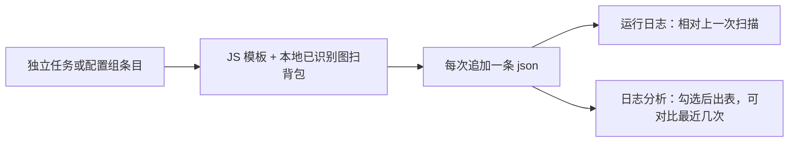

# 背包材料统计：独立任务 + 配置组条目

状态：已实现  
范围：本体扫背包、落库存快照、运行日志和日志分析里对比增减。材料名单来自已订阅的 JS「背包材料统计」（清单名：背包统计采集系统）。

**和原版 JS 不是同一产品。** 仓库脚本主线是：按目标数量 / CD 筛路径 → 跑图采集 → 同一次运行的首末扫描算「本趟拿到多少」。本体**不做跑图和 CD**，主线是：

1. 统计当前背包里（有模板的）物品数量  
2. 落一条快照，和**上一次扫描**做差（运行日志、日志分析页）



## 1. 背景

| 能力 | 实际做的事 |
| --- | --- |
| JS「背包材料统计」 | 采集调度；差值是**同一次运行**首末扫描 |
| `CountInventoryItem` | JS 按物品名查当前数量，无快照、无本任务入口 |
| 本任务 | 全页统计 + 历史快照 + 相对上次增减 |

模板用订阅脚本的 `assets/images`（文件名即材料名），本体不打包。**首次运行必须先在脚本仓库订阅 JS「背包材料统计」**，用来生成白名单和已识别目录。之后若脚本卸了，只要本地 `已识别` 里还有图，仍可扫。

本功能**不是**：移植 JS 的 CD / pathing / 弹窗；通用独立任务框架；无订阅时用 `ItemV2` 扫全背包；把「本趟采集首末差」当主输出。

## 2. 产品行为

每次成功扫完：

1. 得到 `物品名 → 数量`。数量 OCR 失败记 `-2`，不参与做差。名单里没扫到的记 `0`。  
2. **每次追加一条 json**，不覆盖：

   `log/InventoryMaterialStats/{脚本FolderName}/yyyy-MM-dd_HHmmss.json`

   时间用服务器时区（`ServerTimeHelper`）。json 内有 `serverDate`、`recordedAt`、`counts`，以及按「昨日最后一条」算出的 `gained` / `lost`（给打开文件看；控制台不读这两份字段）。

3. **运行日志对比的是上一次扫描**（同目录按 `recordedAt` 从新到旧，跳过刚写入的这条取下一条），不是隔日：

```
背包材料统计 2026-10-06（服务器日）
相对上次（10-06 17:47）：
  薄荷 +120
  夜泊石 -2
未识别数量：精锻用魔矿
已识别新增 3，未识别 1（其中已命名 1）
```

没有上一条则只写「已写入本次库存，尚无上次记录」。增减都打印；没有「只打获得」开关。全量只在 json 里，日志不 dump 全背包。

4. **日志分析页**：配置组分析对话框勾选「背包材料统计」后，把有至少两条记录的拷贝做成 HTML 表。下拉最多对比最近 10 次；选 1 只显示当前数量和相对上一次有变化的行。

5. 独立任务「打开目录」指向 `log/InventoryMaterialStats/`。

### 2.1 本地图标

- `已识别/{背包页}/{物品名}.png`：认上之后保存盖过「新」角标的背包裁图。下次 TM 会用。  
- `未识别/{背包页}/`：点开详情后标题对不上白名单 → `{标题}.png`；标题也没有 → `待命名_{hash}.png`。已命名的下次当额外模板。  
- 右上「新」：匹配前用左上角底板色盖住右上约 30%×30%。  
- 数量区无数字且 Reason 为 `EMPTY`：当作数量 1（游戏不显示 1）；对上名字则记 1。对不上名字则跳过，不点开、不落盘。  
- 空白格（过暗/过匀）跳过。

## 3. 扫描与资源

**前置（首次）：** `User\JsScript\{FolderName}` 清单名为「背包统计采集系统」，且 `assets/images` 下至少有一张 PNG。独立任务页文案写明须先订阅。

解析：配置里的 `ScriptFolderName` → `FindInstalledCopies()` 匹配；空则用第一份已安装拷贝。配置组条目的 `FolderName` 同样走这套。无脚本但本地已识别图够用时仍可运行。

分类按**背包页**勾选，默认三页全开：

| `assets/images` 子目录 | 背包页 |
| --- | --- |
| 怪物掉落素材、周本素材、角色突破素材、宝石、角色天赋素材、武器突破素材、祝圣精华 | 养成道具 |
| 采集食物、料理 | 食物 |
| 锻造素材、一般素材、烹饪食材、木材、鱼饵鱼类 | 材料 |

同页分类模板取并集，该页只打开一次。养成道具页额外 OCR 左下原石、摩拉。

内核：`OpenInventory` / `SwitchInventoryTab` + `GridScreen` 枚举格子。认到的名字从 `remaining` 去掉，越扫越快；翻页重叠的格子会跳过。

## 3.1 认名

```
格子 → GetGridIcon（125×125，去掉数量条）→ 盖「新」
     → 嵌入（当前 ItemIconRecognitionMode；名字必须在本次模板名单里）
     → TM：JS 灰度 0.85 → 未识别彩色 0.68 → 已识别彩色 0.68
           过线的第一名须比第二名高 0.03，或分数 ≥ 0.93，否则当没认上
     → 仍未识别：点开格子，OCR 右侧详情标题（GetGridIconsTask 同一 ROI）
          → Canonical 后对白名单（规范化 + 相似度 ≥ 0.85，唯一最高分）
          → 对上则收下；对不上则用标题落盘并计入 counts
     → 点开失败：不计名；写入 未识别/待命名_{hash}.png
     → GridItemCountRecognizer 读格子底部数量
```

`Canonical`：去空白、NFKC，再单字替换（形近 OCR + 异体，如 监→盐、凈/淨→净、靑→青），再整词别名（怪木→柽木）。模板文件名和 OCR 标题都走这套，避免同物两个 key。

嵌入命中但该名已不在 `remaining` 时，先走完 TM，避免近邻图把另一格当成「已统计」漏掉。

JS 图用未盖角的格子比；已识别/未识别两边都盖角。本地图通道一致时走彩色 `CCoeffNormed`。

数量 `-2` 只表示数量 OCR 失败；名字三种都失败的格子不进 `counts`。

**不做：** 整页大图 TM；感知哈希单独认名；每格对全部模板（认上的会从 remaining 删掉，不是全量）。点开详情很慢，只作为 TM 失败后的补漏，不为「多个模板都过线」再点一遍。

## 4. 入口

### 4.1 独立任务页

选脚本拷贝、勾选养成/食物/材料、运行（`TaskRunner.RunSoloTaskAsync`）。文案说明首次须订阅 JS。无模板且无已识别图则抛错提示去仓库。

配置：`InventoryMaterialStatsConfig`（`ScriptFolderName` + 三页开关），分类不做配置组条目编辑器，组内读这份全局配置。

### 4.2 配置组

日常组末尾加一条即可。

- `Type = "SoloTask"`  
- `FolderName` = JS 文件夹名（添加菜单目前写入「背包材料统计」）  
- `Name` = 展示名  

组内 `Start(ct)`，不套 `RunSoloTaskAsync`。不要和原版 JS 叠在同一组里连扫两次，除非仍要跑采集调度。

### 4.3 日志分析

`LogParseConfig.ScriptGroupLogParseConfig.InventoryMaterialStatsSwitch`；帮助 HTML 见 `InventoryMaterialStatsLogHtml.BuildHelpHtml()`。

## 5. 和原版 JS

快照写在本体 `log/InventoryMaterialStats`，**不要覆盖**脚本的 `latest_record.txt`。不给 JS 提供 `dispatcher.runInventoryMaterialStats`。

## 6. 代码位置

| 位置 | 作用 |
| --- | --- |
| `GameTask/InventoryMaterialStats/*` | 任务、配置、定位脚本、认名、OCR、记录、日志 HTML、本地图标 |
| `AllConfig.cs` | `InventoryMaterialStatsConfig` |
| `ScriptGroupProject.cs` / `ScriptService.cs` | `SoloTask` 类型 |
| `TaskSettingsPage` / ViewModel | 独立任务 UI |
| `ScriptControlViewModel` | 配置组添加条目、分析勾选 |
| `LogParse.cs` / `LogParseConfig.cs` | 分析页插入表格 |
| `User/I18n/*.json` | 文案 |

未接：`Dispatcher`、快捷键、一条龙。

## 7. 风险（现状）

- **连跑两次结果仍可能差几条**：近名料理/宝石/天赋书认串、翻页漏格、点开详情后网格脏掉。数量 OCR 偶发（如 1↔4）。隔日差建议用当天最后一条，不要用任意相邻两次。  
- **json 的 gained/lost 按昨日最后一条**，运行日志按上一次扫描；同一天连跑时两套差会对不上，属当前实现。  
- **漏扫**：`GridScreen` 去重靠 remaining；漏格会一直是 0。  
- **切号**：按脚本 `FolderName` 分子目录，不按 UID。  
- **未识别膨胀**：空白不存、hash 去重；仍需偶尔清理 `待命名_*`。  
- **嵌入错近邻**：白名单拦住名单外的名字；名单内近邻靠 TM 阈值。  
- 模板/清单改名：定位失败则提示订阅。
