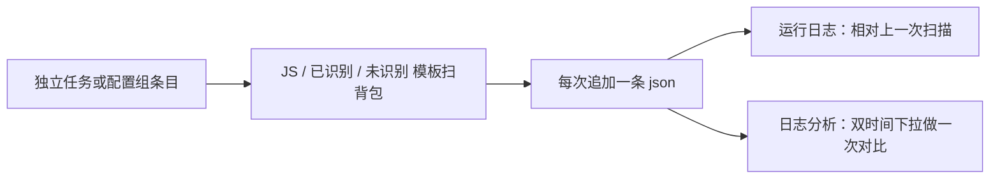

# 背包材料统计：独立任务 + 配置组条目

状态：已实现  
范围：本体扫背包、落库存快照、运行日志和日志分析里对比增减。材料名单优先来自已订阅的 JS「背包材料统计」（清单名：背包统计采集系统）；本地 `已识别` 也可单独撑起后续扫描。

**和原版 JS 不是同一产品。** 仓库脚本主线是：按目标数量 / CD 筛路径 → 跑图采集 → 同一次运行的首末扫描算「本趟拿到多少」。本体**不做跑图和 CD**，主线是：

1. 统计当前背包里（有模板的）物品数量，养成道具页额外记原石、摩拉  
2. 落一条快照，和**上一次扫描**做差（运行日志）；日志分析里任选两次扫描对比



## 1. 背景

| 能力 | 实际做的事 |
| --- | --- |
| JS「背包材料统计」 | 采集调度；差值是**同一次运行**首末扫描 |
| `CountInventoryItem` | JS 按物品名查当前数量，无快照、无本任务入口 |
| 本任务 | 全页统计 + 历史快照 + 相对上次 / 任选两次增减 |

模板用订阅脚本的 `assets/images`（文件名即材料名），本体不打包。**首次**通常需要脚本资源生成白名单和 `已识别`；配置组「添加独立任务」不再拦截未订阅。运行时若既无脚本图也无本地 `已识别`，日志提示去脚本仓库订阅。脚本卸了之后，只要 `已识别` 里还有图，仍可扫。

本功能**不是**：移植 JS 的 CD / pathing / 弹窗；通用独立任务框架；无任何本地模板时用 `ItemV2` 扫全背包；把「本趟采集首末差」当主输出。

## 2. 产品行为

每次成功扫完：

1. 得到 `物品名 → 数量`。数量 OCR 失败记 `-2`，不参与做差。名单里没扫到的记 `0`。养成道具页另记 `原石`、`摩拉`。  
2. **每次追加一条 json**，不覆盖：

   `log/InventoryMaterialStats/{FolderName}/yyyy-MM-dd_HHmmss.json`

   时间用服务器时区（`ServerTimeHelper`）。json 内有 `serverDate`、`recordedAt`、`counts`，以及按「昨日最后一条」算出的 `gained` / `lost`（给打开文件看；控制台不读这两份字段）。

3. **运行日志对比的是上一次扫描**（同目录按 `recordedAt` 从新到旧，跳过刚写入的这条取下一条），不是隔日：

```
背包材料统计 2026-10-06（服务器日）
相对上次（10-06 17:47）：
  薄荷 +120
  夜泊石 -2
未识别数量：精锻用魔矿
已识别新增 3，未识别 1（其中已命名 1）
```

没有上一条则只写「已写入本次库存，尚无上次记录」。只打数量有变化的项；全量只在 json 里。

4. **日志分析页**（见 §4.3）：勾选后嵌入静态 HTML；无后端请求。  
5. 独立任务「打开目录」指向 `log/InventoryMaterialStats/`。

### 2.1 本地图标

- `已识别/{背包页}/{物品名}.png`：认上之后保存盖过「新」角标的背包裁图。下次 TM 会用。  
- `未识别/{背包页}/`：点开详情后标题对不上白名单 → `{标题}.png`；标题也没有 → `待命名_{hash}.png`。已命名的下次当额外模板。  
- 右上「新」：匹配前用左上角底板色盖住右上约 30%×30%（仅背包裁图侧；JS 人工图本身不含这块）。  
- 数量区无数字且 Reason 为 `EMPTY`：当作数量 1（游戏不显示 1）；对上名字则记 1。对不上名字则跳过，不点开、不落盘。  
- 空白格（过暗/过匀）跳过。  
- OCR 多读尾巴（如「枫木中」）时，按最长前缀收回白名单名，且不把这类后缀名当独立未识别模板加载。

## 3. 扫描与资源

**前置（首次）：** 建议安装 `User\JsScript\{FolderName}`，清单名「背包统计采集系统」，`assets/images` 下有 PNG。也可仅靠已有 `已识别`。

解析：`TryResolve` — 配置 / 条目的 `FolderName` → 已安装拷贝；没有脚本则 `null`，只靠本地图。配置组添加菜单固定可选「背包材料统计」，不检查是否已订阅。

分类按**背包页**勾选，默认三页全开：

| `assets/images` 子目录 | 背包页 |
| --- | --- |
| 怪物掉落素材、周本素材、角色突破素材、宝石、角色天赋素材、武器突破素材、祝圣精华 | 养成道具 |
| 采集食物、料理 | 食物 |
| 锻造素材、一般素材、烹饪食材、木材、鱼饵鱼类 | 材料 |

同页分类模板取并集，该页只打开一次。**养成道具页**打开后额外 OCR 左下角两条白底色字：四角星旁为**原石**，金币旁为**摩拉**。

内核：`OpenInventory` / `SwitchInventoryTab` + `GridScreen` 枚举格子。认到的名字从 `remaining` 去掉；翻页重叠格子会跳过。

## 3.1 认名

```
格子 → GetGridIcon（125×125）→ 盖「新」（嵌入 / 本地裁图）
     → 嵌入（当前 ItemIconRecognitionMode；名字须在本次模板名单里）
     → TM 顺序：JS（阈值 0.85）→ 已识别（0.68）→ 未识别（0.68）
           过线的第一名须比第二名高 0.03，或分数 ≥ 0.93，否则当没认上
     → 整图 TM 失败：再比「新」下沿到星标上沿的中间带（格子与模板同裁）
     → 仍未识别：点开格子，OCR 右侧详情标题（白字抽亮后识别）
          → Canonical / 相似度 / 最长前缀对齐白名单
          → 对上则收下；对不上则用标题落盘并计入 counts
     → 点开失败：不计名；写入 未识别/待命名_{hash}.png
     → GridItemCountRecognizer 读格子底部数量（深色字）
```

`Canonical`：去空白、NFKC，再单字替换与整词别名。模板文件名和 OCR 标题都走这套。

OCR 分色：

| 区域 | 字色 | 处理 |
| --- | --- | --- |
| 格子底部数量 | 深色字 | `GridItemCountRecognizer` 已抽黑字 |
| 右侧详情标题 | 白字彩底 | 抽高亮再 OCR |
| 左下原石 / 摩拉 | 白底彩色字 | 抽白底上的数字笔画再 OCR |

**不做：** 整页大图 TM；感知哈希单独认名；点开详情作默认路径（只作补漏）。

## 4. 入口

### 4.1 独立任务页

勾选养成 / 食物 / 材料、选脚本拷贝（可选）、运行（`TaskRunner.RunSoloTaskAsync`）。无模板且无已识别图则抛错 / 日志提示订阅。

配置：`InventoryMaterialStatsConfig`（`ScriptFolderName` + 三页开关）。组内读这份全局配置，不做条目级分类编辑器。

### 4.2 配置组

日常组末尾加一条即可。

- `Type = "SoloTask"`  
- `FolderName` / `Name`：添加时选「背包材料统计」  
- 组内 `Start(ct)`，不套 `RunSoloTaskAsync`  

不要和原版 JS 叠在同一组里连扫两次，除非仍要跑采集调度。

### 4.3 日志分析

- 开关：`LogParseConfig.ScriptGroupLogParseConfig.InventoryMaterialStatsSwitch`  
- 帮助：`InventoryMaterialStatsLogHtml.BuildHelpHtml()`  
- 生成：`LogParse` 拼 HTML 时插入 `BuildSection()`；扫描记录与图标 base64 写进页面内 JSON，**无后台交互**；过大时整页落到 `log/logparse/LogAnalysis_*.html`  

交互（`log.js` 本地重绘）：

1. **较新 / 对比** 两个时间下拉，默认最近一次 vs 上一次，可改选任意两次（目录内最多取最近 11 条）。  
2. **一张表**：  
   - 首行：原石、摩拉的数量与增量  
   - 下一行起：材料、养成道具、食物（及无法归页的「其他」）**各占一格**；格内铺开有变化的物品，每项为「图 + 名字 数量（增量）」  
3. **显示食物增量** 勾选框：默认不勾，食物行不出现。  

只有数量相对所选基线有变化的物品才出现在分类格里。

## 5. 和原版 JS

快照写在本体 `log/InventoryMaterialStats`，**不要覆盖**脚本的 `latest_record.txt`。不给 JS 提供 `dispatcher.runInventoryMaterialStats`。

## 6. 代码位置

| 位置 | 作用 |
| --- | --- |
| `GameTask/InventoryMaterialStats/*` | 任务、配置、定位脚本、认名、OCR、记录、日志 HTML、本地图标 |
| `AllConfig.cs` | `InventoryMaterialStatsConfig` |
| `ScriptGroupProject.cs` / `ScriptService.cs` | `SoloTask` 类型 |
| `TaskSettingsPage` / ViewModel | 独立任务 UI |
| `ScriptControlViewModel` | 配置组添加条目、分析勾选 |
| `LogParse.cs` / `LogParseConfig.cs` / `LogParse/Assets/log.{js,css}` | 分析页插入与前端对比 UI |
| `User/I18n/*.json` | 文案 |

未接：`Dispatcher`、快捷键、一条龙。

## 7. 风险（现状）

- **连跑两次结果仍可能差几条**：近名料理/宝石/天赋书认串、翻页漏格、点开详情后网格脏掉。数量 OCR 偶发（如 1↔4）。隔日差建议用当天最后一条，不要用任意相邻两次。  
- **json 的 gained/lost 按昨日最后一条**，运行日志按上一次扫描；同一天连跑时两套差会对不上，属当前实现。  
- **漏扫**：`GridScreen` 去重靠 remaining；漏格会一直是 0。  
- **切号**：按 `FolderName` 分子目录，不按 UID。  
- **未识别膨胀**：空白不存、hash 去重；仍需偶尔清理 `待命名_*`。  
- **嵌入错近邻**：白名单拦住名单外的名字；名单内近邻靠 TM 阈值与中间带补匹配。  
- **原石 / 摩拉**：依赖养成道具页底部 pill 定位；分辨率或 UI 改版时可能读失败（失败记警告，不记 0）。  
- 模板/清单改名：无脚本且无已识别则提示订阅。
