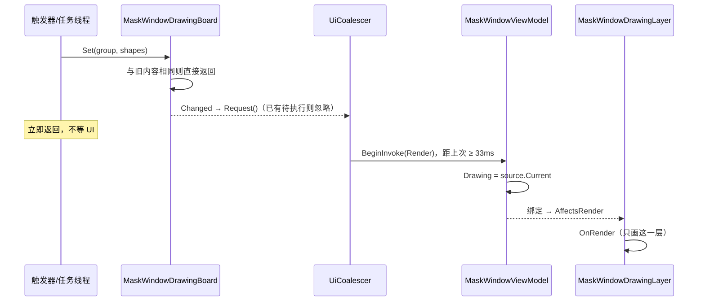

# 遮罩窗口（MaskWindow）统一设计

> 状态：已实现（分支 `refactor/20260930-mask-window`，实现与设计的差异见第 11 节） · 2026-09-30

## 1. 背景

遮罩窗口是覆盖在游戏窗口上的透明窗口。外部对它的使用分四类：

| 使用 | 当前入口 | 写入方 |
| --- | --- | --- |
| 绘制图形（识别框、线、文字、技能 CD） | `VisionContext.Instance().DrawContent` → `MaskWindow.OnRender` | 触发器、独立任务、`Region` 体系 |
| 窗口显隐、置顶、跟随游戏窗口 | `MaskWindow.Instance()` 上的方法 | `TaskTriggerDispatcher`、`HomePageViewModel`、`TaskRunner`、个别任务 |
| 地图点位状态（是否在大地图、视口） | 把 `DataContext` 强转成 VM，直接调用具名控件 | `MapMaskTrigger`、`TaskRunner` |
| 状态、日志、指标等常驻 UI | XAML 绑定 `MaskWindowViewModel` | 配置、各服务 |

前三类绕过了 MVVM 和 DI，直接操作 View。本设计把它们收敛为三个接口。第四类只做 DI 和 MVVM 规范化。

调用规模：`VisionContext.Instance()` 78 处，分布在 35 个文件；`MaskWindow.Instance*()` 20 处，分布在 8 个文件。

## 2. 现状问题

### 2.1 绘制链路

1. 每次绘制都同步切到 UI 线程。`DrawContent` 的每个 `Put*`、`Remove*`、`ClearAll` 都会调用 `MaskWindow.Instance().Refresh()`，也就是 `Dispatcher.Invoke(InvalidateVisual)`。调用方有两类：
   - `TaskTriggerDispatcher.Tick` 里的触发器。调用时正持有 `_locker` 和 `_triggerListLocker`，UI 线程一忙，截图循环就被拖慢；如果 UI 线程上有代码在等这两把锁，就会死锁。
   - 独立任务线程。每画一次框，都要同步等待 UI 线程处理完。
2. 重绘过多：
   - 去重条件写反了。`prevRect.Count == 0 && newRect.Equals(prevRect[0])` 永远不成立，`Count` 为 0 时还会越界。`PutOrRemove*List` 只要参数非空就判定为有变化。结果是 `SkillCdTrigger` 在主界面时每帧都触发一次重绘。
   - `Equals` 不完整。`TextDrawable` 只比较坐标，`RectDrawable` 不比较画笔，所以即使修好去重也会漏掉变化。
   - 重绘范围是整个窗口。`OnRender` 每次都把准星和全部图形重画一遍，并新建 Pen、Brush、FormattedText。而 `AllowsTransparency` 窗口每次重绘本身开销就大。
   - 还有其他重绘来源。`MaskWindowConfig` 任意属性变化，以及 VM 的 `IsInBigMapUi`、`IsMapPointPickerOpen` 变化，都会执行 `Dispatcher.Invoke(InvalidateVisual)`。`AutoLeyLineOutcropTask` 在 Put 之后还会再调用一次 `Refresh()`。
3. 存在数据竞争。字典里存的就是调用方传入的那个 `List<T>`。`AutoArtifactSalvageTask` 把列表放进去以后继续往里 `Add`，还用 `TextList.GetOrAdd` 绕过了刷新；与此同时，UI 线程在 `OnRender` 里枚举这些列表。由此产生的异常被 `catch` 吞掉，表现为偶发丢帧。
4. 坐标系混用。矩形和直线在生产方就除以了 `TaskContext.DpiScale`（主屏 DPI），文字则在 `OnRender` 里除以窗口的 `PixelsPerDip`。`AutoArtifactSalvageTask` 用已经换算过的矩形坐标生成文字，高 DPI 下坐标被除了两次。
5. 渲染器要了解业务：
   - `OnRender` 通过字符串 `"SkillCdText"` 特判技能 CD 的样式。
   - `DisplayRecognitionResultsOnMask` 一个开关同时控制调试框和技能 CD。
   - `AutoLeyLineOutcropTask` 为了显示自己的提示，会临时改写这个用户配置。
6. 静态耦合：
   - `VisionContext` 是静态单例，里面只有一个可替换的 `DrawContent`，另一个属性 `Drawable` 没有任何地方使用。
   - `DrawContent` 本是业务模型，却直接依赖 View。单测里的 `FakeDrawContent` 没有覆写 `PutOrRemoveTextList`，一旦调用就会抛出"MaskWindow 未初始化"。

### 2.2 窗口访问

7. View 是静态单例。`_maskWindow` 在构造函数里赋值，窗口关闭后也不清空；窗口创建之前调用 `Instance()` 会直接抛异常。
8. 显隐策略分散在 5 处：
   - `TaskTriggerDispatcher.Tick`：每帧 `BeginInvoke(Show)`。
   - `HomePageViewModel`：new、Show、Hide、Close。
   - `TaskRunner`。
   - `AutoLeyLineOutcropTask`：设置 Topmost、Show、BringToTop。
   - `HideSelf`：编辑模式守卫。

   `HtmlMaskWindow` 在同样的位置被平行调用。`CustomHtmlMaskService` 在计时器线程上读取 `IsVisible`。
9. 遮罩窗口被当作通用 Dispatcher 使用。`maskWindow.Invoke/BeginInvoke` 的效果与 `UIDispatcherHelper` 相同，而且会吞掉取消异常。
10. 越层访问。`MapMaskTrigger` 和 `TaskRunner` 把 `DataContext` 强转成 `MaskWindowViewModel` 来修改 `IsInBigMapUi`，还直接调用具名控件的方法 `PointsCanvasControl.UpdateViewport`。

### 2.3 MVVM / DI

11. VM 是在 XAML 里 `new` 出来的，不经过 DI，依赖只能通过 `App.GetService` 获取。配置同时从 `Config` 和 `TaskContext.Instance().Config` 两处读取。
12. `HomePageViewModel` 自己创建并持有 View（`new MaskWindow()`）。
13. VM 和 View 互相越界：
    - VM 接收 `SizeChangedEventArgs`，并直接调用 `Application.Current.Dispatcher`。
    - code-behind 读取 `TaskContext`、修改 VM 状态、计算点击穿透，还负责打印系统信息和检查游戏设置。

## 3. 目标与非目标

目标：

- 业务代码只依赖接口，不引用 `MaskWindow`、`MaskWindowViewModel`、`Dispatcher`。
- 绘制请求只写数据，不阻塞，也不切线程。UI 侧把多次请求合并，按帧率上限重绘，而且只重绘发生变化的那一层。
- 遮罩窗口的创建、显隐、置顶、跟随只有一个入口。
- MaskWindow 回到标准 MVVM：窗口由 DI 构造，状态放在 VM，交互通过绑定和 Behavior 实现。
- 删除 `VisionContext`、`DrawContent`、`*Drawable`，以及 `MaskWindow` 的全部静态成员。

非目标：

- `HtmlMaskWindow` 内部不改，只是改为由宿主统一驱动它的显隐和位置。
- 日志框（已通过 `IRichTextBox` 解耦）、画中画、点位选择器的业务逻辑都不动。
- 拆分 `MaskWindowViewModel`，可以留作后续工作。

## 4. 总体结构

### 4.1 遮罩窗口内的区域

窗口内有多个互相独立的区域，每个区域有自己的名字和数据来源：

| 区域 | View 元素 | 数据来源 | 本次改动 |
| --- | --- | --- | --- |
| 绘制（识别框、线、文字、技能 CD） | `MaskWindowDrawingLayer` | `IMaskWindowDrawingBoard` | 新增，替代 `OnRender` |
| 准星 | `MaskWindowCrosshairLayer` | `MaskWindowConfig` | 新增，替代 `OnRender` |
| 地图点位（大地图、小地图） | `PointsCanvas`、`MiniMapPointsCanvas` | `IMaskWindowMapState` + `IMaskMapPointService` | 视口改为绑定 |
| 状态、日志、指标 | 现有 `AdjustableOverlayItem` | 配置、`IRichTextBox`、`OverlayMetricsService` | 不改 |

窗口本身的生命周期由 `IMaskWindowHost` 负责。

### 4.2 分层

```text
业务层   Trigger / Task / Region / BgiYoloPredictor / SkillCd …
           │ 只依赖 Core/Mask 里的接口；可在任意线程调用，立即返回
接口层   IMaskWindowDrawingBoard       IMaskWindowHost            IMaskWindowMapState
         画什么                   窗口怎么显示                地图点位状态
           │                        │                          │
实现层   MaskWindowDrawingBoard        MaskWindowHost             MaskWindowMapState
         不可变快照 + Changed     唯一持有 MaskWindow         不可变快照 + Changed
           │                        │ 内部使用 UiCoalescer      │
VM 层    MaskWindowViewModel（DI 单例）：用 UiCoalescer 拉取快照 → Drawing / IsInBigMapUi / 视口
           │ 绑定
View 层  MaskWindow（DI 构造）
           ├─ MaskWindowCrosshairLayer   只在准星配置变化时重绘
           ├─ MaskWindowDrawingLayer     只在绘制快照变化时重绘
           └─ 现有 XAML（状态、日志、指标、点位…）
```

依赖规则：

- `Core/Mask` 不引用 `View` 或 `ViewModel`。
- 只有 View 层引用 `MaskWindow` 类型。`MaskWindowHost` 放在 `View/Mask/` 下，View 层以外的代码只能通过它接触遮罩窗口。
- 遮罩相关的新代码跨线程时只能经过 `UiCoalescer`，不再调用 `Dispatcher.Invoke`。

### 4.3 绘制时序



## 5. 接口定义

命名空间为 `BetterGenshinImpact.Core.Mask`，目录为 `Core/Mask/`。不用 `Core.MaskWindow` 的原因见 10.1。

术语约定：

- Layer：只指 View 中负责渲染的元素。
- Group：一组按名字整体替换的图形，也就是原来 `DrawContent` 的 key。

### 5.1 绘制：IMaskWindowDrawingBoard

```csharp
/// 遮罩窗口绘制入口（业务侧）。线程安全，所有方法立即返回，不等待 UI。
public interface IMaskWindowDrawingBoard
{
    /// 整组替换。shapes 为空等价于 Clear；内容与当前相同则不做任何事。
    void Set(MaskWindowDrawingGroup group, IReadOnlyList<MaskWindowDrawingShape>? shapes);
    void Clear(MaskWindowDrawingGroup group);
    void ClearAll();
}

public static class MaskWindowDrawingBoardExtensions
{
    public static void Set(this IMaskWindowDrawingBoard board, MaskWindowDrawingGroup group, MaskWindowDrawingShape shape)
        => board.Set(group, new[] { shape });

    /// Dispose 时清除该组，用于"任务期间显示、结束即清"
    public static IDisposable Scope(this IMaskWindowDrawingBoard board, MaskWindowDrawingGroup group);
}
```

`MaskWindowDrawingBoard` 的实现要点：

- 存储：按 `group.Name` 存进 `ImmutableDictionary<string, MaskWindowDrawingEntry>`。写入时加锁，锁内只做比较和替换。
- `Set`：
  - 先把 `shapes` 拷贝成数组，调用方之后再改原列表也不会影响已存的内容。
  - 再用 `SequenceEqual` 和旧内容比较（图形是 record，按值相等）。相同就直接返回。
  - 不同则替换内容、版本号加 1、触发 `Changed`。
- `Changed` 在写入线程上同步触发，订阅方在回调里只能做 O(1) 的操作，例如 `UiCoalescer.Request()`。
- `NullMaskWindowDrawingBoard.Instance` 是空实现，用于单测和没有 DI 的环境。

### 5.2 分组与图形

```csharp
public enum MaskWindowDrawingKind
{
    Recognition, // 识别结果（调试可视化）：受「在遮罩上显示识别结果」开关和统一样式控制
    Feature,     // 功能提示（技能 CD、地脉 OCR 区域）：遮罩可见就显示，使用图形自带样式
}

/// 绘制分组。按 Name 存储，Kind 决定显示规则
public readonly record struct MaskWindowDrawingGroup(
    string Name, MaskWindowDrawingKind Kind = MaskWindowDrawingKind.Recognition)
{
    public static implicit operator MaskWindowDrawingGroup(string name) => new(name);
}

public abstract record MaskWindowDrawingShape;
public sealed record MaskWindowDrawingRect(Rect Bounds, MaskWindowDrawingStroke? Stroke = null) : MaskWindowDrawingShape;
public sealed record MaskWindowDrawingLine(Point From, Point To, MaskWindowDrawingStroke? Stroke = null) : MaskWindowDrawingShape;
public sealed record MaskWindowDrawingText(string Text, Point Origin, MaskWindowDrawingTextStyle? Style = null) : MaskWindowDrawingShape;

public readonly record struct MaskWindowDrawingStroke(Color Color, double Thickness = 2);

/// 为 null 的字段使用 MaskWindowConfig 的识别结果样式。
/// FontSize 单位为捕获像素；Background 不为空时绘制圆角底色；Numeric 表示使用数字字体（Fgi）
public sealed record MaskWindowDrawingTextStyle(
    Color? Foreground = null, double? FontSize = null, Color? Background = null, bool Numeric = false);
```

约定：

- 坐标：统一用游戏捕获区域的物理像素，与截图 `Mat` 的坐标系相同。换算成 DIP 只在 `MaskWindowDrawingLayer` 里做一次，使用遮罩窗口自身的 DPI。生产方不再读取 `TaskContext.DpiScale`。
- 样式：图形没带样式时，使用 `MaskWindowConfig` 里的识别结果样式。开启"统一样式"后，`Recognition` 组忽略图形自带的样式，这与现状一致。
- 类型：`Point`、`Rect` 来自 `System.Windows`，`Color` 是 `System.Windows.Media.Color`。它们都是值类型，不持有 GDI 资源。

### 5.3 读端：IMaskWindowSnapshotSource

```csharp
/// 渲染侧读取，仅 MaskWindowViewModel 使用
public interface IMaskWindowSnapshotSource<out T>
{
    T Current { get; }       // 不可变快照，UI 线程直接读取，无需加锁
    event Action? Changed;   // 可在任意线程触发，只表示"有新版本"，由订阅方自行合并
}

public sealed record MaskWindowDrawingSnapshot(long Version, IReadOnlyList<MaskWindowDrawingEntry> Entries);
public sealed record MaskWindowDrawingEntry(MaskWindowDrawingGroup Group, IReadOnlyList<MaskWindowDrawingShape> Shapes);
```

`MaskWindowDrawingBoard` 同时实现 `IMaskWindowDrawingBoard` 和 `IMaskWindowSnapshotSource<MaskWindowDrawingSnapshot>`，DI 中用同一个单例注册这两个接口。

### 5.4 窗口：IMaskWindowHost

```csharp
public interface IMaskWindowHost
{
    void Attach(nint gameHandle);                  // UI 线程。首次调用时创建窗口，绑定游戏窗口并显示
    void Detach();                                 // UI 线程。隐藏窗口并解除绑定，窗口实例保留复用
    void Close();                                  // UI 线程。关闭并释放窗口（程序退出时）
    void ReportGameWindow(GameWindowState state);  // 任意线程，每帧可调；宿主去重后决定显隐、置顶、跟随
    MaskWindowState State { get; }                 // 缓存值，任意线程可读
    event EventHandler<MaskWindowState>? StateChanged; // 在 UI 线程触发，附属遮罩订阅
}

/// 描述游戏窗口，不是遮罩窗口，所以不加 MaskWindow 前缀
public readonly record struct GameWindowState(
    bool IsCapturing, bool IsActive, bool IsMinimized, bool IsForegroundOwnedByBetterGiOrGame, RECT Bounds);

public readonly record struct MaskWindowState(bool IsVisible, Rect Bounds);
```

显隐策略集中在 `MaskWindowHost` 中，按优先级从高到低判断，命中一条即停止：

| 条件 | 遮罩 |
| --- | --- |
| 未 Attach | 隐藏 |
| 布局编辑模式 | 显示 |
| `IsCapturing = false` | 隐藏 |
| `IsMinimized` | 保持不变 |
| `IsActive` | 显示；从非活动转为活动时置顶一次 |
| 前台窗口属于 BetterGI 自身或游戏进程，或没有前台窗口（按进程 ID 判断） | 保持不变 |
| 其他 | 隐藏 |

`Bounds` 变化时重新定位遮罩。位置按游戏窗口所在显示器的 DPI 换算，与 `HtmlMaskWindow` 一样使用 `DpiHelper.GetScale(gameHandle)`。

实现要点：

- 在调用 `ReportGameWindow` 的线程上算出期望状态。和上次的期望状态相同就直接返回，不同时才调用 `UiCoalescer.Request()`。
- 在 UI 线程上应用：窗口由构造注入的 `Func<MaskWindow>` 工厂创建，然后依次执行 Show/Hide、BringToTop、设置位置，最后触发 `StateChanged`。
- `CustomHtmlMaskService` 和 `HtmlMaskWindow.ShowAll/HideAll/UpdateAllPositions` 改为订阅 `StateChanged`，`TaskTriggerDispatcher` 不再平行调用它们。

### 5.5 地图点位：IMaskWindowMapState

```csharp
public interface IMaskWindowMapState
{
    /// 任意线程调用。字段为 null 表示不修改；多次调用合并为一个快照
    void Update(bool? isInBigMap = null, Rect? bigMapViewport = null, Rect? miniMapViewport = null);

    /// 退出大地图并清空两个视口。在任务开始、地图遮罩关闭时调用
    void Reset();
}

public sealed record MaskWindowMapSnapshot(bool IsInBigMap, Rect BigMapViewport, Rect MiniMapViewport);
```

- `MaskWindowMapState` 同时实现 `IMaskWindowSnapshotSource<MaskWindowMapSnapshot>`。
- `MapMaskTrigger` 现有的合并逻辑（`PendingUiUpdate`、`TryScheduleUiApply`）拆成两部分：字段合并移到 `MaskWindowMapState.Update`，UI 调度交给 VM 的 `UiCoalescer`。
- `PointsCanvas` 和 `MiniMapPointsCanvas` 新增 `Viewport` 依赖属性，绑定到 VM。`UpdateViewport` 改为私有方法，在依赖属性的回调中调用。

### 5.6 UiCoalescer

```csharp
/// 把任意线程、任意频率的 Request 合并成 UI 线程上的一次 apply
public sealed class UiCoalescer(Action apply, TimeSpan minInterval = default,
                                DispatcherPriority priority = DispatcherPriority.Render)
{
    public void Request();
}
```

- 单飞：用 `Interlocked` 保证同一时刻最多只有一个待执行的回调。
- 限频：两次 apply 的间隔不小于 `minInterval`，不足时推迟到满足间隔再执行。
- 不阻塞：只用 `BeginInvoke`。标志位在调用 apply 之前复位，apply 执行期间新到的请求不会丢失。
- 没有 `Application.Current` 时（例如单测）直接同步执行。
- 位置：`Helpers/Ui/UiCoalescer.cs`。绘制用 33 ms（约 30 fps），地图状态和宿主用 0。

## 6. View / ViewModel 规则

1. 构造方式：
   - DI 注册 `services.AddSingleton<MaskWindowViewModel>()`、`services.AddTransient<MaskWindow>()`，另外注册一个 `Func<MaskWindow>` 工厂供 `MaskWindowHost` 使用。
   - `MaskWindow(MaskWindowViewModel vm)` 在构造函数里设置 `DataContext`，同时删除 XAML 中的 `<Window.DataContext>`。
   - VM 的依赖全部通过构造函数注入：`IConfigService`、`OverlayMetricsService`、`IMaskMapPointService`、两个 `IMaskWindowSnapshotSource<>`、`ILogger<>`。配置统一从 `Config` 读取。
2. 删除 `MaskWindow` 的这些成员：`_maskWindow`、`Instance()`、`InstanceNullable()`、`IsExist()`、`Refresh()`、`Invoke()`、`BeginInvoke()`、`HideSelf()`、`RefreshPosition*()`、`LogBox`、`OnRender`。
3. 渲染层：
   - `MaskWindowDrawingLayer` 和 `MaskWindowCrosshairLayer` 都是 `FrameworkElement`，依赖属性设为 `AffectsRender`，并设置 `IsHitTestVisible=False`。两者放在根 Grid 的最底层，跨满所有行列。
   - Pen 和 Brush 冻结后缓存，缓存键是"颜色 + 粗细"。
   - VM 把 `MaskWindowConfig.Recognition*` 这组配置合成一个 `MaskWindowDrawingStyle` 记录，只在这些属性变化时更新。
   - 准星的每个配置项分别绑定到一个依赖属性，其他配置的变化不会触发准星重绘。
4. 点击穿透：
   - VM 提供两个属性：`IsClickThrough = !(OverlayLayoutEditEnabled || IsInBigMapUi)`，`IsCrosshairVisible = CrosshairEnabled && IsClickThrough`。
   - `WindowClickThroughBehavior` 绑定 `IsClickThrough`，据此设置 `WS_EX_TRANSPARENT`。
5. 视图事件改为命令。`IsVisibleChanged`、窗口最小化、`PointsCanvas.ViewportChanged` 三个事件通过 `EventTrigger` + `InvokeCommandAction` 调用 VM 的 `CloseTransientPopupsCommand`。
6. VM 不接收 WPF 类型。窗口尺寸由 Behavior 以 `Size` 推送给 VM，布局提交事件经 `EventArgsConverter` 转换成纯数据。
7. code-behind 只保留纯视图逻辑：日志框裁剪、`MapLabelSearchWindow` 定位。`PrintSystemInfo` 和 `GameSettingsChecker` 移到 `HomePageViewModel.Start` 中，在 `Attach` 之后调用。

## 7. 线程规则

- 业务线程调用 `IMaskWindowDrawingBoard`、`IMaskWindowHost.ReportGameWindow`、`IMaskWindowMapState` 时只写数据，调用立即返回，在持锁代码里调用也是安全的。
- 进入 UI 线程只能通过 `UiCoalescer`（内部使用 `BeginInvoke`）。遮罩相关代码禁止使用 `Dispatcher.Invoke`。
- UI 线程只读取不可变快照，不需要加锁。
- `MaskWindowViewModel` 中还有两处也要改为经 `UiCoalescer` 进入 UI 线程：
  - `OverlayMetricsService.MetricsUpdated` 的回调里同步调用了 `UIDispatcherHelper.Invoke`。
  - `FpsInspector` 回调直接写 `Fps`。

## 8. 归属、获取方式与调用对照

### 8.1 归属

```text
DI 容器
 ├─ MaskWindowDrawingBoard 单例 ··················· 所有者，生命周期 = 进程
 │   ├─ 读端 → MaskWindowViewModel（构造注入）→ MaskWindowDrawingLayer
 │   └─ 写端 → Win32RuntimeProvider（构造注入）
 │        └─ new GameRuntime(..., drawingBoard, mapState) ···· 借用，Dispose 不释放
 │             └─ TaskContext.Bind(runtime) → SystemInfo.DesktopRectArea → 截图区域树继承
 ├─ MaskWindowMapState 单例 ······················ 同上：读端 VM，写端经 Provider 放进 GameRuntime
 └─ IMaskWindowHost 单例 ························· 窗口显示策略，不属于运行环境，只做构造注入
```

- 绘制内容和地图点位状态以这次运行环境的捕获像素为坐标，放在 `GameRuntime` 上，与 `Capture`、`Input` 并列：没有运行环境就没有可画的地方。
- 实例由 DI 拥有，`GameRuntime` 只借用。`GameRuntimeService.Stop` 解绑时 `ClearAll` 并 `Reset`，下一次运行环境不会带着旧内容。
- `IMaskWindowHost` 管的是遮罩窗口本身（创建、显隐、跟随），和运行环境的生命周期无关，不放进 `GameRuntime`。

### 8.2 获取方式

| 调用方 | 获取方式 |
| --- | --- |
| DI 构造的类型 | 构造注入 `IMaskWindowHost`；读端注入 `IMaskWindowSnapshotSource<>` |
| 手上有截图区域（触发器 `OnCapture`、识别、画框） | `region.DrawingBoard`，或直接 `region.DrawSelf/DrawRect/DrawLine` |
| 手上没有截图区域（任务开始 / 结束、静态方法、行为树 `Terminate`） | 用到时读 `TaskContext.Instance().Runtime?.MaskWindowDrawingBoard`；截图器未启动时为 null，没有可清的内容 |
| 地图点位 | `TaskContext.Instance().Runtime?.MaskWindowMapState` |
| 单测 | 区域不传绘制入口即为空实现，不会碰到 DI 容器 |

规则：

- 业务代码不调用 `App.GetService<IMaskWindow…>`。
- 不把绘制入口缓存到跨运行环境存活的对象里（触发器实例、静态字段）。单次任务内可以在 `Start` 时取一次；行为树节点在 `Terminate` 时截图可能已释放，可保存最近一次截图的 `DrawingBoard`。
- 等 GameRuntime P3 把任务改成由 DI 创建后，`TaskContext.Instance().Runtime` 换成注入的 `GameRuntime`，写法不变。

### 8.3 调用对照

| 场景 | 改造前 | 改造后 |
| --- | --- | --- |
| 区域画框 | `region.DrawSelf("Name")` | 写法不变，内部写入 `region.DrawingBoard` |
| 识别结果 | `VisionContext.Instance().DrawContent.PutOrRemoveRectList(key, list)` | `region.DrawingBoard.Set(key, list)` |
| 清除 | `RemoveRect(key)`、`PutOrRemoveTextList(key, null)` | `region.DrawingBoard.Clear(key)` |
| 清空（任务边界） | `VisionContext.Instance().DrawContent.ClearAll()` | `TaskContext.Instance().Runtime?.MaskWindowDrawingBoard.ClearAll()` |
| 技能 CD | `PutOrRemoveTextList("SkillCdText", list)`，由 `OnRender` 特判样式 | `SkillCdOverlayRenderer.Update(board, key, cds)`，分组类型为 `Feature`，颜色和字号由生产方写进 `MaskWindowDrawingTextStyle` |
| 任务期间的提示 | 临时改写用户配置，再设置 `Topmost`、调用 `BringToTop`、`Refresh()` | `using var scope = capture.DrawingBoard.Scope(group)`，分组类型为 `Feature`；游戏在前台时遮罩本来就显示 |
| 跟随与显隐 | `maskWindow.Invoke(HideSelf)`、`BeginInvoke(Show)`、`RefreshPosition()` | `_maskWindowHost.ReportGameWindow(state)` |
| 启动 / 停止 | `new MaskWindow()`、`Show()`、`Hide()`、`Close()` | `GameRuntimeService.Started / Stopped` 中 `_maskWindowHost.Attach(handle)`、`Detach()` |
| 大地图状态 | `vm.IsInBigMapUi = x`、`window.PointsCanvasControl.UpdateViewport(...)` | `Runtime?.MaskWindowMapState.Update(isInBigMap: x, bigMapViewport: r)` |
| 任务开始 | `UIDispatcherHelper.Invoke(() => vm.IsInBigMapUi = false)`、`maskWindow.Invoke(Show)` | `Runtime?.MaskWindowMapState.Reset()`，显示交给下一帧的 `ReportGameWindow` |
| 样式变更后刷新 | `MaskWindow.InstanceNullable()?.Refresh()` | 删除，由绑定自动重绘 |
| 通用 UI 调度 | `maskWindow.Invoke(...)` | `UIDispatcherHelper` |

## 9. 迁移步骤

在一个分支里按下面的顺序完成，最后一次性编译通过。与 InputHub 的做法一样，直接替换入口，不保留转发层。

1. 基础设施：
   - 新增 `Core/Mask/`，包括所有接口、模型，以及 `MaskWindowDrawingBoard`、`NullMaskWindowDrawingBoard`、`MaskWindowMapState`。
   - 新增 `Helpers/Ui/UiCoalescer.cs`，并完成 DI 注册。
2. View 层：
   - 新增 `View/Mask/` 下的 `MaskWindowDrawingLayer.cs`、`MaskWindowCrosshairLayer.cs`、`MaskWindowHost.cs`，以及 `View/Behavior/WindowClickThroughBehavior.cs`。
   - 按第 6 节改造 `MaskWindow` 和 `MaskWindowViewModel`。
3. 窗口调用方：
   - `HomePageViewModel`：改用 `Attach` / `Detach`。
   - `TaskTriggerDispatcher`：`Tick` 和 `SyncMaskWindowPosition` 改用 `ReportGameWindow`。
   - `TaskRunner`：删除对遮罩窗口的操作。
   - `AutoLeyLineOutcropTask`：OCR 区域提示改用 `Feature` 分组，删除 `EnsureMaskOverlayVisible`、`RestoreMaskOverlayVisible`、`RefreshMaskWindowForOverlay`。
   - `CustomHtmlMaskService`：改为订阅 `StateChanged`。
4. 绘制调用方：
   - `Region`、`ImageRegion`、`GameCaptureRegion` 中的 `drawContent` 换成 `IMaskWindowDrawingBoard`。
   - `ToRectDrawable` 改名为 `ToMaskWindowDrawingRect`，并去掉其中除以 `DpiScale` 的换算。
   - 其余 78 处 `VisionContext.Instance()` 按第 8 节替换。
   - `SkillCdOverlayRenderer` 负责生成带样式的 `MaskWindowDrawingText`。
   - `AutoArtifactSalvageTask` 的文字坐标改用捕获像素。
5. 地图：
   - `MapMaskTrigger` 和 `TaskRunner` 改为写当前运行环境的 `MaskWindowMapState`。
   - 两个 Canvas 新增 `Viewport` 依赖属性。
6. 清理：
   - 删除整个 `View/Drawable/` 目录和 `FakeDrawContent`。
   - 可选：加一个源码扫描单测，确保 `MaskWindow` 只出现在 `View/` 下。

## 10. 命名（已确认）

### 10.1 命名规则

- 业务代码能看到的、用来操作遮罩窗口的类型，一律以 `MaskWindow` 开头，结构为 `MaskWindow` + 区域或职责 + 概念：
  - 区域或职责：`Drawing`、`Map`、`Crosshair`、`Host`。
  - 概念：`Group`、`Rect`、`Snapshot`、`Layer` 等。
- 这样和窗口里其他区域以及其他遮罩都能区分开。其他区域指状态、日志、指标（`AdjustableOverlayItem`）；其他遮罩指 `HtmlMaskWindow`，以及将来可能新增的 Overlay。
- 不加前缀的只有三个：
  - `UiCoalescer`：通用 UI 调度工具。
  - `WindowClickThroughBehavior`：`HtmlMaskWindow` 也能用。
  - `GameWindowState`：描述的是游戏窗口，不是遮罩窗口。
- 命名空间用 `Core.Mask`，不用 `Core.MaskWindow`。原因是 C# 查找简单名称时，会先查外层命名空间的成员，再看文件顶部的 using。如果存在 `BetterGenshinImpact.Core.MaskWindow` 这个命名空间，那么 `BetterGenshinImpact.Core.*` 下的代码写 `MaskWindow` 时会先解析到这个命名空间，报 CS0118。

### 10.2 命名一览

| 概念 | 推荐 | 备选 |
| --- | --- | --- |
| 绘制入口 | `IMaskWindowDrawingBoard` / `MaskWindowDrawingBoard`（已选定） | |
| 空实现 | `NullMaskWindowDrawingBoard` | |
| 写入方法 | `Set` / `Clear` / `ClearAll` / `Scope` | 沿用 `Put` / `Remove` |
| 分组（原 key） | `MaskWindowDrawingGroup` | `MaskWindowDrawingKey` |
| 分组类型 | `MaskWindowDrawingKind { Recognition, Feature }` | `{ Debug, Hint }` |
| 图形 | `MaskWindowDrawingShape` / `Rect` / `Line` / `Text` | |
| 样式 | `MaskWindowDrawingStroke` / `MaskWindowDrawingTextStyle` / `MaskWindowDrawingStyle` | |
| 快照 | `MaskWindowDrawingSnapshot` / `MaskWindowDrawingEntry` | |
| 读端 | `IMaskWindowSnapshotSource<T>` | |
| 窗口宿主 | `IMaskWindowHost` / `MaskWindowHost` | `IMaskWindowController`、`IMaskWindowManager` |
| 宿主方法 | `Attach` / `Detach` / `Close` / `ReportGameWindow` | |
| 宿主状态 | `MaskWindowState` | |
| 地图点位 | `IMaskWindowMapState` / `MaskWindowMapSnapshot` | `IMaskWindowMapPointState` |
| View 渲染层 | `MaskWindowDrawingLayer` / `MaskWindowCrosshairLayer` | |
| Region 辅助方法 | `ToMaskWindowDrawingRect` / `SelfToMaskWindowDrawingRect` | |

几个取舍：

- 绘制入口用 `DrawingBoard`，不用 `Canvas`。窗口里已经有 `PointsCanvas` 这个真正的画布控件，`Canvas` 会和它、以及 WPF 的 `Canvas` 混淆。
- 分组用 `Group`，不用 `Layer`。`Layer` 留给 View 里的渲染元素，免得 `MaskWindowDrawingLayer` 里又出现一个"layer"参数。
- 宿主用 `Host`，不用 `Manager` 或 `Controller`。`Host` 表示拥有这个窗口并决定它怎么显示；`Manager` 太泛；`Controller` 听起来像只负责转发指令。

### 10.3 其他待确认

1. 技能 CD 改为 `Feature` 分组后，不再受"在遮罩上显示识别结果"开关控制，这是一处行为变化。
2. 绘制重绘上限定为 33 ms（约 30 fps）是否合适，是否需要做成配置项。

## 11. 实现记录

### 11.1 与设计的差异

| 位置 | 设计 | 实现 | 原因 |
| --- | --- | --- | --- |
| `IMaskWindowDrawingBoard.Set` | shapes 不可空 | 允许传 null，等价于 `Clear` | 旧代码大量 `PutOrRemove*(key, null)`，迁移时写法最直接 |
| `MaskWindowDrawingTextStyle` | 前景色、字号必填 | 全部可空，空字段用配置里的识别结果样式 | 识别结果文字只指定颜色、不指定字号 |
| `IMaskWindowHost` | 无 `Close` | 增加 `Close()` | 程序退出时需要真正关闭窗口 |
| 遮罩隐藏 / 最小化 → 关闭弹窗 | `EventTrigger` | `WindowHiddenCommandBehavior` | `IsVisibleChanged` 的参数不是 `EventArgs`，`EventTrigger` 无法绑定 |
| 布局提交事件 | 经 `EventArgsConverter` 转成纯数据 | 保持 `OverlayLayoutCommittedEventArgs` | 它本身就是纯数据类，不含 WPF 类型 |
| 获取绘制入口 | 构造参数 + `App.GetService` 兜底 | 归属 `GameRuntime`，见第 8 节；`Region.DrawingBoard`：显式传入 → 继承父区域 → 空实现 | 绘制坐标属于这次运行环境；子区域自动继承，业务代码拿到截图就能画 |
| 地图点位状态 | 构造注入 | 同样放进 `GameRuntime.MaskWindowMapState` | 视口也是这次运行环境的坐标，解绑时统一重置 |
| `IMaskWindowHost.KeepVisible` | 任务期间保持遮罩可见 | 删除 | 唯一的使用方（地脉花）改用 `Feature` 分组后不再需要 |
| 渲染层坐标换算 | 用窗口 DPI | `MaskWindowLayerMetrics` 同时计入"本层 → 窗口"的缩放和"窗口 → 设备"的缩放 | `DpiAwarenessController` 会给窗口内容加 `LayoutTransform`，渲染层在它下面，单用 DPI 会错位 |

### 11.2 行为变化

- 技能 CD（含 AutoCombo 接管时）改为 `Feature` 分组，不再受「在遮罩上显示识别结果」开关控制。
- 地脉花任务不再临时改写 `DisplayRecognitionResultsOnMask`，也不再强制显示遮罩；OCR 区域提示是 `Feature` 分组，任务期间其他识别框仍按用户开关显示。
- `AutoArtifactSalvageTask` 的"识别失败 / 套装名"文字改用捕获像素坐标，修复了高 DPI 下位置偏移。
- 系统信息与 MSI Afterburner 检查从遮罩窗口 `Loaded` 移到 `HomePageViewModel.OnRuntimeStarted`，每次启动截图器都会输出。
- 截图器停止时清空所有绘制内容并重置地图点位状态。
- HTML 遮罩改为只在主遮罩显隐或移动时同步，不再每帧 `ShowAll`。

### 11.3 验证情况

- `dotnet build BetterGenshinImpact.sln -c Debug` 通过，没有新增警告。
- 没有实际运行程序。以下行为需要手动验证：遮罩显隐与跟随、多显示器 / 非 100% DPI 下识别框和准星位置、布局编辑模式下的点击穿透、大地图点位与小地图、技能 CD 显示。
- 单测依赖的资源子模块在新 worktree 中没有初始化，未运行单测。
