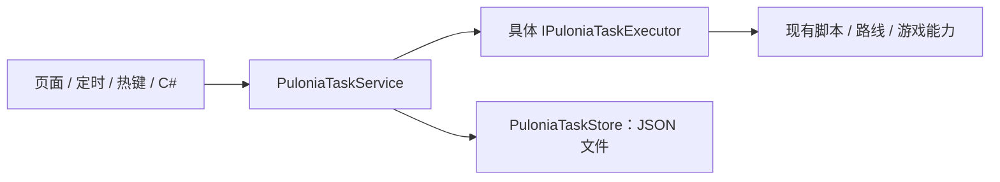

# Pulonia：执行、生命周期、恢复与 API

[返回总览](../automation-system.md) · [用户故事](requirements.md) · [开发与验收计划](development-plan.md)

说明如何运行任务、按需获取游戏资源、停止与恢复，以及 JS/C# 接入。CD 和可靠落盘的详细语义见[结果与存储](results-and-storage.md)。

## 执行结构与资源生命周期



主链只保留以下职责：

| 部分 | 内容 |
| --- | --- |
| `PuloniaTaskService` | 统一入口、串行队列、集中准备运行快照/执行树、执行编排、条件/CD 检查、运行状态和取消 |
| `IPuloniaTaskExecutor` 的具体实现 | JS、路线、Shell、C#、内置功能的实际执行，接收已解析参数并返回真实结果 |
| `PuloniaTaskStore` | 读写计划、状态、历史等 JSON；不引用 ViewModel，不负责执行 |
| 触发入口 | 定时循环和热键回调只提交请求；代码较长时可放进 `PuloniaTaskService` 的独立 partial 文件 |

`PuloniaTaskService` 通过 `TaskType → IPuloniaTaskExecutor` 注册查找具体能力。运行准备集中完成展开、参数解析、校验与版本固定，可产出只读执行树，具体选择见[任务模型](task-model.md)。这不是另一套执行服务；避免重复的 Converter/Factory 链、Engine/Runner 调度层、通用事件总线和后台历史 Recorder。游戏会话准备及恢复复用已有运行环境；可按职责拆分辅助类，不要求把所有逻辑堆入一个大服务。

目录结构按 `Pulonia/Models`、`Pulonia/Services`、`Pulonia/Executors` 组织；WPF View/ViewModel 保持现有项目位置。Model 是普通数据，ViewModel 包装同一模型进行编辑；执行时深复制并固定配置，防止编辑影响运行。实现可以按功能分文件，但不增加仅透传参数的层。

### 按需求获取资源

| 能力 | 所需资源 | 生命周期 |
| --- | --- | --- |
| Shell、文件处理、纯计算 C# | 通常无游戏资源 | 自己拥有子进程、文件流等资源 |
| 纯计算 JS | 脚本引擎 | 本次动作内创建、结束时释放 |
| 游戏路线、秘境、游戏 JS/C# | 游戏会话、截图、独占输入 | 执行前按需获取；相邻游戏动作允许复用会话 |
| 游戏启动/账号切换 | 启动或登录阶段能力 | 不要求先到大世界；完成后核验身份 |
| 自动拾取等实时辅助 | 当前游戏动作的辅助能力集合 | 随动作作用域注册与撤销 |

能力声明独立于实现语言。JS 不天然等于游戏任务，C# 也不天然等于纯计算。旧脚本没有声明时，兼容适配按需要游戏处理；新脚本可声明为纯脚本。声明缺失的游戏调用必须明确失败或通过受控会话入口获取资源，不能绕过协调器。

`GameRuntimeService` 目前将绑定窗口与截图启动组合在一起，可先复用这个组合边界。第一步只要求纯任务不碰它；确有需求后再拆分窗口、输入、截图获取，不先建复杂资源依赖图。

租约区分“借用用户已启动的截图器”和“本次自动启动”。借用者不能在结束时关闭其他使用者仍需要的环境。动作负责释放自己创建的 `Mat`、`Bitmap`、流、引擎和子 CTS；会话服务负责环境。恢复监测只读截图，恢复动作与业务动作必须交接输入控制权。

### 并发、取消、线程

- 首版由一个主协调器串行执行请求；Shell 即使不依赖游戏，也可以先排队，避免为首版引入并发复杂度。
- 同一 Windows 交互会话只允许一个前台输入所有者。已有子进程和 WebView 实例必须通过统一协调器申请；独立启动的旧入口在切换完成后不能绕过它。
- 等待电脑空闲、等待未来时段、等待人工处理期间不持有游戏输入租约。
- 每次运行独立 `CancellationTokenSource`；节点超时建立关联 CTS 并及时释放，不使用全局 `CancellationContext` 控制新引擎。
- 计划可设置总运行时限，节点重试和公共恢复均消耗同一总预算。时限到达后走正常取消与清理，不强行把仍在运行的节点标成已停止。请求截止时间控制能否开始，与运行总时限分别保存。
- 取消请求不等于停止完成。等待执行器退出、释放按键及资源后才能启动下一项；不配合取消的旧代码必须保持租约隔离并显示“停止中/待处理”，不能后台继续点击。
- Shell 记录退出码并异步读取输出；超时/取消需要结束本次拥有的进程树并确认退出，不能只取消 `WaitForExitAsync`。
- WPF 页面、窗口钩子和依赖消息循环的对象继续在 UI/STA 线程建立与释放；耗时执行、扫描、索引在后台。核心 DTO 和引擎不依赖 `Dispatcher`，通过 UI 适配层切换。

### 推荐执行顺序

请求准入 → 固定计划、引用与配置版本 → 校验资源 → 获取所需会话 → 核验 UID → 刷新关键状态 → 保存操作意图和额度占用 → 执行动作 → 确认副作用 → 在同一运行状态中保存证据、CD 和进度 → 释放作用域。

CD 和空闲条件至少在排队时、真正执行前分别检查。业务动作跨日切或账号状态变化时，再检查关键状态。状态写入锁只保护短暂的检查与保存，不能跨游戏操作持有。

## 异常恢复

恢复链为“识别已知打断 → 处理弹窗/等待网络 → 重新建立已知起始场景 → 核验副作用 → 按合同决定重试或待处理”。

| 场景 | 建议行为 |
| --- | --- |
| 加载中、短暂网络波动 | 在超时预算内等待目标状态，有限次重试，避免连续点击 |
| 已知日切月卡、已知奖励弹窗 | 由专用处理器处理，确认界面稳定后继续 |
| 进入已知剧情/菜单 | 按明确识别结果退出；任务重新准备起始状态 |
| 被顶号、需要验证码、UID 不符 | 停止该账号自动执行，进入待处理，不无限重登抢号 |
| 游戏退出、截图失效 | 按配置重建会话，重新核验 UID、游戏状态和未决副作用 |
| 背包空间不足、任务所需资源不足 | 返回明确原因并退出该能力；按计划策略跳过依赖它的部分或待处理，不自动销毁物品 |
| 版本更新或未知界面 | 保存诊断截图及步骤；有限恢复仍未知则待处理 |

恢复动作不能与业务动作同时发送输入。局部任务状态机负责自己的正常页面；公共恢复器只处理明确识别的全局中断。任务内部重试与公共恢复共享总时长/总次数预算，避免层层重试相乘。

游戏输入后必须等待响应再识别，不能立即用旧帧判断成功；可取得帧编号/时间戳时先要求新帧，再核验目标界面。公共中断处理不能被脚本清理自身实时辅助时误撤销；脚本只管理自己的作用域，宿主负责暂停、交接输入和恢复。旧 JS 无法安全交接时取消当前节点后重新准备，不承诺保留其任意指令位置。

任何“未知界面都能自动恢复”的承诺都不可靠。可持续做法是扩大已知打断覆盖面，记录无法恢复的样本，在明确预算内尝试，最后给出可续跑的位置。

## 续跑与版本快照

首版提供节点级续跑，满足“从这里开始”：

- 运行前保存完整计划、引用展开结果、有效配置、账号绑定、资产版本与文件指纹快照。
- 中断后展示已完成节点、未确认节点、失败节点和未开始节点。
- “继续上次”创建关联的新运行，沿用原快照，跳过已确认完成的节点；对不确定节点先核验，不盲目重放。
- “从此节点开始”是明确的运行范围；仍执行必要的会话初始化、账号核验、祖先条件与额度检查。
- 被引用计划多次出现、重复执行多轮，靠 `TaskAddress` 区分，不能只存 `NextTaskIndex`。
- 无法保留旧脚本版本时，检测指纹变化并提示改为按新版本新开运行，不能假装精确恢复。支持旧版本续跑的资源应保留不可变版本缓存。
- 后续仅让有明确检查点的路线/内置能力保存 `Checkpoint`，不要求任意 JS、Shell 或 C# 从某一行恢复。

长任务的最小确认粒度建议是一次领取、一次秘境结算、一个路线段；即使首版只支持节点级续跑，已确认副作用也要即时入账。

## C# 调用及自定义能力

两件事分别支持：C# 发起已有计划，以及 C# 实现一个新能力。以下仅为建议契约示意，不是当前可用 API。若模型验收选择只读执行节点，内部执行器入参可据此调整；外部请求、结果和取消语义保持一致。

```csharp
namespace BetterGenshinImpact.Pulonia;

public interface IPuloniaTaskService
{
    Task<Guid> EnqueueAsync(PuloniaTaskRequest request, CancellationToken ct);
    Task<PuloniaTaskPlanRunView> GetRunAsync(Guid planRunId, CancellationToken ct);
    Task CancelAsync(Guid planRunId, CancellationToken ct);
}

public interface IPuloniaTaskExecutor
{
    string TaskType { get; }

    Task<PuloniaTaskOutcome> ExecuteAsync(
        PuloniaTask task,
        PuloniaTaskExecutionContext context,
        CancellationToken ct);
}
```

调用示意：

```csharp
// 返回请求 ID；排队时不要求游戏或截图器已启动。
var requestId = await puloniaTasks.EnqueueAsync(
    new PuloniaTaskRequest { PlanId = planId, AccountId = accountId }, ct);
```

实际 SDK 同时提供按 `requestId` 查询状态与运行 ID、等待完成、查询节点结果和取消排队请求。请求调用的 `ct` 只控制提交/查询等待；持久化请求的取消使用显式 API，避免客户端断开导致语义不清。

提交时由服务生成并保护 ID、状态、来源等服务端字段，调用方只填写目标和允许的参数。同一个请求模型即可，不另建仅复制字段的 RequestSpec、Invocation 等中间层；需要边界隔离的外部 IPC 消息可以有最小 DTO。

`PuloniaTaskExecutionContext` 提供本次账号、有效配置、日志、进度、受控游戏能力及完成事件报告。内部组合使用 `ExecuteChildAsync` 一类同运行入口，继承同一取消、输入所有权和账本，并记录子步骤；不能通过再入全局队列等待自己，造成死锁或绕过记录。

JS 桥接同样提供可等待的结构化结果，包括状态、原因、确认程度与子步骤关联；保留旧 API 签名的兼容包装，但新脚本不需要伪造日志或按停止热键来报告失败。新树的 JS、C# 与直接执行都必须经过相同的能力适配和记账边界；旧脚本自存的 CD 只能作为带来源的迁移数据，未经核验不能与新账本重复累计。

外部 C# 程序使用轻量客户端，通过本机命名管道访问同一服务；复用当前实例通信基础设施的可用部分，增加协议版本和当前用户访问限制。先支持列出能力、提交计划/单动作、状态、取消；有明确远程需求时再考虑 HTTP。

保留 d-v3 中 C# 与 JS/Shell 同列的交互入口，但普通使用者选择已注册方法及参数。首版采用编译后 DI 注册的执行器或委托，明确注入取消令牌和返回 `PuloniaTaskOutcome`。不将“程序集扫描 → 猜测重载 → 无参构造实例”的反射链作为默认机制；否则改个方法名就会破坏任务文件，也难以保证取消和依赖注入。需要导入旧 `MethodPath` 时提供显式映射和不支持提示。

进程外工具通过 CLI/客户端调用。动态编译 `.csx`、热加载 DLL 和依赖隔离有确切需求再考虑，不引入 Roslyn 作为前置条件。
