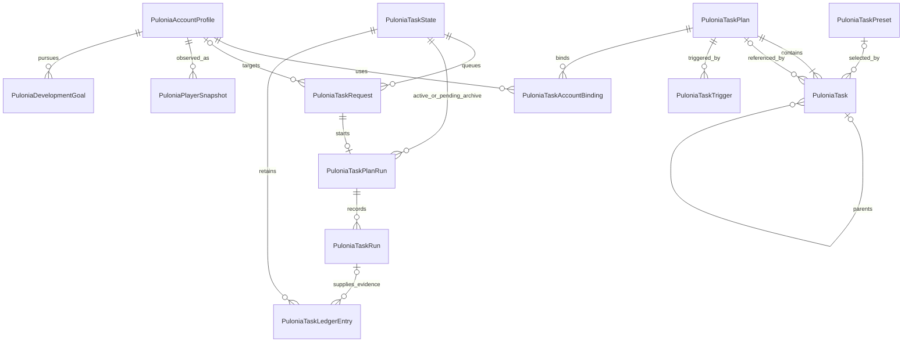

# Pulonia：实体、任务树与配置

[返回总览](../automation-system.md) · [用户故事](requirements.md) · [开发与验收计划](development-plan.md)

定义 Pulonia 命名、实体关系、JSON 树格式和配置优先级。运行时是否采用独立的只读执行节点是待模型阶段验收的实现选择。

## 实体与命名

采用 `BetterGenshinImpact.Pulonia` 命名空间，任务相关类型统一以 `PuloniaTask` 命名，区别旧的 `ScriptGroup`、`OneDragonFlow`、`TaskRunner`。

`PuloniaTask` 直接表示任务树中的一个节点，通过 `TaskType` 区分分组、脚本、路线、内置功能等；不再另设同义的 `PuloniaTaskNode`。`PuloniaTaskPlan` 保存计划元信息和 `RootTask`。`PuloniaTaskDefinition` 仅是代码注册或资源清单提供的类型说明，不再作为每次执行必须引用的独立实体。

运行记录对应区分为 `PuloniaTaskPlanRun`（一次计划运行）与 `PuloniaTaskRun`（树中某个任务的一次执行尝试）。账号、状态快照和培养目标使用 `Pulonia` 前缀，分别命名为 `PuloniaAccountProfile`、`PuloniaPlayerSnapshot`、`PuloniaDevelopmentGoal`。

用户界面依然使用“任务计划”“任务”“配置预设”等中文，不暴露内部术语。

### 第一阶段模型

| 概念 / 命名 | 关键字段 | 职责与边界 |
| --- | --- | --- |
| 任务计划 `PuloniaTaskPlan` | `Id`、`SchemaVersion`、`Revision`、`Name`、`Description`、`RootTask`、`Triggers`、`Accounts` | 一个计划文件，包含任务树、触发配置和账号绑定；一条龙只是其简洁视图 |
| 树节点 `PuloniaTask` | `Id`、`Name`、`TaskType`、`Path`、`IsEnabled`、`Parameters`、`Children`、`PresetId?`、`Policy`、`Source?` | 沿用 d-v3 的持久化形状；运行前固定快照，可集中构建只读执行节点，不把执行状态写回编辑模型 |
| 类型说明 `PuloniaTaskDefinition` | `TaskType`、`ParameterSchema`、`Requirements`、`CompletionContract`、`AvailabilityRules` | 由内置注册或资源清单提供，不单独存储，不设管理服务；执行器注册字典按 `TaskType` 查找 |
| 配置预设 `PuloniaTaskPreset` | `Id`、`TaskType`、`ResourceId?`、`SchemaVersion`、`Values` | 可选；脚本专用预设同时绑定资源和参数版本，避免不同 JS 的同名参数被混用 |
| 触发器 `PuloniaTaskTrigger` | `Id`、`TargetTaskId?`、`Kind`、`Schedule/Hotkey`、`TimeZoneId`、`AdmissionPolicy` | 嵌入计划，定时或热键；全局触发页面只是各计划触发器的汇总 |
| 游戏账号 `PuloniaAccountProfile` | `Id`、`Uid`、`Server`、`LoginProfileRef`、`Preferences` | 游戏身份和账号偏好；不是 BGI 进程实例，不把密码直接写入计划 |
| 计划账号绑定 `PuloniaTaskAccountBinding` | `AccountId`、`Enabled`、`PresetSelections` | 嵌入计划，列表顺序就是账号顺序；不单独持久化 |
| 待执行请求 `PuloniaTaskRequest` | `Id`、`PlanId`、`AccountId?`、`Source`、`IdempotencyKey`、`NotBefore`、`ExpiresAt`、`Status`、`BatchId?` | 运行状态文件中的队列项；不设独立请求仓储 |
| 计划运行 `PuloniaTaskPlanRun` | `Id`、`RequestId`、`Snapshot`、`Status`、`StartedAt`、`EndedAt`、`ResumedFromPlanRunId?` | 记录一次实际执行，持有不可变的计划、资源版本、有效配置快照 |
| 节点尝试 `PuloniaTaskRun` | `Id`、`PlanRunId`、`TaskAddress`、`Attempt`、`Status`、`Outcome`、`Evidence`、`Checkpoint?` | 记录某个位置的某次尝试；失败、跳过、重试都能定位 |
| 活动账本项 `PuloniaTaskLedgerEntry` | `EventKey`、`ScopeKey`、`EffectKey`、`WindowKey`、`State`、`Units`、`OccurredAt`、`NextEligibleAt?`、`TaskRunId?` | 运行状态中的 CD/额度记录，保留未决操作与有效完成依据；不新增账本服务 |
| 运行状态 `PuloniaTaskState` | `SchemaVersion`、`Sequence`、`PendingRequests`、`ActiveRun`、`PendingArchives`、`Ledger`、`TriggerCursors` | 一个文件统一保存会相互影响的执行状态，替代数据库事务需求 |

真正独立保存的对象只有计划、预设、账号资料、运行状态、运行历史五类。其余是其中的嵌套记录或类型说明，不对应独立文件、仓储、服务或菜单。保留命名是为了表达业务含义，不是增加调用层级。

`Policy`、`Requirements`、`Outcome`、`Evidence`、`Checkpoint` 都是值对象，不再各自引入实体管理页面。

### 托管阶段增加两个实体

| 实体 | 主要内容 |
| --- | --- |
| `PuloniaPlayerSnapshot` | 账号状态快照：角色、武器、物品、树脂等。每个字段记录观测时间、来源、可信程度；未识别不等于 0 |
| `PuloniaDevelopmentGoal` | 角色或物品目标、目标口径（培养 / 库存达到 / 周期内新增）、目标等级/数量、优先级、资源预算和允许的替代策略 |

圣遗物逐件属性、配装优化等可后续扩展快照内容，不把这部分复杂度放进执行引擎。

### ER 图

这是主要对象关系图；使用文件存储，没有数据库表。类型说明来自注册字典，省略在图外。



约束补充：

- 每个计划恰有一个根节点；非根节点恰有一个父节点。具体任务没有子任务；分组、重复、引用按类型约束子任务来源。
- 根节点固定为 `group`。引用可形成计划依赖，但禁止自引用和间接循环，校验最大嵌套深度。
- 每个计划的账号绑定不重复。一次请求只生成一次实际运行，依靠单写入者检查状态，不依赖数据库唯一约束。
- 每个请求生成至多一次运行；续跑创建新请求、新运行，以 `ResumedFromPlanRunId` 关联原运行。
- 节点尝试关联的是运行快照中的节点地址，不依赖当前可编辑树。因此删除节点、移动顺序、修改计划都不会改写历史。
- `TaskAddress` 使用稳定节点 ID、引用调用路径、重复轮次组合，不使用显示名称或列表下标。
- 账本可由人工校正或状态核验生成，因此 `TaskRunId` 可空；账号/世界作用域由 `ScopeKey` 表达，不能仅绑定某个计划。

## 任务树的最小语义

保留 d-v3 的“计划 → 根任务 → children”格式。`TaskType` 是唯一类型判别字段：

| 类型 | 行为 |
| --- | --- |
| `group` | 按 `Children` 数组顺序执行；承担分组与公共配置继承 |
| `javascript` / `pathing` / `keymouse` / `shell` / `csharp` / `builtin.*` | 按类型查找具体执行器，参数直接在节点中保存 |
| `plan` | 引用另一个计划；在本次运行中按展开快照执行 |
| `repeat` | 重复一棵子树；固定次数，或带最大次数/最长时长的结束条件 |

格式示意：

```json
{
  "id": "plan-daily",
  "schema_version": 1,
  "revision": 1,
  "name": "每日计划",
  "root_task": {
    "id": "task-root",
    "name": "每日计划",
    "task_type": "group",
    "is_enabled": true,
    "parameters": {},
    "children": [
      {
        "id": "task-collect",
        "name": "采集材料 A",
        "task_type": "pathing",
        "path": "{pathingRepoFolder}/材料A/路线1.json",
        "is_enabled": true,
        "parameters": { "party_name": "采集队" },
        "children": []
      }
    ]
  },
  "triggers": [],
  "accounts": []
}
```

示例 ID 用可读字符串说明关系，实际创建时生成稳定 ID。与 d-v3 相比，必要调整只有：

- `parameters` 存 JSON 对象，运行时按类型校验和转换；不再存转义后的 JSON 字符串，Shell 命令也放进明确的参数对象。
- `is_directory` 不再与 `task_type` 同时决定行为，导入时转换为 `group`；空分组仍是分组。`is_expanded` 可保留为展示状态，执行器忽略它。
- 新增节点 ID，数组位置只表示顺序。节点 `priority` 不参与重排，调度优先级只属于请求。
- `Source` 是目录/计划引用的可选值对象：目录保存定位与版本，计划引用保存目标 PlanId。目录引用仍以分组展示，不额外增加一个用户必须学习的实体。引用组保存来源、展开组保存 Children，不能同时维护两份可编辑的子任务。
- 每个 `pathing` 节点直接指向路线，每个 JS 节点直接指向脚本资源，不强制先建一份“能力定义实体”再建节点。

节点可附带启用状态、结构化条件、失败策略、超时。日历窗口、CD、树脂不足等返回可解释的跳过或等待原因，不能都记为失败。

内置条件只覆盖常见情况，例如星期、物品缺口、树脂阈值、剩余时长。复杂逻辑交给 JS/C# 能力；首版不设计图形化编程语言。条件读到未知状态时，可以先刷新，仍未知则跳过或待处理，不能当成 0。

```text
每日计划
├─ 日常
│  ├─ 领取邮件
│  ├─ 派遣
│  └─ 每日奖励
├─ 培养素材
│  ├─ 刷秘境 [预设：角色 A 天赋]
│  └─ 采集材料 A
│     ├─ 路线 1
│     └─ 路线 2
├─ 引用：每周事项
├─ 剩余时间采集 [有总时长上限]
└─ Shell：生成本次报告
```

手工任务树严格按用户顺序执行。自动托管在生成树时按目标优先级排序；队列优先级只决定下一个请求，不打断正在消耗资源的动作。

重复不是重试：重复会产生新的业务尝试并重新检查额度；重试必须先判断上次副作用是否已经发生。失败策略首版只需要停止计划、跳过后续同组、继续后续节点，外加有限重试。完成后操作使用普通末尾节点；异常清理属于执行器 `finally`，不把“关机”与“释放输入”混在一起。

## 配置层级与复用

先按含义分开，避免什么都放进一个 `AllConfig`：

| 配置类别 | 归属 |
| --- | --- |
| 截图后端、窗口绑定、日志等设备配置 | 程序/运行环境；业务节点不能任意覆盖 |
| UID、服务器、登录资料、账号培养目标 | 账号资料；属于上下文，不参与任意 JSON 合并 |
| 秘境、队伍、路线策略、JS 参数、Shell 参数 | 类型默认值、能力预设、树上覆盖 |
| 超时、有限重试、失败策略 | 可继承的执行策略；按字段解析 |
| 定时、热键、空闲门槛、触发过期时间 | 触发器 |
| 资源刷新规则、奖励上限、完成证据要求 | 能力元数据与账本；不是普通参数覆盖项 |

业务参数和执行策略使用统一解析规则，优先级从高到低：

```text
本次调用覆盖 > 本节点覆盖 > 最近祖先覆盖 > 选用预设 > 类型默认值
```

根节点就是计划级配置；祖先覆盖从近到远查找。通用执行策略可按 `TaskType` 组织；脚本专用参数还需绑定具体资源及参数版本，不能仅凭都属于 JS 就合并配置，也不能把路线的队伍字段灌入 Shell。默认界面只展示“当前任务设置”和“继承的公共设置”；共享预设、嵌套覆盖和本次临时覆盖按需展开。

账号绑定可以为指定节点选择另一个预设，例如大号和小号使用不同战斗队伍；它替换“选用哪个预设”，不增加一层隐式合并。

每个字段显示最终有效值及来源，例如“战斗队伍：采集队，来自素材采集分组”。支持“恢复继承”；缺省、显式空值、0、false 分开保存，集合默认整体替换。配置在开始运行时解析成强类型、不可变快照。

独立任务、一条龙卡片和树节点详情复用同一参数编辑器。编辑动作明确区分“修改共享预设”和“只覆盖此节点”。计划引用默认沿用被引用计划的内部配置；引用节点仅允许覆盖声明的公共参数及执行策略，避免外部祖先悄悄改写整棵引用树。

UI 可为内置能力提供专用参数编辑器；JS 依据 Schema 生成表单。编辑器提供方放在 WPF 层，`PuloniaTaskDefinition` 不引用 `UserControl`。

切换计划、节点、账号或预设时，编辑器和有效值预览绑定同一个当前选择；异步加载只提交仍属于当前选择的结果。复制、导入、正常读档使用同一参数转换与校验规则，保留数组、布尔值和数值类型；不能出现复制后必须重启才正常的第二种参数表示。

## 持久化树与可执行树的取舍

持久化模型保持 `PuloniaTaskPlan → RootTask → Children`。执行前需要展开目录/计划引用、解析有效参数、校验能力并固定资源版本，因此允许在这一步生成只读执行树。它属于本次运行的内部表示，不增加另一份用户配置文件。

建议在第 1 步用一份实际样例评估两种实现：直接执行已解析的快照，或生成携带强类型参数和执行器绑定的只读节点。两者满足相同合同后，由用户验收确定；“禁止可执行树”不再是架构约束。

- 构建逻辑集中在一个入口，需要独立类时可命名 `PuloniaTaskBuilder`；不再串联只做转发的 Converter、Factory 与多层 Runner。
- 执行节点保留来源节点 ID 与引用路径，用于界面定位、结果和续跑；不能仅凭数组下标对应。
- 可序列化的运行快照记录展开内容、有效参数和资源版本；执行器实例、服务引用和委托不直接保存到 JSON，恢复时按快照重新绑定。
- 运行状态继续归 `PuloniaTaskRun` 等记录，不能因节点有 `RunAsync` 就把执行行为、可变状态和 WPF 命令全部塞进一个类。
- 参数校验失败在执行前指向原节点报错；不能悄悄替换为被禁用的占位节点。

具体调用与生命周期见[执行机制](execution.md)，快照落盘见[结果与存储](results-and-storage.md)。
