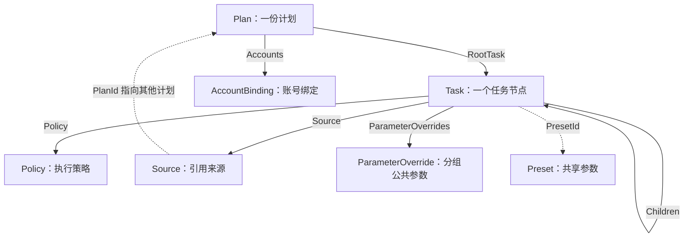
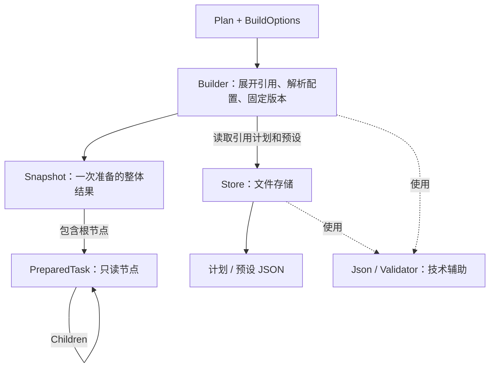
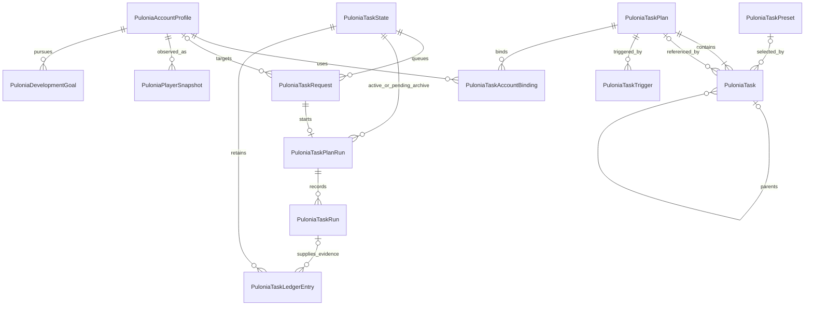

# Pulonia：实体、任务树与配置

[返回总览](../automation-system.md) · [用户故事](requirements.md) · [开发与验收计划](development-plan.md)

定义 Pulonia 命名、实体关系、JSON 树格式和配置优先级。步骤 1 已于 2026-10-02 验收，运行时采用独立的只读执行节点；编辑页始终包装并修改配置模型，不把运行状态写回配置树。

## 先看清当前类型的职责和关系

阅读代码时先抓住三个用户概念：**计划、任务、可选的共享预设**。计划包含任务树，树上的节点可以选用共享预设。其他类型提供嵌套配置、能力说明、运行准备数据和技术辅助。

以下说明对应步骤 1 原型的现有类型；后文的完整实体表还包括后续执行、调度与托管阶段的设计。当前实现有 16 个公开类型：7 个配置模型、1 个能力说明、3 个运行准备数据类型、4 个技术辅助类型和 1 个定位异常，另有一个私有的 `BuildContext`。公开范围属于当前实现选择，并不要求所有类型都成为正式 API。当前独立保存的配置只有计划和预设，嵌套字段不对应独立文件、仓储、服务或管理页面。

图表使用短名方便阅读：`Plan` 对应 `PuloniaTaskPlan`，`Task` 对应 `PuloniaTask`；其余短名在前面加 `PuloniaTask` 即为当前完整类名。`BuildContext` 是 Builder 内部的私有类型，不遵循这一缩写规则。

### 用户配置的关系



这是类型之间的包含与引用关系，图中 `Source → Plan` 表示引用其他计划；实际计划仍禁止自引用和间接循环。

这些类型属于**配置模型层**。当前由 Store 和 Builder 使用，后续由 ViewModel 包装进行编辑，页面不会承担文件存储或执行编排。

| 类型 | 职责 | 使用方 | 必要性判断 |
| --- | --- | --- | --- |
| [Plan](../../../BetterGenshinImpact/Pulonia/Models/PuloniaTaskPlan.cs) | 计划名称、修订号、根任务和账号绑定 | Store、Builder；后续计划编辑 ViewModel | 必须，代表一份计划 |
| [Task](../../../BetterGenshinImpact/Pulonia/Models/PuloniaTask.cs) | 分组、路线、JS 等树节点；`TaskType` 区分结构或能力，`Source` 表示可选外部来源；分组自身可配置执行次数 | Store、Builder；后续树编辑 ViewModel | 必须，是任务树的核心；无需为计划引用、固定重复等配置再建立任务类型 |
| [Preset](../../../BetterGenshinImpact/Pulonia/Models/PuloniaTaskPreset.cs) | 独立保存、可被多个节点复用的一套参数 | Store、Builder；后续参数编辑 ViewModel | 共享预设功能需要，普通计划可以不用 |
| [Policy](../../../BetterGenshinImpact/Pulonia/Models/PuloniaTaskPolicy.cs) | 把超时、失败行为和重试设置放在一起 | 嵌入 Task，由 Builder 解析；后续执行服务读取 | 值对象，值得保留；不单独管理 |
| [Source](../../../BetterGenshinImpact/Pulonia/Models/PuloniaTaskSource.cs) | 指定节点引用哪个目录或其他计划 | 嵌入 Task，由校验和 Builder 读取 | 引用功能需要，作为节点的嵌套字段 |
| [ParameterOverride](../../../BetterGenshinImpact/Pulonia/Models/PuloniaTaskParameterOverride.cs) | 指定分组为哪种能力、哪个脚本覆盖哪些参数 | 嵌入 Task，由 Builder 解析 | 作用域继承需要，作为节点的嵌套字段 |
| [AccountBinding](../../../BetterGenshinImpact/Pulonia/Models/PuloniaTaskAccountBinding.cs) | 计划关联的账号及其节点预设选择 | 嵌入 Plan，由校验和 Builder 读取；后续多账号执行使用 | 多账号需要；当前只保留身份引用和预设选择，不代表已实现账号切换 |

`Preset` 和 `ParameterOverride` 的字段有相似之处，但生命周期和作用范围不同：

- `Preset` 是独立保存的共享参数集合，例如“采集队配置”；修改后可影响多个使用者。它只复用参数，不复用节点结构、执行顺序或计划引用，并按任务类型、可选资源 ID 和参数格式版本限制兼容范围。
- `ParameterOverride` 是某个分组内部的覆盖，例如“这个分组统一使用夜兰队”；只属于任务树中的这一位置。

`Policy`、`Source`、`ParameterOverride`、`AccountBinding` 都是小型嵌套对象。按含义分组字段有助于阅读，独立成类不意味着独立成一个业务模块。是否独立成文件可以按项目对小型类的规则调整。

### 运行准备的关系

**现有原型到快照就结束，尚未执行任务。** 下图中的箭头表示数据生成与辅助调用，`Snapshot → PreparedTask` 是包含关系。



下面四个类型属于**能力说明与运行准备层**，不构成新的用户配置模块：

| 类型 | 职责 | 使用方 | 必要性判断 |
| --- | --- | --- | --- |
| [Definition](../../../BetterGenshinImpact/Pulonia/Models/PuloniaTaskDefinition.cs) | 描述能力的默认参数、参数格式和允许跨计划覆盖的公共参数 | 当前 Builder 读取；设计上由执行器注册或资源清单提供 | 能力说明有必要，不需要独立管理服务；当前由调用端提供仅是原型方式 |
| [BuildOptions](../../../BetterGenshinImpact/Pulonia/Models/PuloniaTaskBuildOptions.cs) | 携带路径变量、账号、临时覆盖和展开限制等显式输入 | 当前 C# 调用端传入，Builder 使用 | 可以保留为内部准备输入；当前混入 `Definitions`，职责偏宽，见后文收口建议 |
| [PreparedTask](../../../BetterGenshinImpact/Pulonia/Models/PuloniaTaskPreparedTask.cs) | 保存展开地址、有效参数、资源版本、来源和子节点 | Builder 输出；后续执行器读取 | 选择只读执行树方案时需要，属于内部运行表示，具体形式仍待模型验收 |
| [Snapshot](../../../BetterGenshinImpact/Pulonia/Models/PuloniaTaskSnapshot.cs) | 包装一次准备的整体结果，包含准备树和来源配置 | Builder 输出，当前可序列化展示；后续运行状态与历史保存 | 快照概念需要；执行数据与来源留档的范围和表示还需明确 |

`Snapshot` 与 `PreparedTask` 分别表示整体和其中的节点，与 `Plan` 包含 `Task` 的关系相似。它们的生命周期是一次准备或运行，编辑模型则长期保存并允许用户修改。

例如，包含同一路线的分组配置为执行两轮，编辑树仍只有一个分组和一个路线节点；准备树需要区分 `#1/路线` 与 `#2/路线`，后续才能分别记录结果和定位续跑。生成运行地址、固定参数并隔离后续编辑，是额外运行表示的实际用途。当前原型仍未绑定执行器，也没有完成强类型能力参数和快照恢复，因此不能把它当成已验收的最终执行合同。

### 技术辅助的职责

下面类型属于**技术辅助与文件存储职责**。它们是被直接调用的辅助代码，不是四层串联调度。

| 类型 | 职责 | 使用方 | 必要性判断 |
| --- | --- | --- | --- |
| [Builder](../../../BetterGenshinImpact/Pulonia/Services/PuloniaTaskBuilder.cs) | 集中完成展开、参数解析、校验和版本固定 | 当前 C# 调用端；后续由统一任务服务调用 | 值得保留一个集中入口；不再增加转发它的 Factory、Converter 或 Runner |
| [Store](../../../BetterGenshinImpact/Pulonia/Services/PuloniaTaskStore.cs) | 文件读写、修订冲突检查、完整替换和备份 | 当前 Builder、C# 调用端；后续编辑 ViewModel 和任务服务 | 需要，作为存储入口旁路支持主执行链 |
| [Json](../../../BetterGenshinImpact/Pulonia/Services/PuloniaTaskJson.cs) | 序列化、反序列化和复制辅助 | 当前 Store、Builder、准备模型的参数/策略读取及调用示例 | 功能需要，公开范围可以缩小；准备模型中的依赖见收口建议 |
| [Validator](../../../BetterGenshinImpact/Pulonia/Services/PuloniaTaskValidator.cs) | 检查树、引用、参数和策略是否合法 | Json、Store、Builder | 功能需要，作为共用辅助；无需独立调度或管理生命周期 |
| [ValidationException](../../../BetterGenshinImpact/Pulonia/Models/PuloniaTaskValidationException.cs) | 携带错误位置，供调用方定位节点或参数 | 校验与保存/准备过程抛出，调用方展示 | 轻量且用途明确；属于诊断类型，不属于业务实体 |
| [PlanCatalog](../../../BetterGenshinImpact/Pulonia/Models/PuloniaTaskPlanCatalog.cs) | 只保存编辑器计划列表的稳定 ID 顺序 | Store 读写、任务计划页面拖拽排序 | 属于界面目录元数据，不参与任务执行、计划修订或引用语义 |

Builder 内还有私有 `BuildContext`，只保存本次准备的计划/预设/资源缓存、展开计数器和取消令牌，已经限定在 Builder 内部，无需成为公开类型或用户概念。

### 对简洁性的判断与收口建议

核心概念符合“复杂性要有来源”的设计边界，现有准备过程也没有增加层层转发的调度链。不过，步骤 1 的公开范围和运行数据处理偏重，应在后续实现中收敛。**以下是待实施的收口建议，不代表代码已经调整，也不代表步骤 1 已验收通过。**

1. **让运行数据的读取更直接。** 当前 `PreparedTask` 把参数和策略存成 JSON 字符串，每次读取再反序列化，以保证返回独立副本。这增加了重复解析和理解成本，也让运行模型依赖 `Services.PuloniaTaskJson`。应集中处理复制、冻结和序列化，运行数据表达已解析内容；调整后仍须保证修改编辑模型或取出的参数不会改写已有快照。
2. **由宿主管理能力说明。** 当前 `BuildOptions` 要求调用端传入 `Definitions`，适合演示准备原型。正式入口应由宿主从执行器注册或资源清单取得能力说明，页面和普通 C# 调用主要提交目标、账号和临时覆盖，避免每个入口组装一套定义。无需为此另建一层独立的能力定义管理服务。
3. **区分配置、能力说明、运行数据和诊断类型，缩小公开范围。** 目前它们混在 `Models` 中，且全部公开；应按用途组织，并按真实调用需求决定哪些保持内部可见。快照中的展开树用于执行，原计划/预设留档用于追溯，要明确各自的用途与保存范围，并保持已要求的版本追溯和续跑语义。

建议保留配置模型与一个集中准备入口，先收敛上述边界，再推进界面阶段。后续主线继续围绕 **Plan、Task、统一任务服务、类型执行器和 Store** 展开，其他类型只在对应功能内部出现。执行结构见[执行设计](execution.md#执行结构与资源生命周期)，实施状态与验收结论统一维护在[开发计划](development-plan.md)。

## 实体与命名

采用 `BetterGenshinImpact.Pulonia` 命名空间，任务相关类型统一以 `PuloniaTask` 命名，区别旧的 `ScriptGroup`、`OneDragonFlow`、`TaskRunner`。

`PuloniaTask` 直接表示任务树中的一个节点，通过 `TaskType` 区分分组、脚本、路线、内置功能等；计划引用是带计划来源的分组，不占用能力类型。不再另设同义的 `PuloniaTaskNode`。`PuloniaTaskPlan` 保存计划元信息和 `RootTask`。`PuloniaTaskDefinition` 仅是代码注册或资源清单提供的类型说明，不再作为每次执行必须引用的独立实体。

运行记录对应区分为 `PuloniaTaskPlanRun`（一次计划运行）与 `PuloniaTaskRun`（树中某个任务的一次执行尝试）。账号、状态快照和培养目标使用 `Pulonia` 前缀，分别命名为 `PuloniaAccountProfile`、`PuloniaPlayerSnapshot`、`PuloniaDevelopmentGoal`。

用户界面依然使用“任务计划”“任务”“配置预设”等中文，不暴露内部术语。

### 第一阶段模型

| 概念 / 命名 | 关键字段 | 职责与边界 |
| --- | --- | --- |
| 任务计划 `PuloniaTaskPlan` | `Id`、`SchemaVersion`、`Revision`、`Name`、`Description`、`RootTask`、`Triggers`、`Accounts` | 一个计划文件，包含任务树、触发配置和账号绑定；一条龙只是其简洁视图 |
| 树节点 `PuloniaTask` | `Id`、`Name`、`TaskType`、`Path`、`IsEnabled`、`RepeatCount?`、`Parameters`、`ParameterOverrides`、`Children`、`PresetId?`、`Policy`、`Source?` | 沿用 d-v3 的持久化形状；分组可配置完整执行子项的次数；运行前固定快照，可集中构建只读执行节点，不把执行状态写回编辑模型 |
| 类型说明 `PuloniaTaskDefinition` | `TaskType`、`ParameterSchema`、`Requirements`、`CompletionContract`、`AvailabilityRules` | 由内置注册或资源清单提供，不单独存储，不设管理服务；执行器注册字典按 `TaskType` 查找 |
| 配置预设 `PuloniaTaskPreset` | `Id`、`TaskType`、`ResourceId?`、`SchemaVersion`、`Values` | 可选；脚本专用预设同时绑定资源和参数版本，避免不同 JS 的同名参数被混用 |
| 触发器 `PuloniaTaskTrigger` | `Id`、`TargetTaskId?`、`Kind`、`Schedule/Hotkey`、`TimeZoneId`、`AdmissionPolicy` | 嵌入计划，定时或热键；全局触发页面只是各计划触发器的汇总 |
| 游戏账号 `PuloniaAccountProfile` | `Id`、`Uid`、`Server`、`LoginProfileRef`、`Preferences` | 游戏身份和账号偏好；不是 BGI 进程实例，不把密码直接写入计划 |
| 计划账号绑定 `PuloniaTaskAccountBinding` | `AccountId`、`Enabled`、`PresetSelections` | 嵌入计划，列表顺序就是账号顺序；不单独持久化 |
| 待执行请求 `PuloniaTaskRequest` | `Id`、`PlanId`、`AccountId?`、`Source`、`IdempotencyKey`、`NotBefore`、`ExpiresAt`、`Status`、`BatchId?` | 运行状态文件中的队列项；不设独立请求仓储 |
| 计划运行 `PuloniaTaskPlanRun` | `Id`、`RequestId`、`Snapshot`、`Status`、`StartedAt`、`EndedAt`、`ResumedFromPlanRunId?` | 记录一次实际执行，持有不可变的计划、资源版本、有效配置快照 |
| 节点尝试 `PuloniaTaskRun` | `Id`、`PlanRunId`、`TaskAddress`、`Attempt`、`Status`、`Outcome`、`Evidence`、`Checkpoint?` | 记录某个位置的某次尝试；失败、跳过、重试都能定位 |
| 活动账本项 `PuloniaTaskLedgerEntry` | `EventKey`、`ScopeKey`、`EffectKey`、`WindowKey`、`State`、`Units`、`OccurredAt`、`NextEligibleAt?`、`TaskRunId?` | 运行状态中的 CD/额度记录，保留未决操作与有效完成依据；不新增账本服务 |
| 运行状态 `PuloniaTaskState` | `SchemaVersion`、`Sequence`、`PendingRequests`、`ActiveRun`、`PendingArchives`、`Ledger`、`TriggerCursors` | 一个文件统一保存会相互影响的执行状态，替代数据库事务需求 |

真正独立保存的业务对象只有计划、预设、账号资料、运行状态、运行历史五类。`PuloniaTaskPlanCatalog` 只是计划列表顺序的界面元数据，不是第六种业务对象，也没有独立服务或菜单。其余类型是嵌套记录或类型说明，不对应独立文件、仓储、服务或菜单。保留命名是为了表达业务含义，不是增加调用层级。

`Policy`、`Requirements`、`Outcome`、`Evidence`、`Checkpoint` 都是值对象，不再各自引入实体管理页面。

### 托管阶段增加两个实体

| 实体 | 主要内容 |
| --- | --- |
| `PuloniaPlayerSnapshot` | 账号状态快照：角色、武器、物品、树脂等。每个字段记录观测时间、来源、可信程度；未识别不等于 0 |
| `PuloniaDevelopmentGoal` | 角色或物品目标、目标口径（培养 / 库存达到 / 周期内新增）、目标等级/数量、优先级、资源预算和允许的替代策略 |

圣遗物逐件属性、配装优化等可后续扩展快照内容，不把这部分复杂度放进执行引擎。

### ER 图

这是主要对象关系图；使用文件存储，没有数据库表。类型说明来自注册字典，省略在图外。



约束补充：

- 每个计划恰有一个根节点；非根节点恰有一个父节点。具体任务没有子任务；分组与引用按类型约束子任务来源。
- 根节点固定为 `group`。引用可形成计划依赖，但禁止自引用和间接循环，校验最大嵌套深度。
- 每个计划的账号绑定不重复。一次请求只生成一次实际运行，依靠单写入者检查状态，不依赖数据库唯一约束。
- 每个请求生成至多一次运行；续跑创建新请求、新运行，以 `ResumedFromPlanRunId` 关联原运行。
- 节点尝试关联的是运行快照中的节点地址，不依赖当前可编辑树。因此删除节点、移动顺序、修改计划都不会改写历史。
- `TaskAddress` 使用稳定节点 ID、引用调用路径、重复轮次组合，不使用显示名称或列表下标。
- 账本可由人工校正或状态核验生成，因此 `TaskRunId` 可空；账号/世界作用域由 `ScopeKey` 表达，不能仅绑定某个计划。

## 任务树的最小语义

保留 d-v3 的“计划 → 根任务 → children”格式。`TaskType` 区分结构节点和具体能力，`Source` 只补充节点的外部子项来源：

| 类型 | 行为 |
| --- | --- |
| `group` | 按 `Children` 数组顺序执行；承担分组、公共配置继承和可选的固定执行次数；设置计划或目录 `Source` 时，子项改由该来源提供 |
| `javascript` / `pathing` / `keymouse` / `shell` / `csharp` / `builtin.*` | 按类型查找具体执行器，参数直接在节点中保存 |

格式示意：

```json
{
  "id": "plan-daily",
  "schema_version": 1,
  "revision": 1,
  "name": "每日计划",
  "root_task": {
    "id": "task-root",
    "name": "每日计划",
    "task_type": "group",
    "is_enabled": true,
    "parameters": {},
    "children": [
      {
        "id": "task-collect",
        "name": "采集材料 A",
        "task_type": "pathing",
        "path": "{pathingRepoFolder}/材料A/路线1.json",
        "is_enabled": true,
        "parameters": { "party_name": "采集队" },
        "children": []
      }
    ]
  },
  "triggers": [],
  "accounts": []
}
```

示例 ID 用可读字符串说明关系，实际创建时生成稳定 ID。与 d-v3 相比，必要调整只有：

- `parameters` 存 JSON 对象，运行时按类型校验和转换；不再存转义后的 JSON 字符串，Shell 命令也放进明确的参数对象。
- `is_directory` 不再与 `task_type` 同时决定行为，导入时转换为 `group`；空分组仍是分组。`is_expanded` 可保留为展示状态，执行器忽略它。
- 新增节点 ID，数组位置只表示顺序。节点 `priority` 不参与重排，调度优先级只属于请求。
- `Source` 是分组的可选外部来源值对象：目录保存定位与版本，计划引用保存目标 PlanId。目录引用和计划引用都仍以分组展示，不额外增加用户必须学习的任务类型。引用组保存来源、展开组保存 Children，不能同时维护两份可编辑的子任务。
- 每个 `pathing` 节点直接指向路线，每个 JS 节点直接指向脚本资源，不强制先建一份“能力定义实体”再建节点。

节点可附带启用状态、结构化条件、失败策略、超时。日历窗口、CD、树脂不足等返回可解释的跳过或等待原因，不能都记为失败。

内置条件只覆盖常见情况，例如星期、物品缺口、树脂阈值、剩余时长。复杂逻辑交给 JS/C# 能力；首版不设计图形化编程语言。条件读到未知状态时，可以先刷新，仍未知则跳过或待处理，不能当成 0。

```text
每日计划
├─ 日常
│  ├─ 领取邮件
│  ├─ 派遣
│  └─ 每日奖励
├─ 培养素材
│  ├─ 刷秘境 [预设：角色 A 天赋]
│  └─ 采集材料 A
│     ├─ 路线 1
│     └─ 路线 2
├─ 引用：每周事项
├─ 剩余时间采集 [有总时长上限]
└─ Shell：生成本次报告
```

手工任务树严格按用户顺序执行。自动托管在生成树时按目标优先级排序；队列优先级只决定下一个请求，不打断正在消耗资源的动作。

分组多轮执行不是重试：每一轮会产生新的业务尝试并重新检查额度；重试必须先判断上次副作用是否已经发生。失败策略首版只需要停止计划、跳过后续同组、继续后续节点，外加有限重试。完成后操作使用普通末尾节点；异常清理属于执行器 `finally`，不把“关机”与“释放输入”混在一起。

## 配置层级与复用

先按含义分开，避免什么都放进一个 `AllConfig`：

| 配置类别 | 归属 |
| --- | --- |
| 截图后端、窗口绑定、日志等设备配置 | 程序/运行环境；业务节点不能任意覆盖 |
| UID、服务器、登录资料、账号培养目标 | 账号资料；属于上下文，不参与任意 JSON 合并 |
| 秘境、队伍、路线策略、JS 参数、Shell 参数 | 类型默认值、能力预设、树上覆盖 |
| 超时、有限重试、失败策略 | 可继承的执行策略；按字段解析 |
| 定时、热键、空闲门槛、触发过期时间 | 触发器 |
| 资源刷新规则、奖励上限、完成证据要求 | 能力元数据与账本；不是普通参数覆盖项 |

业务参数和执行策略使用统一解析规则，优先级从高到低：

```text
本次调用覆盖 > 本节点覆盖 > 最近祖先覆盖 > 选用预设 > 类型默认值
```

根节点就是计划级配置和顶层任务容器；编辑树不重复显示根节点，而是直接展示其 `Children`，树空白区域的结构命令作用于该内部根节点。祖先覆盖从近到远查找。通用执行策略可按 `TaskType` 组织；脚本专用参数还需绑定具体资源及参数版本，不能仅凭都属于 JS 就合并配置，也不能把路线的队伍字段灌入 Shell。默认界面只展示“当前任务设置”和“继承的公共设置”；共享预设、嵌套覆盖和本次临时覆盖按需展开。

账号绑定可以为指定节点选择另一个预设，例如大号和小号使用不同战斗队伍；它替换“选用哪个预设”，不增加一层隐式合并。

每个字段显示最终有效值及来源，例如“战斗队伍：采集队，来自素材采集分组”。支持“恢复继承”；缺省、显式空值、0、false 分开保存，集合默认整体替换。配置在开始运行时解析成强类型、不可变快照。

独立任务、一条龙卡片和树节点详情复用同一参数编辑器。编辑动作明确区分“修改共享预设”和“只覆盖此节点”。计划引用默认沿用被引用计划的内部配置；引用节点仅允许覆盖声明的公共参数及执行策略，避免外部祖先悄悄改写整棵引用树。

UI 可为内置能力提供专用参数编辑器；JS 依据 Schema 生成表单。编辑器提供方放在 WPF 层，`PuloniaTaskDefinition` 不引用 `UserControl`。

切换计划、节点、账号或预设时，编辑器和有效值预览绑定同一个当前选择；异步加载只提交仍属于当前选择的结果。复制、导入、正常读档使用同一参数转换与校验规则，保留数组、布尔值和数值类型；不能出现复制后必须重启才正常的第二种参数表示。

## 持久化树与可执行树的取舍

持久化模型保持 `PuloniaTaskPlan → RootTask → Children`。执行前需要展开目录/计划引用、解析有效参数、校验能力并固定资源版本，因此允许在这一步生成只读执行树。它属于本次运行的内部表示，不增加另一份用户配置文件。

建议在第 1 步用一份实际样例评估两种实现：直接执行已解析的快照，或生成携带强类型参数和执行器绑定的只读节点。两者满足相同合同后，由用户验收确定；“禁止可执行树”不再是架构约束。

- 构建逻辑集中在一个入口，需要独立类时可命名 `PuloniaTaskBuilder`；不再串联只做转发的 Converter、Factory 与多层 Runner。
- 执行节点保留来源节点 ID 与引用路径，用于界面定位、结果和续跑；不能仅凭数组下标对应。
- 可序列化的运行快照记录展开内容、有效参数和资源版本；执行器实例、服务引用和委托不直接保存到 JSON，恢复时按快照重新绑定。
- 运行状态继续归 `PuloniaTaskRun` 等记录，不能因节点有 `RunAsync` 就把执行行为、可变状态和 WPF 命令全部塞进一个类。
- 参数校验失败在执行前指向原节点报错；不能悄悄替换为被禁用的占位节点。

具体调用与生命周期见[执行机制](execution.md)，快照落盘见[结果与存储](results-and-storage.md)。

## 步骤 1 已验收的具体格式

实现与可阅读样例见 [步骤 1 样例说明](examples/step-1/README.md)。以下表示已随步骤 1 验收固定为后续运行合同；新增能力仍须遵守同一身份、复制和快照语义。

- 新建计划/预设的 `revision` 为 0；保存成功返回修订递增的独立副本，保存旧修订明确报冲突。ID 实际生成为 GUID 的小写 N 格式；文件读取同时允许样例使用的小写可读 ID，长度最多 96，拒绝路径字符及 Windows 保留名称。
- `group.parameters` 保持空对象；叶子任务的 `parameters` 是本节点覆盖。分组的 `parameter_overrides` 保存 `{task_type, resource_id?, schema_version, values}` 列表，明确公共参数作用域。JS 必须绑定 `resource_id` 和参数版本；其他能力允许通用预设或资源专用预设。同层先应用通用覆盖，再应用资源专用覆盖；最近祖先始终更优先。
- `Source` 只配置在 `group`：目录格式为 `{kind: "directory", path, task_type, recursive, version?}`，计划格式为 `{kind: "plan", plan_id}`。引用分组不保存可编辑 `children`。`plan` 不是合法任务类型。目录原型只展开 pathing/keymouse JSON 文件；超深、超量和访问失败明确报错，跳过重解析点。
- 非根 `group.repeat_count` 可选，取值为 1—10000；缺省或 1 表示顺序执行一次，大于 1 时完整重复该分组的全部子项。固定展开的地址使用节点 ID、`@planId` 引用路径和 `#轮次`。`repeat` 不是合法任务类型。目录展开节点 ID 来自相对路径的 SHA-256，`source_task_id` 定位原引用分组。条件循环不是固定次数配置，若未来需要应建立独立、具备明确终止条件的执行语义。
- `Policy` 按 `timeout_seconds`、`failure_behavior`、`max_retries`、`retry_delay_seconds` 字段继承。计划引用的内部树只接收引用节点显式配置的策略及公共参数，普通外部祖先配置不会隐式灌入。
- `Triggers` 暂用 `JArray` 保留 JSON；账号绑定只定义身份引用及节点预设选择。调度、账号核验、运行状态和历史在对应步骤实现。
- 原型采用 `PuloniaTaskPreparedTask` 和 `PuloniaTaskSnapshot` 两个只读运行表示。参数和策略通过防御性副本读取；快照保存原计划/预设 JSON、有效参数、来源和资源指纹，不含执行器实例。两种表示的比较与当前限制在样例中列出，待本步验收后固定选择。
