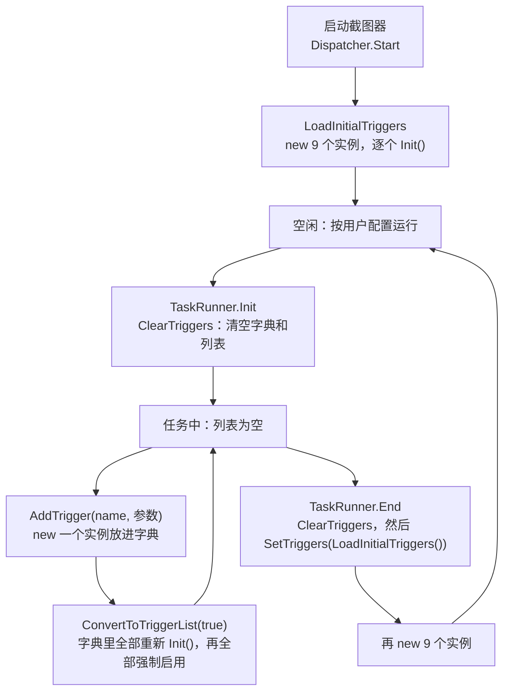
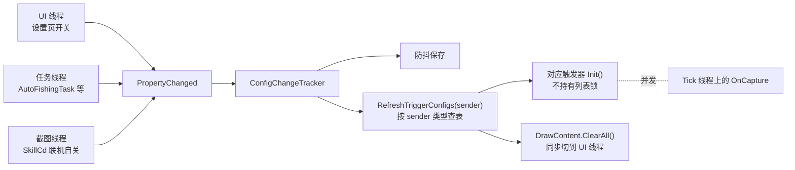
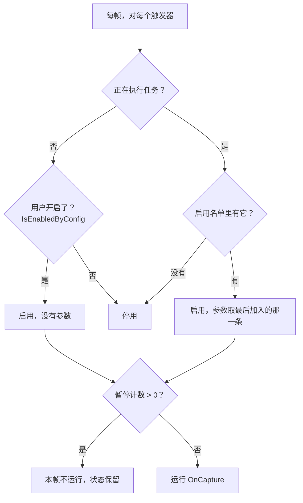
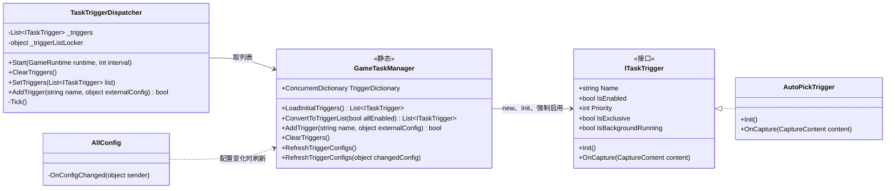
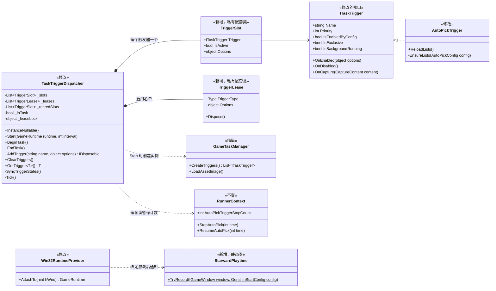
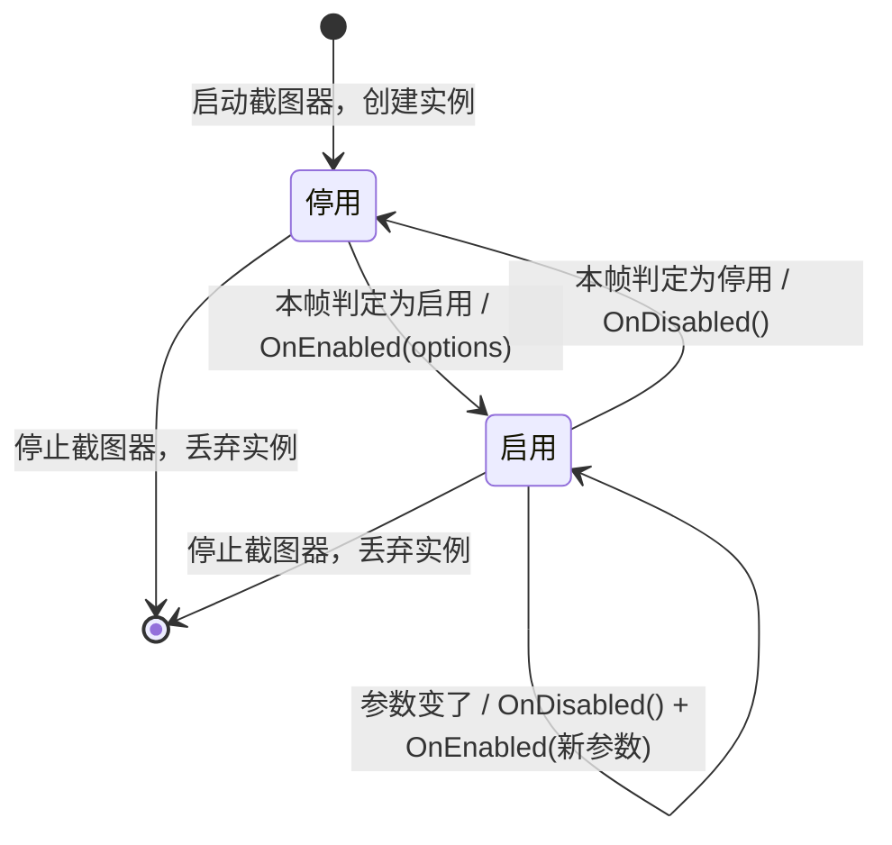
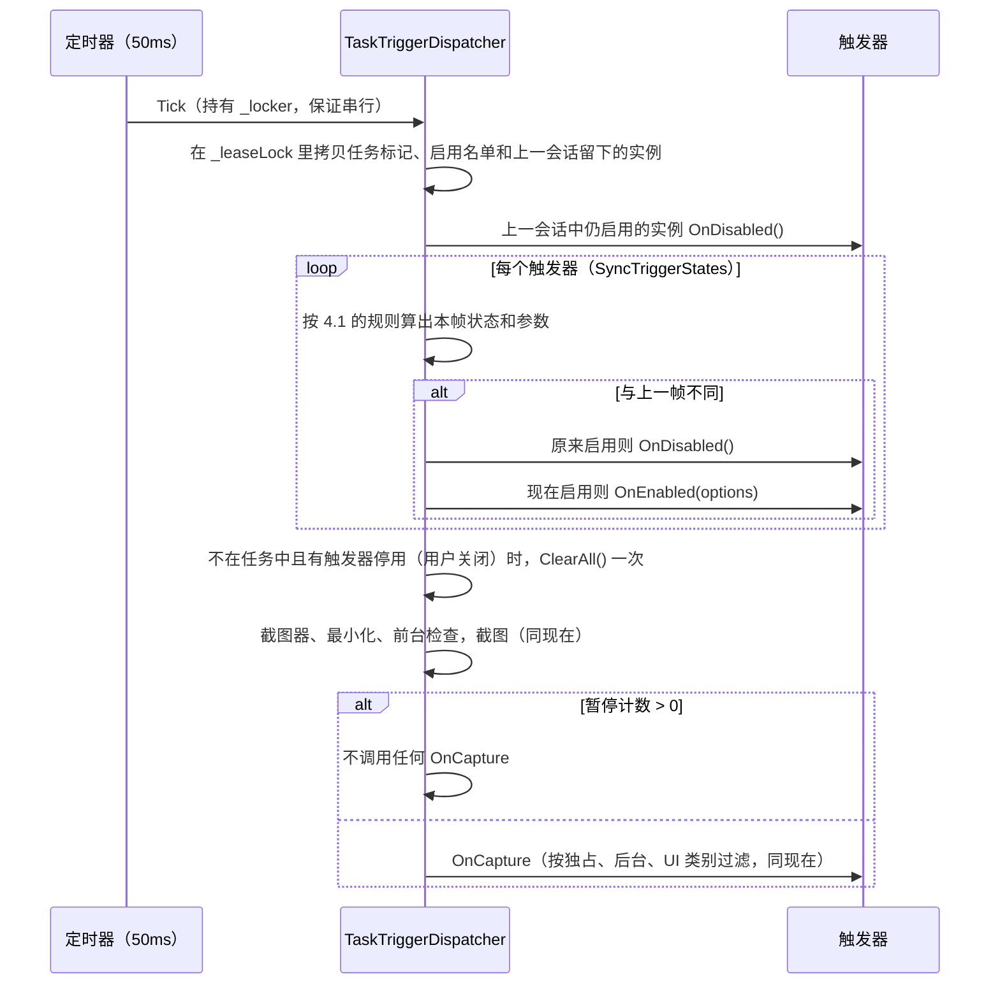
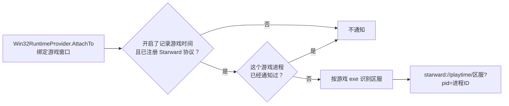
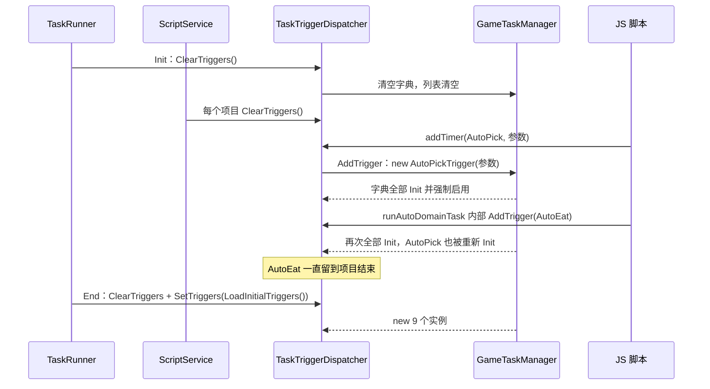
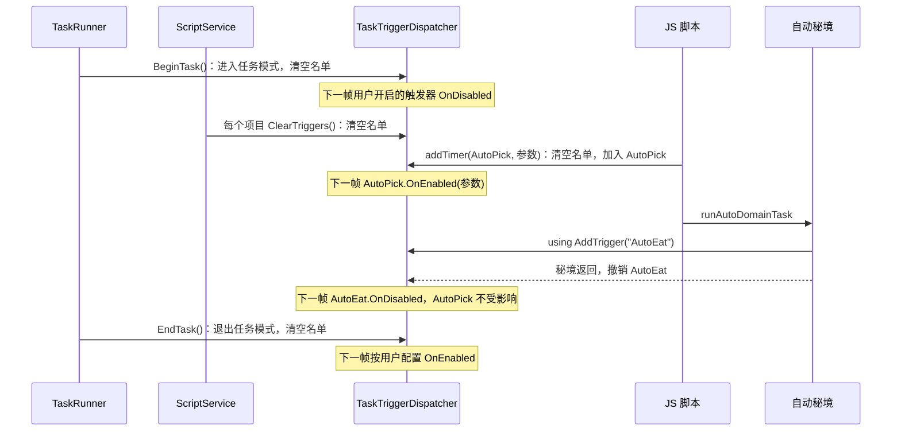

# 实时触发器生命周期与启停设计

> 状态：已实施（第 2 版） · 2026-09-30 · 关联：[配置持久化链路](config-persistence.md)、[GameRuntime](game-runtime.md)、[遮罩窗口](mask-window.md)

## 0. 一句话说明

触发器实例在启动截图器时创建一次，之后不再销毁或重建。原来的"清空 / 重新引入"改成增删一张"任务期间启用名单"，调度器每一帧照着这张名单（不在任务中时照用户配置）决定哪些触发器运行。

- 实例什么时候销毁：只在停止截图器时丢弃，下次启动截图器再新建一套，这一点和现在一样。任务开始和结束、脚本添加和清空触发器、修改配置，都不再销毁或重建实例。上一次会话中仍处于启用状态的实例，在新会话第一帧收到 `OnDisabled`，清掉留在遮罩上的内容。
- 触发器怎么知道自己被开关：调度器每帧把"本帧该不该运行"和上一帧比较，不同时调用触发器的 `OnEnabled` 或 `OnDisabled`。原来散在 `Init()` 和外部代码里的初始化、收尾逻辑，都搬进这两个方法。
- 对原有功能的影响：用法和效果基本不变，JS 接口不变，暂停、任务期间全停这些规则也保持原样。能感知到的差异见 7.2：任务里临时启用的触发器随任务结束、暂停不再卡住 Tick，其余是 bug 修复和生效时机的细微变化。

## 1. 背景

实时触发器（`ITaskTrigger`）由 `TaskTriggerDispatcher` 驱动。每 50ms 执行一次 Tick：截一帧图，然后按优先级依次调用各触发器的 `OnCapture`。现有 9 个触发器：

| 类 | 名称 | 优先级 | 用户开关 | 说明 |
| --- | --- | --- | --- | --- |
| `TestTrigger` | RecognitionTest | 9999 | 无，恒为关闭 | 开发用 |
| `GameLoadingTrigger` | GameLoading | 999 | `GenshinStartConfig.AutoEnterGameEnabled` | 自动开门；可后台运行；进入主界面或 5 分钟后自停 |
| `AutoPickTrigger` | AutoPick | 30 | `AutoPickConfig.Enabled` | 脚本可启用，可带参数 |
| `AutoEatTrigger` | AutoEat | 25 | `AutoEatConfig.Enabled` | 脚本可启用 |
| `QuickTeleportTrigger` | QuickTeleport | 21 | `QuickTeleportConfig.Enabled` | |
| `AutoSkipTrigger` | AutoSkip | 20 | `AutoSkipConfig.Enabled` | 脚本可启用，可带参数；可后台运行 |
| `AutoFishingTrigger` | AutoFish | 15 | `AutoFishingConfig.Enabled` | 进入钓鱼界面后独占 |
| `SkillCdTrigger` | SkillCd | 10 | `SkillCdConfig.Enabled` | |
| `MapMaskTrigger` | MapMask | 1 | `MapMaskConfig.Enabled` | |

## 2. 现状问题

### 2.1 清空就是销毁，恢复就是全部重建



1. 实例的生命周期和"是否启用"绑在一起：要关只能从列表删掉，要恢复只能重新 new。每个任务结束都会重建全部 9 个实例。
2. 重建有副作用：`AutoFishingTrigger` 在构造函数里按当时的配置建行为树，所以钓鱼配置什么时候生效，取决于之后有没有跑过任务。`GameLoadingTrigger.Init()` 里的 Starward 通知也随重建反复执行，见 2.4。
3. 收尾逻辑散在外面：`TaskRunner.Init` 替 MapMask 复位大地图状态，多处调用 `DrawContent.ClearAll()` 擦掉触发器的残留绘制。
4. 同一份数据有两个来源：静态的 `GameTaskManager.TriggerDictionary` 和 Dispatcher 的 `_triggers`。`DialogueOptionVoiceDiagnosticService` 读的是字典，任务期间字典为空，拿不到 AutoSkip。
5. `AddTrigger` 会把字典里所有触发器都设成 `IsEnabled = true`。`SkillCdTrigger.IsEnabled` 的 setter 会写回用户配置，目前只是因为字典总是先被清空才没有出事。
6. 任务里临时启用的触发器没有撤销入口：自动秘境加入的 AutoEat、地脉花加入的 AutoPick 会一直留到当前项目结束。

### 2.2 配置一变就调用 `Init()`



`Init()` 同时做了四件事，所以配置只要一变，就只能整个重新调用一遍：

| 职责 | 例子 |
| --- | --- |
| 把配置拷贝到触发器 | `IsEnabled = _config.Enabled`、`IsBackgroundRunning = _config.RunBackgroundEnabled` |
| 计算派生数据 | AutoPick 按模式读 5 个名单文件，AutoSkip 读 3 个关键词 JSON |
| 重置运行状态 | SkillCd 清空帧缓存和全部 CD 计时 |
| 关闭时的收尾 | MapMask 隐藏点位，SkillCd 清除文字，AutoSkip 释放选项等待 |

由此带来的问题：

1. 强制启用被覆盖：路径追踪强制启用了 AutoPick，这时 `AutoPickConfig` 只要有一项变化，`Init()` 就会把 `IsEnabled` 改回用户的开关。
2. 无关选项也会重置状态：改 SkillCd 的任意选项，或者编辑 CD 修正规则（这里调用的是全量刷新），CD 计时都会清零。
3. 线程不安全：`Init()` 在触发变更的线程上同步执行，可能是 UI、任务或截图线程，并且不持有列表锁，和 `OnCapture` 并发。SkillCd 检测到联机时会执行 `IsEnabled = false`，这一句会在它自己的 `OnCapture` 里重入 `Init()`，然后在持有两把锁的情况下调用 `ClearAll()`，同步等待 UI 线程。
4. 查表只认子配置对象本身：嵌套对象和集合元素（例如 `CustomCdList` 里的规则）变化时不会刷新。新增触发器时还要记得去登记映射。
5. 清理范围过大：任一触发器的配置变化，`ClearAll()` 会连任务画的内容一起清掉。

### 2.3 暂停拾取会卡住整个 Tick

`RunnerContext.StopAutoPick()` 让计数加 1。`AutoPickTrigger.OnCapture` 发现计数大于 0 时执行 `while (...) Thread.Sleep(1000)`，睡眠期间一直持有 `_locker` 和 `_triggerListLocker`。

- "暂停拾取时全部触发器都停下"这个效果，其实是阻塞带来的副作用，并且只在 AutoPick 处于启用状态时才会出现。
- 窗口跟随、遮罩显隐、画中画这些 Tick 的基础工作也会一起停。
- 这期间其他线程调用 `AddTrigger`、`ClearTriggers` 会一直等锁。

### 2.4 "记录游戏时长"挂在自动开门触发器上

首页"同时启动原神"里的"使用 Starward 记录游戏时间"，代码写在 `GameLoadingTrigger.Init()` 中。开关开启、并且已注册 Starward 协议时，调用 `starward://playtime/{区服}`。`Init()` 在两个时机执行，所以通知也在这两个时机发出：

- 每次启动截图器：手动启动、调度器或一条龙自动启动、命令行启动、切换截图模式后的自动重启。此时游戏窗口已经存在。
- 每个独立任务结束：`TaskRunner.End` 重建全部触发器。

问题：

1. 通知次数取决于启动了几次截图器、跑了几个任务，和游戏进程无关。调用不带 `pid`，[Starward 收到后](https://github.com/Scighost/Starward/blob/main/src/Starward/Features/PlayTime/PlayTimeRecordService.cs)会拉起一个进程，每 2 秒按进程名查找游戏，找不到时最多等十几秒。已经在记录的游戏进程会被跳过，所以时长不会重复计算，但每次调用都会多拉起一个 Starward 进程。
2. 与自动开门无关：关闭"自动进入游戏"也照样通知。
3. 区服只从 `InstallPath` 判断：没配置安装路径，或者 exe 不是 `GenshinImpact.exe`、`YuanShen.exe` 时，不通知。注册表兜底的条件是 `GameServer == null`，而字段初始值是 `""`，所以兜底永远不会执行。

## 3. 目标与非目标

目标：

- 每次截图会话（启动截图器到停止截图器）内，每个触发器只有一个实例。
- 任务期间停止全部用户开启的触发器，只运行任务和脚本显式启用的那些。
- 任务里临时启用的触发器随启用它的任务一起结束。
- 配置变化不再调用触发器，触发器每帧读取实时配置。
- 暂停时全部触发器停止，但不阻塞 Tick。
- JS 接口不变：`dispatcher.addTimer`、`addTrigger`、`clearAllTriggers` 和 `RealtimeTimer`。

非目标：

- 不改各触发器的识别和操作逻辑。
- 不改 Tick 里截图器、窗口、遮罩的判断，这些分别由 [GameRuntime](game-runtime.md) 和 [遮罩窗口](mask-window.md) 负责。
- 不扩大脚本可启用的范围，仍然只有 AutoPick、AutoSkip、AutoEat。
- 不改 `RunnerContext` 的暂停接口，也不改 `SkillCdTrigger.Suspend/Resume`：AutoCombo 只在任务里运行，而任务期间 SkillCd 本来就是停用的。
- 不改 `ConfigChangeTracker` 和保存链路。

## 4. 设计

### 4.1 规则：每一帧谁在运行



整个设计只有这一条规则，用到三份数据：

| 数据 | 谁来改 | 说明 |
| --- | --- | --- |
| 任务标记 | `TaskRunner`：开始时 `BeginTask()`，结束时 `EndTask()` | 两个方法都会清空启用名单 |
| 启用名单 | `AddTrigger` 加入一条，`ClearTriggers` 清空，`AddTrigger` 返回的租约 `Dispose` 时撤销自己那一条 | 每条记录"哪个触发器 + 参数"，只在任务期间生效 |
| 暂停计数 | `RunnerContext.StopAutoPick` / `ResumeAutoPick`，与现在相同 | 大于 0 时全部触发器本帧不运行 |

租约（lease）就是加入名单时拿到的一个 `IDisposable`，调用 `Dispose` 就把自己这一条从名单里删掉。不需要中途撤销的调用方（例如 JS 脚本）可以不管它，名单会在下一次 `ClearTriggers` 或任务结束时整体清空。

### 4.2 类图

改造前：



改造后：



触发器部分只新增 `TaskTriggerDispatcher` 里的两个私有嵌套类。另外从 `GameLoadingTrigger` 拆出一个静态类，负责 Starward 通知：

| 类 | 作用 |
| --- | --- |
| `TriggerSlot` | 包住一个触发器实例，记录它上一帧是否启用、用的是哪份参数，用来判断状态有没有变 |
| `TriggerLease` | 启用名单里的一条，`Dispose` 时把自己从名单里删掉，重复调用无副作用 |
| `StarwardPlaytime` | 绑定游戏进程后通知 Starward 记录时长，每个游戏进程只通知一次（4.8） |

### 4.3 接口

```csharp
public interface ITaskTrigger
{
    string Name { get; }
    int Priority { get; }
    GameUiCategory SupportedGameUiCategory => GameUiCategory.Unknown;

    /// <summary>用户是否开启。每帧读取，实现里直接读配置，不缓存</summary>
    bool IsEnabledByConfig { get; }

    /// <summary>运行时状态，由触发器自己维护</summary>
    bool IsExclusive { get; }

    /// <summary>实时读取配置</summary>
    bool IsBackgroundRunning => false;

    /// <summary>停用 → 启用。options 是脚本传入的参数，没有则为 null。原 Init() 中的初始化放在这里</summary>
    void OnEnabled(object? options) { }

    /// <summary>启用 → 停用。原 Init() 中关闭时的收尾、以及外部替它做的清理放在这里</summary>
    void OnDisabled() { }

    void OnCapture(CaptureContent content);
}
```

与现在相比：

- `IsEnabled { get; set; }` 换成只读的 `IsEnabledByConfig`。触发器不再自己保存启用状态，是否运行由调度器决定。
- `Init()` 拆成 `OnEnabled` 和 `OnDisabled`，只在状态变化时调用。
- `OnCapture` 只在启用且未暂停时调用，触发器内部原来那些 `if (IsEnabled)` 判断可以删掉。

```csharp
public class TaskTriggerDispatcher
{
    /// <summary>任务开始：进入任务模式，清空启用名单。用户开启的触发器下一帧停用</summary>
    public void BeginTask();

    /// <summary>任务结束：退出任务模式，清空启用名单。下一帧按用户配置恢复。重复调用无副作用</summary>
    public void EndTask();

    /// <summary>
    /// 任务期间启用一个触发器，只接受 "AutoPick"、"AutoSkip"、"AutoEat"。
    /// 返回租约，Dispose 时撤销这一条；名称不支持时返回 null
    /// </summary>
    public IDisposable? AddTrigger(string name, object? options = null);

    /// <summary>清空启用名单。不销毁任何实例</summary>
    public void ClearTriggers();

    /// <summary>取当前截图会话中的触发器实例，供诊断等只读场景使用</summary>
    public T? GetTrigger<T>() where T : class, ITaskTrigger;

    /// <summary>调度器还没创建时返回 null，供 TaskRunner.End、诊断服务等"可能早于截图器"的调用方使用</summary>
    public static TaskTriggerDispatcher? InstanceNullable();
}
```

- `ClearTriggers`、`AddTrigger` 保留原来的名字和调用位置，含义从"删除实例 / 新建实例"变成"清空名单 / 加入名单"。
- `TaskRunner.End` 第一步就调用 `EndTask()`，早于"截图器是否已初始化"的判断。任务中途截图器被停止时，也不会停留在任务模式。
- 删除 `SetTriggers`。
- 任务标记用 bool 即可：`TaskControl.TaskSemaphore` 已经保证同一时刻只有一个任务。

### 4.4 触发器状态与 Tick



暂停不是一个状态：暂停只是本帧不调用 `OnCapture`，不会触发 `OnDisabled`，所以触发器的内部状态保留，和现在被阻塞时一样。



规则：

1. `OnEnabled`、`OnDisabled`、`OnCapture` 都只在 Tick 里执行，Tick 由 `_locker` 保证串行，所以触发器内部不需要为它们加锁。
2. 状态同步放在 Tick 开头，早于"最小化、不在前台"这几处提前返回。游戏在后台时，停用也能及时收尾。
3. 参数按引用比较。
4. 回调抛出的异常只记日志，不影响其他触发器，状态照常迁移。
5. `OnCapture` 执行期间不持有 `_leaseLock`，删除 `_triggerListLocker`。其他线程改名单时只等一次列表增删，不会等 Tick。
6. 停止截图器时不处理触发器（`Stop` 可能在退出流程中调用，此时不适合切 UI 线程）。下次 `Start` 新建一套实例，初始全部为停用；旧实例放进 `_retiredSlots`，新会话第一帧对其中仍启用的调用 `OnDisabled`，清掉 SkillCd 文字、MapMask 点位等残留，再按规则启用新实例。
7. `ClearAll()` 只在"不在任务中、有触发器从启用变为停用"时执行，对应原来"改触发器配置就清画布"。任务开始、结束时的清理仍由 `TaskRunner` 负责，撤销租约时不清画布，避免擦掉任务或脚本自己画的内容。

### 4.5 暂停

暂停计数和 5 个调用点都不改，只改检查的位置：从 `AutoPickTrigger.OnCapture` 里的 Sleep 循环挪到 Tick。计数大于 0 时，本帧不调用任何触发器的 `OnCapture`。

| 调用点 | 写法 |
| --- | --- |
| 暂停热键 `TaskControl.TrySuspend` | `StopAutoPick()` / `ResumeAutoPick()`，不变 |
| 战斗、传送、去冒险家协会（`PathExecutor` ×2、`AutoFightHandler`） | `StopAutoPickRunTask(task, 5)`，不变 |
| 选择 F 选项 `ChooseFOptionTask` | `StopAutoPick()` / `ResumeAutoPick()`，不变 |

效果与原来一致，都是全部触发器停止，区别只有两点：不管 AutoPick 是否启用都会生效；Tick 的基础工作照常运行。`AutoPickTriggerStopCount` 的名字保留，注释改为"暂停全部实时触发器的计数"。`RunnerContext.Clear()` 在任务开始和结束时把计数清零，这一点也不变。

### 4.6 配置变更

配置变化不再调用任何触发器。`Init()` 的四件事去向如下：

| 职责 | 新的去处 |
| --- | --- |
| 把配置拷贝到触发器 | 删除。`IsEnabledByConfig`、`IsBackgroundRunning` 等每次直接读配置 |
| 计算派生数据 | AutoPick 名单在 `OnCapture` 里按键缓存，键变了才重读；AutoSkip 关键词在 `OnEnabled` 时读 |
| 重置运行状态 | `OnEnabled` |
| 关闭时的收尾 | `OnDisabled` |

AutoPick 名单缓存直接写在 `AutoPickTrigger` 里，不新增类：

```csharp
private static int _listVersion;

/// <summary>名单文件被界面修改后调用，下一次 OnCapture 重读</summary>
public static void ReloadLists() => Interlocked.Increment(ref _listVersion);

/// <summary>在 OnCapture 识别到拾取键之后、用到名单之前调用</summary>
private void EnsureLists(AutoPickConfig config)
{
    var key = (config.Mode, config.BlacklistModePickEnabled, config.WhitelistModeDoNotPickEnabled,
               Volatile.Read(ref _listVersion));
    if (_loadedListKey == key)
    {
        return;
    }

    _loadedListKey = key;
    LoadLists(config); // 与原 Init() 相同：按模式读 5 个文件，整体替换 4 个集合
}
```

读取失败的弹窗改用 `UIDispatcherHelper.BeginInvoke` 发出，避免在 Tick 里等用户点确定。失败的结果同样按键缓存，同一个键只弹一次。

调用点：

| 位置 | 改造前 | 改造后 |
| --- | --- | --- |
| `AllConfig.OnConfigChanged` | `RefreshTriggerConfigs(sender)`，然后保存 | 只保存；`sender` 是 `MaskWindowConfig` 时 `ClearAll()`，保留"切换识别结果显示时清掉旧图形"的效果 |
| `TriggerSettingsPageViewModel.OnAutoPickModeChanged` | `RefreshTriggerConfigs()` | 删除。拾取模式已经是缓存键的一部分 |
| `TriggerSettingsPageViewModel.OnEditSkillCdConfig` | `RefreshTriggerConfigs()` | 删除。SkillCd 本来就每次实时读取 `CustomCdList` |
| `AutoPickConfigWindowViewModelBase` 保存 | `RefreshTriggerConfigs()` | `AutoPickTrigger.ReloadLists()` |
| `AutoPickBlackListViewModel`、`AutoPickWhiteListViewModel` 保存 | `RefreshTriggerConfigs()` | 删除。这两个窗口写的是 `pick_*_lists.json`，触发器读的是 `.txt`，这次刷新本来就不影响名单 |

用户关闭某个触发器后，下一帧它会停用。停用那一帧由调度器 `ClearAll()` 一次，效果与现在"改配置就清画布"相同。任务期间撤销租约时不清画布，任务或脚本自己画的内容不受影响。

AutoSkip 关键词读取失败的弹窗同样改为 `BeginInvoke`：关键词在 `OnEnabled` 里读，也运行在 Tick 中。

### 4.7 脚本参数（options）

options 就是现在 `AddTrigger(name, externalConfig)` 里的 `externalConfig`，只有 JS 脚本会传：

| 触发器 | options 类型 | JS 写法 | 作用 |
| --- | --- | --- | --- |
| AutoPick | `AutoPickExternalConfig` | `new RealtimeTimer("AutoPick", { forceInteraction: true })` | 识别到 F 键就直接按，不看文字 |
| AutoSkip | `AutoSkipConfig`（脚本自己 new 的实例） | `new RealtimeTimer("AutoSkip", cfg)` | 用这份配置代替全局 AutoSkip 配置，不读关键词文件 |
| AutoEat | 无 | `new RealtimeTimer("AutoEat")` | |

现在参数只能通过构造函数传进去，带参数启用就只能 new 一个新实例。改造后参数记在名单里，同一个实例在 `OnEnabled(options)` 时取用，名单清空后回到全局配置。

同一个触发器在名单里有多条时，用最后加入的那一条。触发器保持启用、但参数变了的时候，按"先 `OnDisabled` 再 `OnEnabled(新参数)`"处理，运行状态随之重置，与现在"替换成新实例"的效果相同。这只会在脚本内部出现，例如脚本对同一个触发器先后调用两次 `addTrigger` 并传了不同参数。

脚本传入的 `AutoSkipConfig.Enabled` 不参与判断，与现在强制启用的效果一致。

### 4.8 记录游戏时长（Starward）

这个功能记录的是游戏进程的时长，和触发器无关。通知从 `GameLoadingTrigger` 移到绑定游戏进程的位置，每个游戏进程只通知一次：



| 项 | 规则 |
| --- | --- |
| 时机 | `Win32RuntimeProvider.AttachTo` 组装好 `GameRuntime` 之后调用 `StarwardPlaytime.TryRecord(window, config.GenshinStartConfig)`。自动查找、关联启动、手动选窗都经过这里，网页版不经过 |
| 条件 | 与现在相同，只看 `RecordGameTimeEnabled` 和协议是否注册，不看是否由 BetterGI 启动游戏、是否开启自动进入游戏 |
| 去重 | 记住上一次通知的游戏进程 ID，相同就跳过。任务结束、截图器重启都不会重复通知；游戏重启后进程 ID 变化，会再通知一次。协议未注册时不记录进程 ID，之后注册了还能补上 |
| 区服 | 从绑定的游戏进程取 exe 路径（`QueryFullProcessImageName`，`PROCESS_QUERY_LIMITED_INFORMATION`），取不到时退回 `InstallPath`。`GenshinImpact.exe` 为国际服；`YuanShen.exe` 读同目录 `config.ini` 的 `channel`，1 为官服、14 为 B 服；仍无法判断时读注册表（官服、B 服）。其他 exe（例如云原神）不通知，与现在一致 |
| 参数 | 带上 `pid`，Starward 直接按进程 ID 记录，不再按进程名轮询 |
| 线程 | `Process.Start` 放到线程池执行，不阻塞 UI 线程 |

`StarwardPlaytime` 放在 `GameTask/Runtime/Win32/`。`GameLoadingTrigger` 中的 `StartStarward`、`GetGameServerRegistry`、`IsStarwardProtocolRegistered`，以及区服识别代码和相关字段，全部移入这个类。

## 5. 各触发器改造

| 触发器 | `IsEnabledByConfig` | `OnEnabled(options)` | `OnDisabled()` | 其他 |
| --- | --- | --- | --- | --- |
| AutoPick | `AutoPickConfig.Enabled` | 保存 options | 清空 options | 名单改为 `EnsureLists` 按键缓存；删除暂停时的 Sleep 循环 |
| AutoSkip | `AutoSkipConfig.Enabled`（全局） | options 是 `AutoSkipConfig` 就用它，否则用全局配置；使用全局配置时读关键词，使用脚本配置时清空关键词 | `ReleaseChooseOptionWait`、`ResetPageCloseRecognition`（原 `IsEnabled` setter 里的逻辑） | `IsBackgroundRunning` 实时读当前配置 |
| AutoFish | `AutoFishingConfig.Enabled` | 按当前配置建行为树（原构造函数中的代码），`IsExclusive = false` | `IsExclusive = false` | 删除行为树中对 `IsEnabled` 的判断 |
| QuickTeleport | `QuickTeleportConfig.Enabled` | | `IsExclusive = false` | |
| AutoEat | `AutoEatConfig.Enabled` | 计时字段清零（与原来重建实例时一致） | | |
| SkillCd | `SkillCdConfig.Enabled` | 清空帧缓存和 CD 状态（原 `Init()` 的前半段），在 `_stateLock` 内进行，避免与后台队伍同步并发 | 清除 CD 文字，释放帧缓存 | 删除写回配置的 setter；联机时直接写 `SkillCdConfig.Enabled = false`，下一帧自然停用；删除 `_wasEnabled` |
| MapMask | `MapMaskConfig.Enabled` | `_active = true` | `_active = false`；释放待计算的 `Mat`，复位大地图状态和两个视口（原 `Init()` 的关闭分支） | UI 线程应用更新时改看 `_active`（原来看 `_config.Enabled`），任务期间停用后迟到的计算结果也会被丢弃 |
| GameLoading | `AutoEnterGameEnabled && !_finished` | | | 删除静态 `GlobalEnabled`，自停改为 `_finished = true`；Starward 通知移出（4.8），`Init()` 删除后不再有其他初始化 |
| RecognitionTest | `false` | | `IsExclusive = false` | |

原来有些运行字段是靠"任务结束重建实例"清零的。实例不再重建后，改造时逐个核对这些字段，需要清零的放进 `OnEnabled`。`OnEnabled` 的调用时机与原来重建的时机一致：任务结束后按用户配置重新启用时。

## 6. 调用点对照

| 位置 | 改造前 | 改造后 |
| --- | --- | --- |
| `TaskTriggerDispatcher.Start` | `_triggers = LoadInitialTriggers()`；设置 `GameLoadingTrigger.GlobalEnabled` | `_slots` 由 `GameTaskManager.CreateTriggers()` 生成 |
| `Win32RuntimeProvider.AttachTo` | 无 | 组装好 `GameRuntime` 后调用 `StarwardPlaytime.TryRecord(window, config.GenshinStartConfig)` |
| `TaskRunner.Init` | `ClearTriggers()`；复位 `IsInBigMapUi` | `BeginTask()`；保留 `IsInBigMapUi` 的同步复位。`MapMask.OnDisabled` 也会复位，但要等下一帧，这里同步复位保证任务第一次点击前遮罩已恢复点击穿透 |
| `TaskRunner.End` | `ClearTriggers()` + `SetTriggers(LoadInitialTriggers())` | 第一步 `InstanceNullable()?.EndTask()`，早于截图器是否初始化的判断 |
| `PathExecutor` 进入剧情时自带的 AutoSkip | `new AutoSkipTrigger(自定义配置)` + `Init()`，自己调用 `OnCapture` | `Init()` 改为 `OnEnabled(null)`，其余不变。这个实例不经过调度器 |
| `ScriptService` 每个项目的每次执行 | `ClearTriggers()` | 不变（含义变为清空名单） |
| `ScriptGroupProject` 路径追踪 | `AddTrigger("AutoPick", null)` | 不变，忽略返回值 |
| JS `Dispatcher.addTimer` / `clearAllTriggers` | `ClearTriggers()` + `AddTrigger` / `ClearTriggers()` | 不变 |
| JS `Dispatcher.addTrigger` | `if (!AddTrigger(...)) throw` | `if (AddTrigger(...) is null) throw` |
| `AutoDomainTask` | `Init()` 中 `AddTrigger("AutoEat", null)` | 在 `Start` 中用 `using` 持有租约，秘境返回时撤销 |
| `AutoLeyLineOutcropTask` | `PrepareForLeyLineRun` 中 `AddTrigger("AutoPick", null)` | 租约保存到字段，在 `Start` 的 `finally` 中 `Dispose` |
| `DialogueOptionVoiceDiagnosticService` | `TriggerDictionary?.GetValueOrDefault("AutoSkip")` | `GetTrigger<AutoSkipTrigger>()`，任务期间也能拿到 |
| `GameTaskManager` | 静态字典及其增删、刷新方法 | 只保留 `CreateTriggers()`（原 `LoadInitialTriggers` 去掉 `Init`）和 `LoadAssetImage` 系列 |

## 7. 变更前后对比

### 7.1 一次调度器执行（JS 项目，脚本里调用了自动秘境）

改造前：



改造后：



### 7.2 行为变化

| 场景 | 改造前 | 改造后 |
| --- | --- | --- |
| 自动秘境启用的 AutoEat、地脉花启用的 AutoPick | 留到项目结束 | 随各自的任务结束 |
| 暂停拾取（热键、战斗、传送、选 F） | AutoPick 启用时整个 Tick 卡住，全部触发器停止 | 全部触发器停止，与 AutoPick 是否启用无关；窗口跟随、遮罩显隐照常 |
| 任务期间 `AutoPickConfig` 有变化（例如被代码修改） | 路径追踪启用的 AutoPick 被改回用户开关 | 不受影响 |
| 修改 SkillCd 选项或 CD 修正规则 | CD 计时清零 | 不清零 |
| 开启"记录游戏时长" | 每次启动截图器、每个任务结束都通知一次，不带进程 ID | 每个游戏进程通知一次，带进程 ID；没配置安装路径时也能识别区服 |
| 切换"自动开门" | 关闭要等下一个任务结束才生效，开启要重启截图器 | 下一帧生效（已经自停的不会重新启用） |
| 用户开关触发器 | 同步生效 | 下一帧生效，不超过 50ms |
| 修改 AutoSkip 的其他选项 | 重读关键词文件 | 不重读；这些文件没有界面编辑入口，关一次再开即可重读 |
| 修改钓鱼配置 | 下一个任务结束后才生效 | 下一次启用自动钓鱼时生效（关一次再开，或任务结束后） |
| 停止截图器后再启动 | 上一次的技能 CD 文字、大地图点位可能残留 | 新会话第一帧清理 |

其余行为不变：任务期间用户开启的触发器全部停止，任务结束后恢复；脚本的 `addTimer`、`addTrigger`、`clearAllTriggers` 用法和效果相同；路径追踪自动拾取、钓鱼独占、后台运行、UI 类别过滤都不变。

### 7.3 代码层面

| 方面 | 改造前 | 改造后 |
| --- | --- | --- |
| 实例 | 每个任务结束重建 9 个 | 每次启动截图器创建 9 个 |
| 数据来源 | 静态字典 + Dispatcher 列表 | Dispatcher 的 `_slots` |
| 进入 / 结束任务 | `ClearTriggers()` / 清空 + `LoadInitialTriggers()` | `BeginTask()` / `EndTask()` |
| 脚本启用 | new 实例，全部重新 `Init()` 并强制启用 | 加入名单 |
| 外部参数 | 构造函数传入 | 记在名单里，`OnEnabled` 时取用 |
| 配置变更 | `RefreshTriggerConfigs(sender)` → `Init()` + `ClearAll()` | 只保存；触发器每帧读配置 |
| 暂停 | AutoPick 持锁 Sleep | Tick 读计数，跳过 `OnCapture` |
| 线程 | `Init()` 在多个线程上执行，与 `OnCapture` 并发 | 触发器的所有回调只在 Tick 里执行 |
| 锁 | `OnCapture` 期间持有 `_triggerListLocker` | 只在拷贝名单时持有 `_leaseLock` |
| 画布清理 | 任一触发器配置变化就 `ClearAll()` | 不在任务中、有触发器停用的那一帧 `ClearAll()`；各触发器在 `OnDisabled` 里清自己的内容 |
| 跨截图会话 | 旧实例直接丢弃 | 旧实例在新会话第一帧收到 `OnDisabled`，清理残留 |

## 8. 改动清单

已在一个分支中完成，编译通过，尚未运行第 9 节的手动测试。

| 文件 | 改动 |
| --- | --- |
| `GameTask/ITaskTrigger.cs` | 按 4.3 修改接口 |
| 9 个触发器 | 按第 5 节改造 |
| `GameTask/TaskTriggerDispatcher.cs` | 新增 `TriggerSlot`、`TriggerLease`、`BeginTask`、`EndTask`、`GetTrigger`、`InstanceNullable`、`SyncTriggerStates`；`AddTrigger` 返回租约；Tick 按 4.4 执行并检查暂停计数；删除 `SetTriggers`、`_triggers`、`_triggerListLocker` |
| `GameTask/GameTaskManager.cs` | 只保留 `CreateTriggers()` 和 `LoadAssetImage` 系列 |
| `GameTask/Runtime/Win32/StarwardPlaytime.cs` | 新增（4.8） |
| `GameTask/Runtime/Win32/Win32RuntimeProvider.cs` | `AttachTo` 中调用 `StarwardPlaytime.TryRecord` |
| `TaskRunner`、JS `Dispatcher`、`AutoDomainTask`、`AutoLeyLineOutcropTask`、`PathExecutor`、`DialogueOptionVoiceDiagnosticService` | 按第 6 节修改 |
| `AllConfig` 与 5 处 ViewModel | 按 4.6 修改 |
| `RunnerContext` | `AutoPickTriggerStopCount` 的注释改为"暂停全部实时触发器的计数" |
| [config-persistence.md](config-persistence.md) | 第 4.2 节标注为已被本文取代 |

## 9. 手动测试

| # | 场景 | 关注点 |
| --- | --- | --- |
| 1 | 启动截图器，逐个开关各触发器 | 下一帧生效；关闭后残留绘制被清除，MapMask 点位隐藏 |
| 2 | 开着 SkillCd，调整其他 SkillCd 选项、编辑修正规则 | CD 计时不清零 |
| 3 | 切换拾取模式；修改黑白名单后保存 | 下一次拾取就按新名单执行 |
| 4 | 开着 AutoPick、SkillCd、MapMask，运行自动秘境 | 任务期间全部停止；结束后恢复，SkillCd 重新计时 |
| 5 | 调度器跑路径追踪，经过战斗和传送 | 期间全部触发器暂停，结束约 5 秒后恢复；暂停时移动游戏窗口，遮罩跟随 |
| 6 | 任务中按暂停热键，然后解除 | 暂停期间没有拾取、剧情等操作；解除后恢复 |
| 7 | JS：`addTimer(AutoPick, {forceInteraction:true})`，然后 `runAutoDomainTask` | 秘境中强制拾取和自动吃药同时生效；秘境结束后自动吃药停止，强制拾取仍然生效 |
| 8 | JS：`clearAllTriggers()` | 脚本启用的触发器全部停止 |
| 9 | 开启"记录游戏时长"：连续运行 3 个任务，再停止、启动截图器；然后重启游戏 | 同一个游戏进程只通知一次，重启游戏后再通知一次；Starward 中能看到时长记录 |
| 10 | 联机状态下开启 SkillCd | 自动关闭并提示，设置页开关同步变为关闭，没有异常或卡顿 |
| 11 | 进入钓鱼界面，然后退出 | 进入时独占并开始钓鱼，退出后其他触发器恢复 |
| 12 | 任务运行时打开 AutoSkip 语音诊断 | 能读到 AutoSkip 的状态 |
| 13 | 停止截图器后再启动 | 没有残留绘制，触发器按用户配置重新启用 |

## 10. 决策记录

| 议题 | 决定 | 原因 |
| --- | --- | --- |
| 实例生命周期 | 与截图会话一致 | 任务和脚本的边界只影响是否运行，不应该销毁重建实例 |
| 取代清空、重新引入 | 任务标记 + 启用名单 | 只有一层规则；原有的 `ClearTriggers`、`AddTrigger` 调用点大多不用改 |
| 是否启用 | 每帧计算 | 只有 9 个触发器，计算量可以忽略；不需要订阅配置，也就没有漏刷、重入和并发问题 |
| 状态何时重置 | 启用、停用变化时回调 | 只在状态真正变化时执行，时机与原来重建一致 |
| 任务期间 | 用户开启的触发器全部停止 | 与现在一致 |
| 暂停 | 沿用现有计数，全部触发器停止，改为不阻塞 | 保持原来的效果，调用点不变 |
| 临时启用的范围 | 随启用它的任务结束 | 自动秘境、地脉花用租约撤销 |
| 参数变化 | 先停用再启用 | 与原来替换实例的效果一致 |
| 新增类型 | Dispatcher 内的两个私有嵌套类，加上 `StarwardPlaytime` | 名单缓存写在 `AutoPickTrigger` 里，暂停沿用 `RunnerContext` |
| 记录游戏时长 | 绑定游戏进程时通知，每个进程一次，带进程 ID | 记录的是游戏进程的时长，与触发器生命周期无关 |
| 回调线程 | 只在 Tick 里执行 | 触发器内部不需要加锁 |
| 画布清理 | 只在用户关闭触发器时 `ClearAll()` | 对应原来"改触发器配置就清画布"；任务开始、结束由 `TaskRunner` 清理，撤销租约不清，避免擦掉任务自己的绘制 |
| 跨截图会话 | 旧实例在新会话第一帧 `OnDisabled` | `Stop` 可能在退出流程中调用，不适合在那里切 UI 线程；放到下一帧，仍然只在 Tick 里回调 |
| 任务开始时的大地图状态 | `TaskRunner.Init` 保留同步复位 | 停用要等下一帧，任务第一次点击前必须恢复遮罩的点击穿透 |
| Tick 中的弹窗 | 名单、关键词读取失败改用 `BeginInvoke` 弹窗 | 读取改在 Tick 里执行，同步弹窗会让截图循环等用户点确定 |
