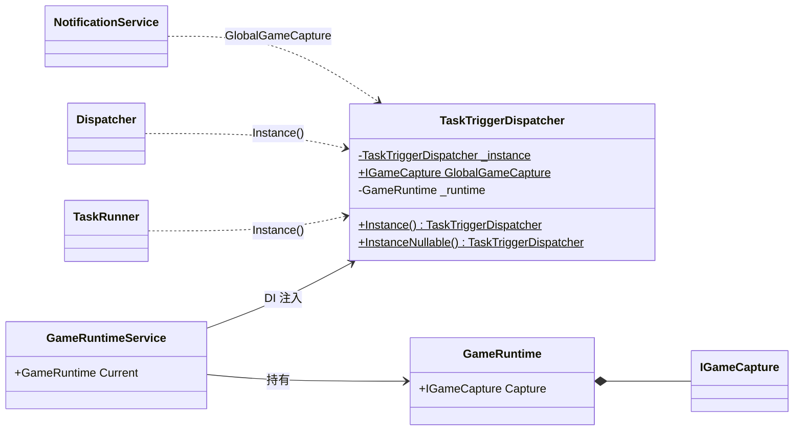
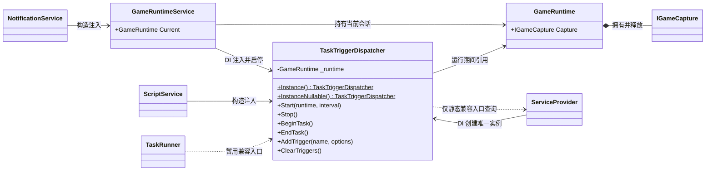

# TaskTriggerDispatcher 依赖注入改造设计

> 状态：精简版已实施，编译通过 · 2026-10-01 · 关联：[GameRuntime 设计](game-runtime.md)、[实时触发器生命周期与启停设计](realtime-trigger.md)

## 1. 现状与决策

改造前，`TaskTriggerDispatcher` 已注册为 DI 单例，`GameRuntimeService` 和部分 ViewModel 也已注入它。但调度器仍在构造时写入静态 `_instance`，其他代码通过 `Instance()`、`InstanceNullable()` 和 `GlobalGameCapture` 访问。这使创建顺序隐含在全局状态里，依赖关系也无法从构造函数看出来。

**建议：先做局部收敛，预计修改 9 个现有类，新增 0 个类 / 接口。** 保留进程级 DI 单例，移除调度器自己维护的 `_instance`；已有 DI 调用方改为注入，旧任务暂留兼容入口，截图访问回到 `GameRuntime`。

上一版将 `TaskRunner`、录制器、脚本宿主的整条创建链都纳入 DI，范围偏大。改造前有 **14 个文件直接使用调度器静态入口**；仅 `new TaskRunner()` 就分布在 **8 个文件**（均不计注释）。彻底删除静态 API 会继续牵动上层调用链，不能只按直接调用点估算成本。

本次优先解决实例来源不统一、截图依赖调度器这两个问题，接受旧代码仍存在隐式依赖。没有必要为了调用方式一致而改造所有对象的创建方式。

当前代码已实现截图器归属：`Win32RuntimeProvider.AttachTo()` 创建并启动截图器，`GameRuntime.Capture` 持有它，`GameRuntime.Dispose()` 释放它。本次沿用这个结构，重点收敛访问路径。

这里的会话是 **BetterGI 从绑定游戏到解绑的一段时间**。同一个游戏进程中停止、重新启动截图器，会产生新的 `GameRuntime` 和截图器；一次脚本或独立任务结束不会结束会话。

| 对象 | 生命周期与所有权 |
| --- | --- |
| `GameRuntimeService` | 进程级 DI 单例，统一编排会话启动、停止与失败回滚 |
| `TaskTriggerDispatcher` | 进程级 DI 单例，随容器释放；每次启动时绑定当前运行环境，停止时解绑 |
| `GameRuntime` | 一次游戏运行会话；由 Provider 创建、`GameRuntimeService.Current` 持有，停止时释放 |
| `IGameCapture` | 属于该 `GameRuntime`，随会话创建与释放；不是 DI 单例，也不由调度器拥有 |

直接注入现有具体类即可；复用 `IGameCapture`。不新增 `ScreenshotService`、`CaptureSession`、调度器接口或 DI Scope。`TakeScreenshot()` 本次保留在调度器中，截图器的所有权仍属于 `GameRuntime`。

## 2. 改造前后

### 改动前



### 本次改动后



调度器只在 `Start(GameRuntime, ...)` 到 `Stop()` 之间使用会话引用，不反向注入 `GameRuntimeService`，避免两者形成 DI 循环。`GameRuntime` 只组合窗口、截图和输入，不负责查询容器，也不充当调度器入口。

| 方面 | 改造前 | 改造后 |
| --- | --- | --- |
| 获取调度器 | DI 注册与 `_instance` 同时存在，构造时写入静态字段 | 容器是唯一实例来源；DI 调用方注入，旧入口只转发 |
| 截图所有权 | 已归 `GameRuntime`，但存在调度器转发入口 | 保持所有权，调用方直接使用会话截图器 |
| 调度器职责 | 触发调度、公开截图器、保存截图 | 删除公共截图器入口；暂保留保存截图方法 |
| 未启动状态 | 部分调用用静态实例是否存在判断 | 实例可以提前创建；是否已启动看会话状态 |

## 3. 预期改动的类

### 已修改：9 个类 / 9 个文件

| 类（文件） | 具体改动 | 涉及范围 |
| --- | --- | --- |
| `TaskTriggerDispatcher` | 内部日志及服务依赖改为构造注入；删除 `_instance`，两个静态方法改为兼容转发；删除 `GlobalGameCapture`，`GameCapture` 改为私有 | 核心调整，不改调度规则 |
| `ScriptService` | 构造注入调度器，替换自身的 `ClearTriggers()` 调用；不向脚本项目继续传参 | 本类内 |
| `HotKeyPageViewModel` | 构造注入调度器，热键调用其 `TakeScreenshot()` | 本类内 |
| `DialogueOptionVoiceDiagnosticService` | 构造注入调度器，`BuildDecisionText()` 改为实例方法，调用 `GetTrigger<AutoSkipTrigger>()` | 本类内 |
| `NotificationService` | 构造注入 `GameRuntimeService`，从当前会话截图 | 本类内，不改通知服务的其他静态入口 |
| `TaskControl` | `CaptureToRectArea()` 从 `TaskContext.Instance().Runtime.Capture` 获取截图器 | 方法签名不变，上层不动 |
| `PictureInPictureWindow` | 从现有 `TaskContext` 取得当前会话截图器；无会话时跳过 | 截图位置小改，不改窗口创建链 |
| `LinneaMiningTask` | 截图来源改为当前会话 | 截图位置小改 |
| 钓鱼行为 `TakeScreenshot`（`AutoFishing/Behaviours.PartII.cs`） | 截图来源改为当前会话 | 截图位置小改 |

前 4 个类调整调度依赖，后 5 个类调整截图来源。已有 DI 注册不变，构造参数由容器补齐；不要求新增工厂或修改所有上层构造函数。

### 本次不改 / 暂缓

| 类或调用链 | 原因与处理 |
| --- | --- |
| `App`、`GameRuntime`、`GameRuntimeService`、`Win32RuntimeProvider`、`IGameCapture` | DI 注册和截图会话所有权已具备，本次无需改结构 |
| `TaskSettingsPageViewModel` | 已经注入调度器，保持现状 |
| `TaskRunner`、`AutoDomainTask`、`AutoLeyLineOutcropTask` | 暂用兼容入口，保留现有 `new`、任务收尾和租约用法 |
| `GlobalKeyMouseRecord` 及其调用方 | 暂用兼容入口，不连带改造录制器、热键页和 `MouseKeyMonitor` 的录制依赖 |
| `ScriptGroupProject`、JS `Dispatcher`、`ScriptProject`、`EngineExtend` | 前两个类暂用兼容入口，不为传递一个调度器而修改整条脚本创建链 |
| `MusicPageViewModel`、`OneDragonFlowViewModel`、`KeyMouseRecordPageViewModel`、`FeedWindowViewModel`、`MapEditorWebBridge`、`RedeemCodeManager`、`OneDragonTaskItem` | 避免因任务构造函数变化而连带修改 |

**取舍：这是局部 DI 改造，不是全量清除静态访问。** 兼容查询仅保留在调度器的两个旧入口中，不将 `App.GetService` 散布到业务代码。旧截图路径复用已有 `TaskContext`；新代码使用构造注入或显式参数，不新增静态调用点。

## 4. 使用示例

以下示例表达依赖方向，省略原有业务逻辑。

### 已有 DI 调用方直接注入

```csharp
// App.xaml.cs：保持唯一注册
services.AddSingleton<TaskTriggerDispatcher>();

// GameRuntimeService / Provider 沿用已有注册。
// GameRuntime 和 IGameCapture 由 Provider 按会话创建，不在根容器注册。

public partial class ScriptService
{
    private readonly TaskTriggerDispatcher _triggers;

    public ScriptService(TaskTriggerDispatcher triggers)
    {
        _triggers = triggers;
    }

    // 每个脚本项目执行前，原来的静态调用改用 _triggers.ClearTriggers()。
}
```

调度器自身的 `ILogger<TaskTriggerDispatcher>`、`OverlayMetricsService`、`CustomHtmlMaskService` 也改为构造注入。构造函数只装配依赖和定时器，不启动会话；调度器不反向注入 `GameRuntimeService`。

### 旧调用方保留兼容入口

```csharp
// 以下方法位于 TaskTriggerDispatcher；删除 _instance 及构造时的静态赋值。
// 仅供旧调用方兼容，返回 DI 容器中的同一个实例，不自行创建或缓存。
public static TaskTriggerDispatcher Instance() =>
    App.GetService<TaskTriggerDispatcher>()
    ?? throw new InvalidOperationException("调度器未注册");

public static TaskTriggerDispatcher? InstanceNullable() =>
    App.GetService<TaskTriggerDispatcher>();

// TaskRunner、JS Dispatcher、录制器等旧调用点暂时保持原样。
TaskTriggerDispatcher.Instance().BeginTask();
```

这种转发仍属于服务定位（Service Locator），只是把实例来源统一交给 DI，不能称为调用方已完成注入。容器初始化后才允许访问；`InstanceNullable()` 可能触发容器首次创建实例，不再表示“截图器是否启动”。`EndTask()` 保持未启动时可调用，`GetTrigger<T>()` 在尚无触发器时返回 null。

### 读取本次会话的截图器

```csharp
public sealed class CaptureCaller(GameRuntimeService runtimes)
{
    public bool TryCapture()
    {
        var runtime = runtimes.Current;
        if (runtime is null) return false;

        using var frame = runtime.Capture.Capture();
        if (frame is null) return false;

        // 使用本次会话的画面；frame.Frame 随 frame 一起释放。
        return true;
    }
}
```

长期存在的服务每次操作读取 `Current`，不能在构造时缓存 `Current.Capture`。属于某次会话的任务可接收固定的 `GameRuntime`，并随该会话取消，避免重启后转而操作新游戏会话。调用方释放截图帧，不释放借用的截图器。

以上截图示例只展示依赖与帧所有权；与停止并发时，还需满足下面的生命周期约束，判空本身不能防止对象被释放。

## 5. 生命周期与实施边界

### 会话边界

- **启动**：Provider 创建并启动截图器 → 组装 `GameRuntime` → Service 绑定上下文和输入 → `dispatcher.Start(runtime)`。失败时由创建方或已接管的 Service 回滚，避免遗漏或重复释放。
- **停止**：由 `GameRuntimeService` 取消任务、停止调度并释放 `GameRuntime`。调度器只解绑，不释放截图器。
- **暂停调度**：录制期间的 `StopTimer()` 只暂停 Tick；截图会话仍然有效。独立任务的 `EndTask()` 也不释放会话。

现有 `Stop()` 发出取消请求、停止定时器后立即释放会话，尚未等待在途任务 / Tick 完成。这是既有的释放竞态，**不纳入本次 9 个类的 DI 调整，也不能宣称已解决**。后续应单独设计停止协调：拒绝新工作，异步等待会话使用者退出后再释放，避免 UI 同步等待或 Tick 等待自身造成死锁。

### 实施与验证

1. 修改 `TaskTriggerDispatcher` 的构造依赖与静态兼容实现，保留现有注册。
2. 修改表中的 3 个调度调用方与 5 个截图调用方，删除公共截图器入口。
3. 检查只保留表中 6 个旧类的静态调度调用，未增加分散的容器查询、重复实例或循环依赖。
4. `dotnet build BetterGenshinImpact.sln -c Debug` 已通过：0 个错误，628 个警告。按项目要求无需实际运行程序。

未来修改某个旧任务时，再顺手将其依赖改为参数传入；等兼容调用自然收敛后删除静态入口，不为清零调用数量单开一轮全量重构。

触发器的启停名单、租约和每帧调度规则沿用现有设计。本次保留已有注释，修改过的 C# 文件均为 UTF-8 无 BOM。
