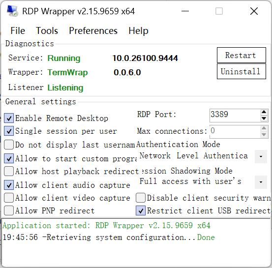
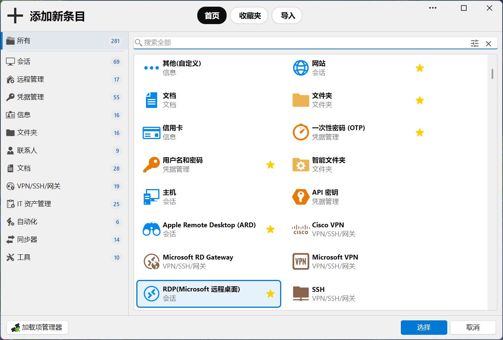
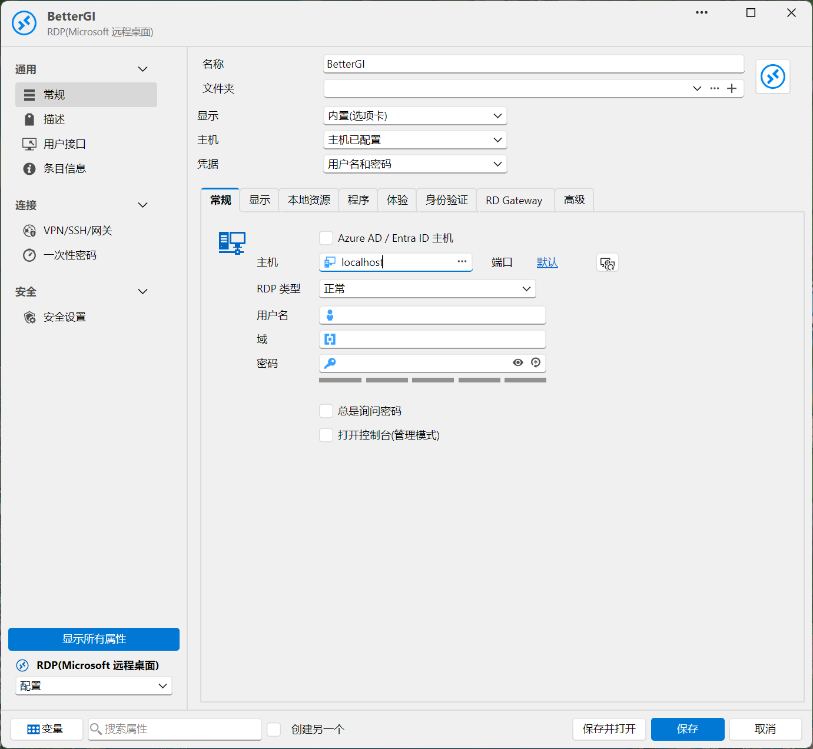
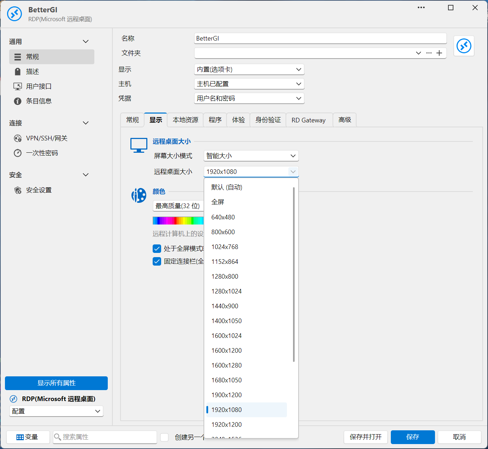
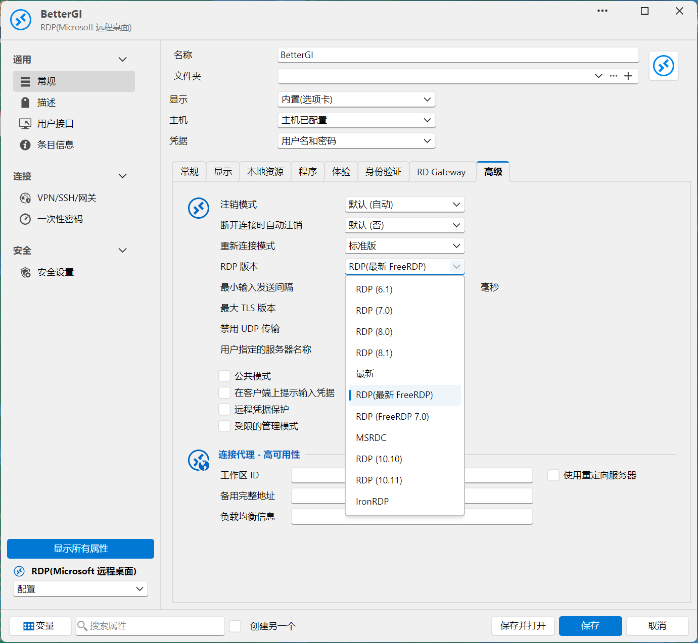
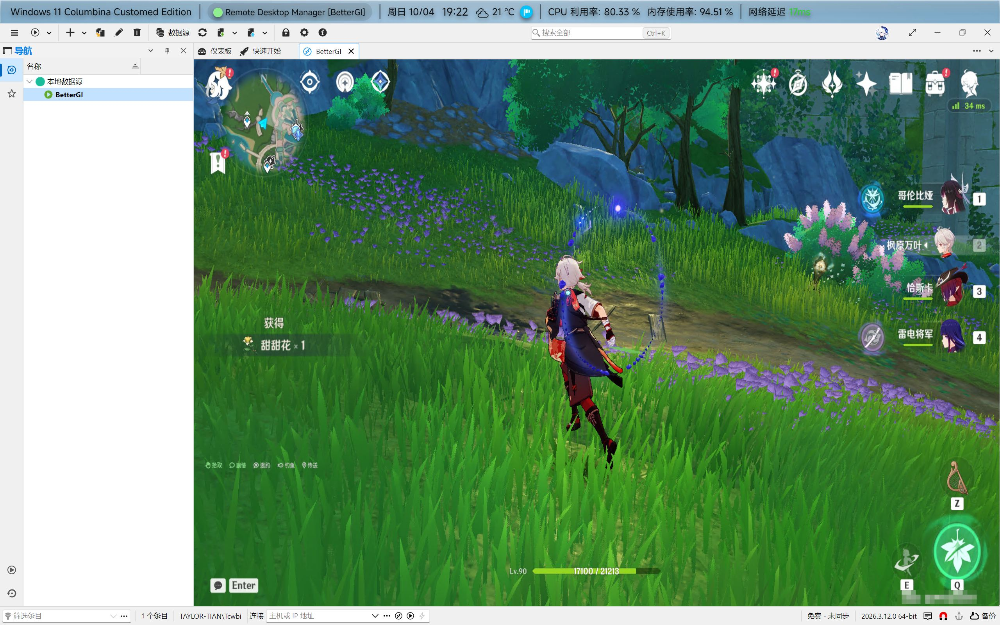
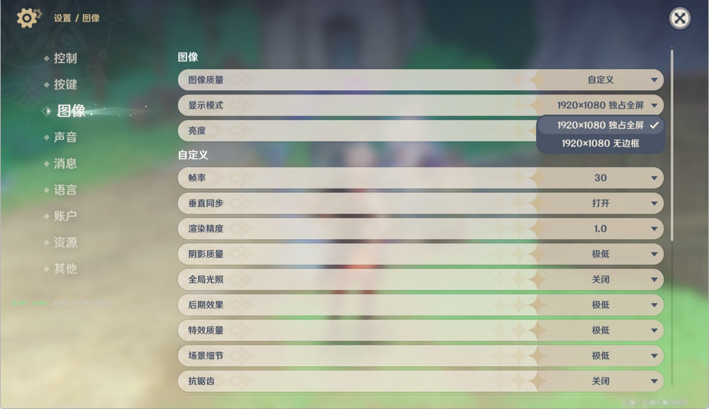
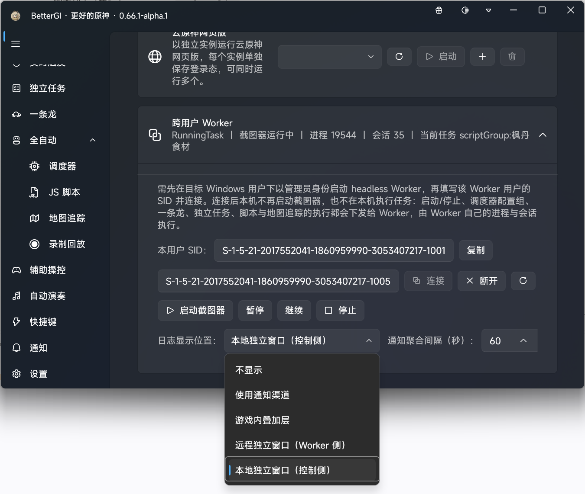

# 单机双用户：用 RDM 登录第二个用户并运行跨用户 Worker

这是一篇面向使用者的操作指南：在**同一台电脑**上让两个 Windows 用户同时在线，
用户 A 在物理桌面上操作 BetterGI 主界面，用户 B 在另一个会话里跑游戏与无头 Worker，
由 A 通过跨用户管道控制 B。

设计细节（管道、ACL、协议）见 [多实例命名管道协议](../design/multi-instance-ipc.md)；
编译与调试见 [开发者文档](../development/README.md)。

## 0. 拓扑与三条红线

| 角色 | Windows 用户 | 会话来源 | 运行的东西 |
| --- | --- | --- | --- |
| 控制端 | 用户 A | **物理控制台**（正常开机登录） | BetterGI 主界面 |
| Worker | 用户 B | **本地 RDP 远程会话**（RDM + FreeRDP 连 `127.0.0.1`） | 原神 + `BetterGI.exe --headless` |

任务始终在**用户 B 自己的进程里**执行，A 只负责下发指令和接收状态/日志。

> ⚠️ **三条红线，先记住再往下看**
>
> 1. **B 的会话只能「断开」，不能「注销」。** 注销 = B 的会话结束，游戏、截图器、Worker 会一起退出。
> 2. **B 的会话分辨率必须固定为 1920×1080。** 远程会话的分辨率由 RDM 指定，和 A 的显示器无关；分辨率不对，识图会整体偏位。
> 3. **两个用户必须使用同一份 BetterGI 安装目录。** 配置组、脚本、地图追踪都按安装目录解析，Worker 找不到文件会直接拒绝任务。

## 1. 前置条件

| 项目 | 要求 |
| --- | --- |
| 系统 | Windows 10 / 11（家庭版可以，见第 3 节说明） |
| 权限 | 全程需要**管理员**权限：装 RDPWrapper、启动 Worker、操作游戏窗口都需要 |
| 账户密码 | 两个用户都**必须设置密码**。Windows Hello 的 PIN 不能用于 RDP 登录 |
| 磁盘 | 游戏与 BetterGI 只需一份，两个用户共用；另需给两个用户的 `AppData` 留出空间 |
| BetterGI | 需要支持 `--headless` 的版本（主界面启动页有「跨用户 Worker」卡片） |

## 2. 创建第二个 Windows 用户（用户 B）

1. `设置 → 账户 → 其他用户 → 添加其他用户`。
2. 选择「**我没有这个人的登录信息**」，下一步选「**添加一个没有 Microsoft 账户的用户**」。
3. 填用户名（例如 `BetterGI`）与**密码**，密码提示随意填，完成。
   密码不能留空：默认策略下空密码账户无法通过 RDP 登录。
4. 回到「其他用户」列表，把该账户的**账户类型改成「管理员」**。
   以普通用户运行时，游戏与 BetterGI 常常拿不到必要的权限。
5. 用这个账户**登录一次物理桌面**（开始菜单 → 用户头像 → 切换用户），把首次登录的欢迎流程走完，然后再切回用户 A。首次登录没完成的话，RDP 登录会卡在准备桌面阶段。

> 如果用户 A 本身是用 Microsoft 账户 + PIN 登录的，RDP 流程里请改用**账户密码**；没有设置过密码的话先去 `设置 → 账户 → 登录选项` 添加密码。

## 3. 开启远程桌面并让本机能同时有两个会话

Windows 客户端系统同一时刻只允许**一个**远程会话，而且新的远程登录会抢走控制台。
用户 A 在控制台、用户 B 要走 RDP，必须在服务端解除这个限制 —— 这就是 RDPWrapper 的作用
（专业版同样只有一个远程会话，所以专业版也需要它；老牌的 stascorp 版 RDPWrap 做的是同一件事，
只是它靠改 `termsrv.dll`，每次系统更新都要跟着更新配置）。

### 3.1 开启远程桌面

`设置 → 系统 → 远程桌面` → 打开「远程桌面」。家庭版没有这一项，靠第 3.2 步的补丁解决。

### 3.2 安装 RDPWrapper（sergiye 版）

用 [sergiye/rdpWrapper](https://github.com/sergiye/rdpWrapper/releases)：它是 stascorp 版 RDPWrap 的纯 .NET 重写，
单文件便携、**不修改 `termsrv.dll`**（只是用不同参数加载它），所以对 Windows 更新更耐用，家庭版也能用。

1. 到 [Releases](https://github.com/sergiye/rdpWrapper/releases) 下载最新的 x64 单文件程序。
2. **以管理员身份**运行它，主界面如下：

   

3. 点击 `Install` 与 `Restart` 并对着 `Diagnostics` 三行确认状态：

   | 行 | 截图里的值 | 目标 |
   | --- | --- | --- |
   | `Service` | `10.0.26100.9444` | 当前系统的 `termsrv.dll` 版本 |
   | `Wrapper` | `TermWrap 0.0.6.0` | wrapper 已正确加载 |
   | `Listener` | **`Listening`** | **必须是 `Listening`**，其它值都说明没装成功 |

4. 在 `General settings` 里确认这几项：

   | 选项 | 建议 | 说明 |
   | --- | --- | --- |
   | Enable Remote Desktop | **勾选** | 相当于打开系统的远程桌面 |
   | SingleSessionPerUser | **不勾选** | 不勾 = 允许同一账户同时有本地与远程会话。本方案两个用户不同，勾不勾都能跑，但不勾更宽松 |
   | RDP Port | `3389` | 默认即可 |
   | AuthenticationMode | `Network Level Authentication` | 保持默认，FreeRDP 支持 NLA |
   | Max connections | `0` | 0 = 不限制并发会话数 |

5. 想撤销就用界面上的 `Uninstall`；改过设置之后用 `Restart` 重启 wrapper 服务。

> **Windows 更新之后**如果 `Listener` 不再是 `Listening`：用 `Tools` 菜单里针对「不支持的版本」生成配置的功能重建对应项（需要先装 Microsoft Visual C++ 运行库），生成后再 `Restart` 一次。菜单名以你手上的版本为准。

> ⚠️ 这个工具会放宽系统默认的「同时只允许一个远程会话」限制，属于**第三方组件**，不是 BetterGI 的一部分。
> 请自行确认下载来源可信；介意的话就别用这套方案（那就只能两台电脑各跑一个用户）。

### 3.3 顺手做的两件事

- **关闭休眠/睡眠**：`设置 → 系统 → 电源` 里把「睡眠」「关闭屏幕」都设为「从不」，否则会话挂起会把游戏中断。
- **确认控制台没被抢占**：装好之后，用 RDM 登录用户 B 时，用户 A 在物理桌面上应该**不受影响**（不会掉到登录界面）。

## 4. 用 RDM（FreeRDP 引擎）登录用户 B

RDM 在这里只承担「把用户 B 登录起来并保持会话」的角色。日常管理用它，游戏与 Worker 都是在登录之后于 B 的桌面里启动。

下面 4.1–4.5 是一条完整的创建流程，按顺序做即可。

### 4.1 添加新条目，类型选 RDP



- 列表很长，直接在右上角的「**搜索全部**」里输入 `RDP` 更快。
- 条目类型的名字里带 Microsoft，指的是**默认引擎**走系统的 Microsoft RDP ActiveX；
  引擎在第 4.4 节换成 FreeRDP，**类型本身不用改**。

### 4.2 常规：主机与登录



| 字段 | 填什么 |
| --- | --- |
| 名称 | 随意，例如 `BetterGI` |
| 显示 | **内置（选项卡）** —— 会话在 RDM 窗口内以标签页打开，方便和用户 A 的桌面同屏对照 |
| 主机 | `localhost`（等价 `127.0.0.1`，都指本机；保存后标题栏会显示解析出的地址） |
| 端口 | `3389`（默认） |
| 用户名 | **用户 B** 的用户名；密码按你的凭据策略填，或勾「总是询问密码」每次输入 |

「打开控制台（管理模式）」**不要勾**：勾了会去连控制台会话，和「控制台留给用户 A」的前提冲突。

### 4.3 屏幕大小：固定 1920×1080



同一个「通用」页往下滚到「屏幕大小」：

| 字段 | 值 | 说明 |
| --- | --- | --- |
| 屏幕大小模式 | **智能大小** | 画面随窗口缩放，不影响实际分辨率 |
| 远程桌面大小 | **1920×1080** | 下拉里选 1920×1080。**这是最关键的一项** |
| 颜色 | 最高质量（32 位） | |

同一页再往下还有几个显示相关项：「远程计算机上的设置可能会覆盖此设置」是提示文字，不用管；
「处于全屏模式时显示连接栏」「固定连接栏」按喜好，建议保持默认，方便随时切回。

### 4.4 高级：RDP 版本改成 FreeRDP

在「通用」页的「**高级**」分组里找到 **`RDP 版本`**，把它设成 **`RDP（最新 FreeRDP）`**：



- 选项列表里带 FreeRDP 字样的有两个：`RDP（最新 FreeRDP）` 和 `RDP (FreeRDP 7.0)`，选前者。
- 其余取值（形如 `RDP (10.10)`、`RDP (10.1)`、`MSRDC`、`IronRDP`）走的是系统自带的 Microsoft RDP ActiveX。
- 想一次性对所有条目生效：`文件 → 设置 → 类型 → RDP` 里改默认引擎。
- 同一分组里的「断开连接时动作」等项保持默认即可，别改成会结束会话的动作。
- 找不到「高级」分组时，先勾上属性列表底部的「**显示所有属性**」。

### 4.5 保存并打开

点右下角的「**保存并打开**」即可登录用户 B。建好的条目会出现在 RDM 的数据源列表里：



**成功的样子**：RDM 窗口内以标签页打开用户 B 的桌面，画面分辨率是 1920×1080，
用户 A 在物理桌面上不受影响。

### 4.6 断开 ≠ 注销

RDM 关闭会话时会问你是 **断开（Disconnect）** 还是 **注销（Log off）**：

- 选**断开**：B 的会话保留在内存里，游戏会继续运行，但 Worker 会由于远程桌面断开连接后自动锁屏而无法正常运行。
- 选**注销**：B 的会话直接结束，游戏、截图器、Worker 全部退出，需要重新登录重来，若你的用户 B 没有启用 Windows 资源管理器（系统桌面），则注销功能会无法使用。

如果只是想腾出屏幕，把 RDM 的会话标签页**最小化**即可，不要关掉会话。

## 5. 在用户 B 里准备环境

1. **同一份 BetterGI 安装目录**：不要给 B 单独装一份。确认 `BetterGI.exe` 的路径与用户 A 用的完全一致（不要放置于用户 A 的私有目录，例如用户文件夹）。
2. **首次启动游戏**：登录 B 后完整跑一次原神（登录、过完首次引导、进入游戏），确认游戏本身没问题。
3. **游戏图像设置**：分辨率与 BetterGI 的识别资源匹配（通常是 1920×1080），其余画质尽量低，减少 GPU 负担。

   

   参考配置：图像质量低、显示模式 1920×1080 独占全屏、帧率 30、垂直同步打开，
   渲染精度/阴影/全局光照/后期/特效/场景细节全部最低或关闭，抗锯齿关闭。

## 6. 在用户 B 里启动 headless Worker

### 6.1 取两个 SID

在两个用户的会话里分别执行（或用 `whoami /user` 取最后一段）：

```powershell
[System.Security.Principal.WindowsIdentity]::GetCurrent().User.Value
```

- 在**用户 A** 里取到的 = 「控制端 SID」，启动 Worker 时作为 `--controller-sid` 的值；
- 在**用户 B** 里取到的 = 「Worker 用户 SID」，在 A 的界面里连接时要填的值。

A 的界面里也能直接看到并复制自己的 SID（启动页「跨用户 Worker」卡片 → 本用户 SID）。

### 6.2 启动

在**用户 B** 的会话里，用管理员权限运行：

```powershell
BetterGI.exe --headless --controller-sid <用户A的SID>
```

- `--headless`：不创建主界面，只对外提供跨用户管道；
- `--controller-sid`：只允许这个用户连接。省略时只允许 B 自己连接（可用于本机自测）。

### 6.3 成功的样子

1. 会**自动弹出一个控制台窗口**，标题是 `BetterGI Worker Console`；从资源管理器启动时父进程没有控制台，所以必须新建，否则你看不到任何输出。
2. 控制台/日志里出现类似：

   ```text
   Worker IPC 已启动：管道 "BetterGI.v2.cross-user.S-1-5-21-....worker"，Worker SID "..."，Controller SID "..."
   ```

> Worker 没有主窗口，所以不要期待它出现 BetterGI 界面。它的状态与日志要么看这个控制台/日志文件，要么看用户 A 那边的界面。

## 7. 在用户 A 里连接 Worker

1. 用户 A 正常启动 BetterGI（物理桌面上的那个），打开**启动页**。
2. 在「**跨用户 Worker**」卡片里填入**用户 B 的 SID**，点「**连接**」。
3. 连接成功后卡片上会显示一行状态：

   ```text
   Idle ｜ 截图器未启动 ｜ 进程 12345 ｜ 会话 2
   ```

   - 状态为 `Idle` 表示 Worker 空闲；
   - 「截图器」那一项是 Worker 侧的截图器状态，**A 本机的截图器不会启动**；
   - 点卡片上的「**启动截图器**」会拉起 B 的截图器与游戏内叠加层。

4. 连接之后，A 界面上的操作都会下发给 B：

   | A 上的入口 | 下发成 |
   | --- | --- |
   | 启动页主按钮 / 启停快捷键 | 控制 B 的截图器 |
   | 调度器「运行」当前配置组 | `scriptGroup` |
   | 调度器「连续执行」 | `scriptGroups`（含循环标记） |
   | 调度器「继续执行」 | `taskProgress` |
   | 一条龙「一键执行」 | `oneDragon` |
   | 任务设置页的独立任务 | `solo` |
   | 脚本列表「执行」 | `scriptFolder` |
   | 地图追踪「执行」 | `pathingFile` |

   还没支持远程下发的入口会被直接拒绝并提示，**不会在 A 本机偷偷执行**。

5. 卡片上的「暂停 / 继续 / 停止」用于控制 B 正在执行的任务，「**退出游戏**」会在 B 侧激活游戏窗口并映射一次 `Alt+F4`（B 的游戏窗口需要处于可操作状态，即 B 侧截图器已启动）。

## 8. 把 Worker 的日志显示在哪里

「Worker 日志」就是原本写进遮罩叠加层日志框的那些内容（格式、级别完全一致，只是换了显示位置）：



在启动页「跨用户 Worker」卡片上有「**日志显示位置**」下拉框和「**通知聚合间隔（秒）**」输入框：

| 选项 | 日志出现在哪 | 说明 |
| --- | --- | --- |
| 不显示 | 哪里都不出现 | 只写 Worker 的日志文件 |
| 使用通知渠道 | 你手机/IM 上的通知 | 需要在**通知设置**里勾选「Worker 日志」事件；按聚合间隔合并成一条，避免被渠道限流 |
| 游戏内叠加层 | **B 的**游戏画面上 | 默认值，与改动前一致 |
| 远程独立窗口 | **B 的**机器上弹出「Worker 日志」窗口 | B 那边能看到，A 看不到 |
| 本地独立窗口 | **A 的**机器上弹出「Worker 日志（远程）」窗口 | 想在自己这边看日志就选这个 |

选择会随连接自动下发给 Worker，Worker 启动时也会按自己配置里的值初始化。

## 9. 常见问题

| 现象 | 可能原因 | 处理 |
| --- | --- | --- |
| A 连接时报 `worker_offline` | B 的 Worker 没启动，或 SID 填错了 | 确认 B 的控制台窗口还在、管道名里的 SID 与 B 的 SID 一致 |
| A 连接被拒绝 | Worker 启动时没带 `--controller-sid`，或填的是别的用户 | 用 A 的 SID 重新启动 Worker |
| 下发任务提示「Worker 截图器尚未启动，请先下发 startGame 任务。」 | B 的截图器没启动 | 先在卡片上点「启动截图器」 |
| 下发任务提示读取配置组/脚本失败 | 两个用户不是同一份安装目录，或该配置组在 Worker 侧不存在 | 改成同一目录，或在 B 侧补齐文件 |
| 提示「本机不执行任务，该入口暂未支持远程下发」 | 这个入口还没做远程映射 | 换用上表里已支持的入口 |
| 游戏画面卡住/黑屏、Worker 日志不再更新 | B 的 RDP 会话被断开或被注销 | 重新用 RDM 登录 B；关闭会话时务必选「断开」而不是「注销」 |
| RDM 连不上、提示会话数已满 | RDPWrapper 没生效，或被系统更新打回 | 打开 RDPWrapper 看 `Listener` 是否为 `Listening`，不是就按第 3.2 节处理 |
| RDM 要输凭据但密码是对的 | PIN 不能用于 RDP，或该账户没设密码 | 给该账户设置密码后重试 |
| 识图偏位、点击位置不对 | B 的会话分辨率不是 1920×1080 | 回到第 4.3 节固定分辨率，并确认游戏内分辨率 |

## 10. 延伸阅读

- 不想用 Worker，而是想让游戏在另一个会话里跑、同时在 BetterGI 窗口里直接看到画面：
  启动页的「**BetterGI 桌面分身**」卡片 → 「打开」→ 「启动并连接」。
  它同样依赖本机的多会话能力（第 3 节）。
- 管道命名、DACL、SID 校验、任务类型与日志显示位置的完整定义：
  [多实例命名管道协议](../design/multi-instance-ipc.md)。
- 想参与开发、需要在 Visual Studio 里调试 Worker：
  [开发者文档](../development/README.md)。
